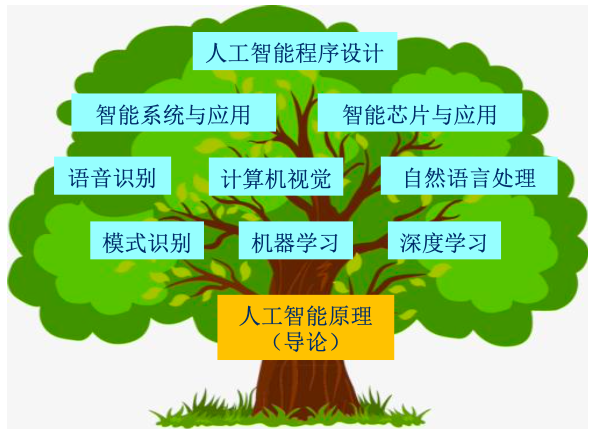

# 课程目录

1. [人工智能原理](人工智能原理/)
    - AI的总体知识脉络，提纲挈领
    - 知识点很多，面面俱到（~~很多以后也用不到，了解个概念即可~~）
2. [模式识别与机器学习](模式识别与机器学习/)
    - 介绍很多传统的机器学习算法
3. [计算机算法设计与分析](计算机算法设计与分析/)
    - 算法基础课，慢慢啃吧
4. [计算机视觉](计算机视觉/)
    - 从传统的视觉技术到神经网络

---

附一张图片，了解下每门课程的定位：

---

> 有些同学喜欢`clone`到本地观看，补一个**本地部署流程**
> 1. 安装python3
> 2. clone本仓库 `git clone https://github.com/YanLin-Git/UCAS_AI_2025.git`
> 3. 进入文件目录，执行`sh start_docsify.sh`
> 4. 浏览器中输入`http://localhost:3001/#/`