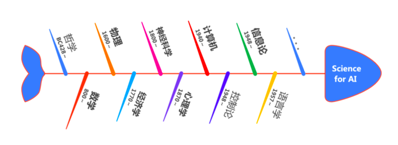

# 人工智能原理与应用

- 第一节课简单介绍了这门课程的整体框架，以及人工智能简史

    

    
<b>纵向：人工智能的发展历程</b>

    
    
    
    

    

    
<b>横向：人工智能的学科基础</b>

    
    
    
    

- 从第二节课开始整理笔记，逐步填充框架中的各部分内容
    1. [x] [搜索](人工智能原理/搜索/)
    2. [ ] [学习](人工智能原理/学习/)
    3. [ ] [推理](人工智能原理/推理/)