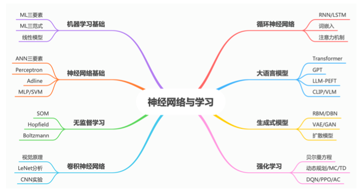

# 学习

<b>课程大纲</b>

1. [x] [机器学习基础](人工智能原理/学习/机器学习基础.md)
2. [x] [神经网络基础](人工智能原理/学习/神经网络基础.md)
3. [x] [无监督学习](人工智能原理/学习/无监督学习.md)
4. [x] [卷积神经网络](人工智能原理/学习/卷积神经网络.md)
5. [x] [循环神经网络](人工智能原理/学习/循环神经网络.md)
    - [注意力机制](人工智能原理/学习/注意力机制.md)
6. [ ] [大语言模型](人工智能原理/学习/大语言模型.md)
7. [x] [生成式模型](人工智能原理/学习/生成式模型.md)
8. [ ] [强化学习](人工智能原理/学习/强化学习.md)
