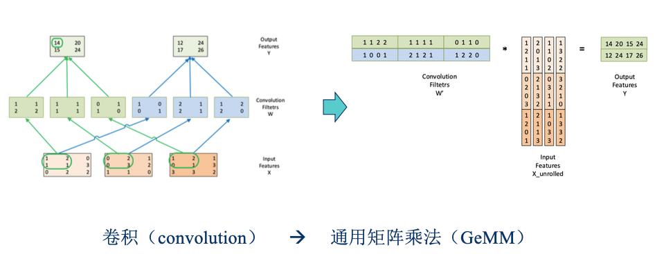
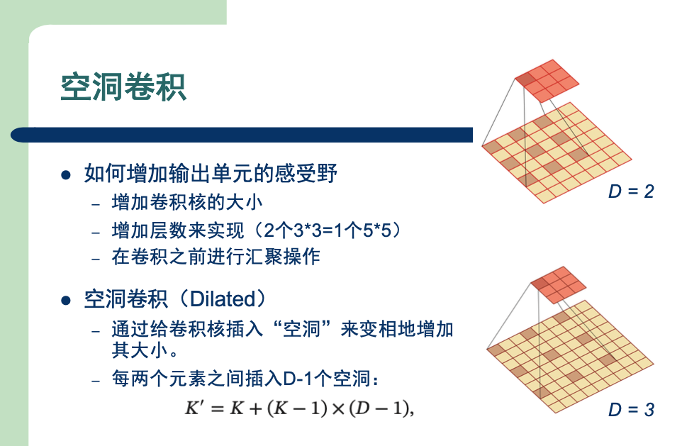
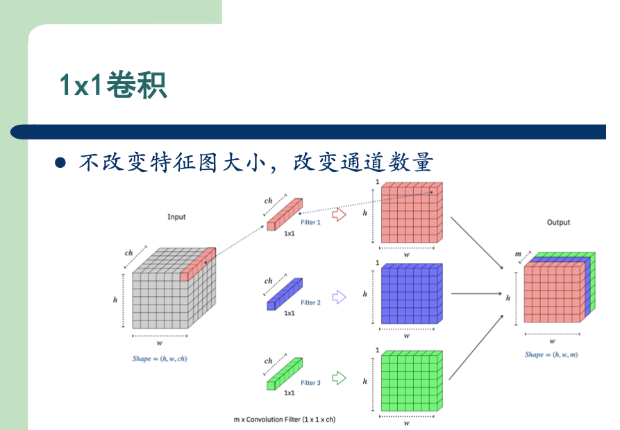
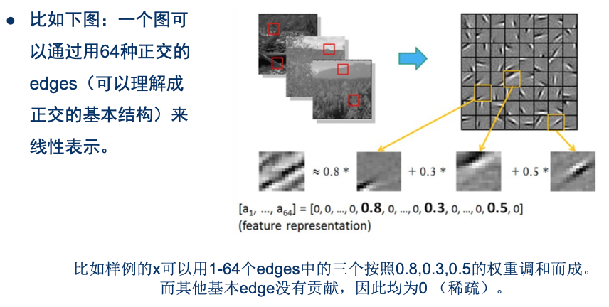
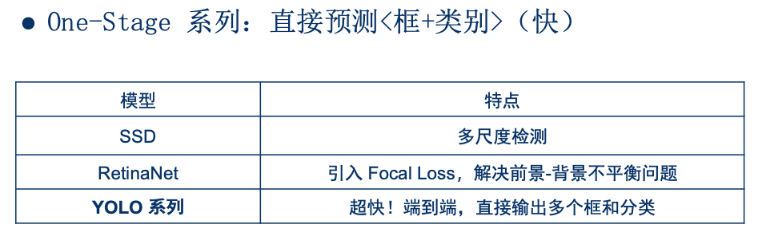
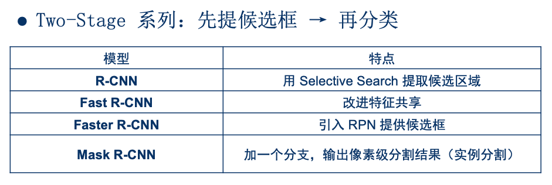
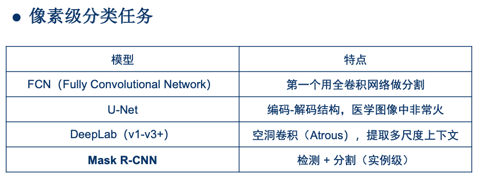
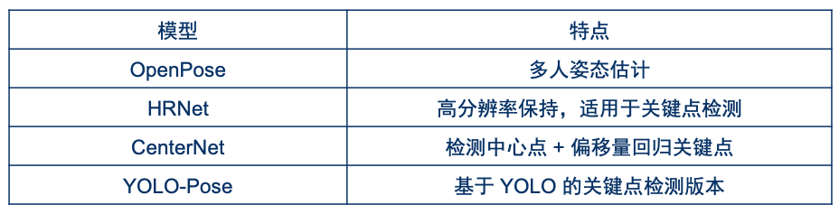

# 卷积神经网络

# 一、卷积计算

> 直接进行卷积运算，效率较低。  
> 所以在代码实现中，通常先将`卷积核`、`特征图`转化为相应**矩阵**，  
> 然后用矩阵运算，代替卷积运算。

# 二、特殊卷积核

## 2.1 转置卷积

示意图

> 左图是正常的卷积运算，(5,5) --> (2,2)  
> 右图则是“反卷积运算”，(2,2) --> (5,5)  
> 应用：`yolo`、`UNet`、`FCN`中的**upsample**

## 2.2 空洞卷积

示意图

## 2.3 1x1卷积

示意图

> 应用：例如`FCN`中，代替全连接层

# 三、全连接层 VS 卷积层

例如我们有`1000x1000`像素的图像，$10^6$个隐藏层神经元

||连接数|参数量|
|---|---|---|
|**全连接层**|`1000x1000`x$10^6 = 10^{12}$|$10^{12}$|
|局部感受野|`10x10`x$10^6 = 10^{8}$|$10^{8}$|
|局部感受野 +权值共享|`10x10`x$10^6 = 10^{8}$|`10x10`|
|局部感受野  +权值共享  +`100`个卷积核  = **卷积层**|`10x10`x$10^6$x`100` = $10^{10}$|`10x10x100`|

# 四、典型CNN网络

## 4.1 LeNet-5

||结构|shape|参数量|连接数|
|---|---|---|---|---|
|C1|6个`5x5x1`的卷积核|(1, 32, 32)  --> (6, 28, 28)|(`5x5x1`+1) x 6 = 156|(`5x5x1`+1) x 6 x `28x28`  = **参数量** x `28x28`  = 122,304|
|S2|`2x2`的区域中取最大值 然后乘以`1`个可训练的系数 再加上`1`个可训练的偏置|(6, 28, 28)  --> (6, 14, 14)|(`1`+`1`) x 6 = 12|(`2x2`+1) x 6 x `14x14` = 5880|
|C3|16个`5x5`的卷积核 =  6个`5x5x3`的卷积核  + 9个`5x5x4`的卷积核  + 1个`5x5x6`的卷积核|(6, 14, 14)  --> (16, 10, 10)|(`5x5x3`+1) x 6  +(`5x5x4`+1) x 9  +(`5x5x6`+1) x 1  = 1516|**参数量** x `10x10` = 151600|
|S4|同S2|(16, 10, 10)  --> (16, 5, 5)|(`1`+`1`) x 16 = 32|(`2x2`+1) x 16 x `5x5` = 2000|
|C5|120个`5x5x16`的卷积核|(16, 5, 5)  --> (120, 1, 1)|(`5x5x16`+1) x 120 = 48120|**参数量** x `1x1` = 48120|
|F6|全连接层|(120,)  --> (84,)|(`120`+1) x 84 = 10164|10164|
|输出层|10个**欧氏径向基函数**神经元组成|(84,)  --> (10,)|||

## 4.2 几个经典网络

|名称|备注|
|---|---|
|**LeNet**|7层，用来识别手写数字，第一个成功的卷积神经网络应用|
|**AlexNet**|8层，在ImageNet2012图像识别挑战赛(`ILSVRC 2012`)中，绝对优势胜出|
|**VGG**|19层，`ILSVRC 2014`中第二名，提出可以重复使用简单的基础块，来构建深度网络|
|**GoogLeNet**|22层，`ILSVRC 2014`中胜出，使用了**Inception块**，多尺度卷积|
|**ResNet**|152层，`ILSVRC 2015`胜出，使用了**跳跃链接**，**批量归一化**(batch norm)|

# 五、CNN 与 CV

## 5.1 稀疏编码

## 5.2 目标检测

#### 1) 1-stage系列

#### 2) 2-stage系列

## 5.3 图像分割

1. `FCN`
    - 用**1x1卷积**代替全连接层
    - 使用**上采样**（或**反卷积**、**转置卷积**）恢复空间分辨率
2. `U-Net`
    - **Skip Connection**：每一层下采样的特征图与对应的上采样层拼接( concat)
3. `Mask R-CNN`
    - 在`Faster R-CNN`基础上新增 一个并行的Mask分支
    - **目标检测**任务的基础上，又添加了**图像分割**任务

## 5.4 姿态估计

