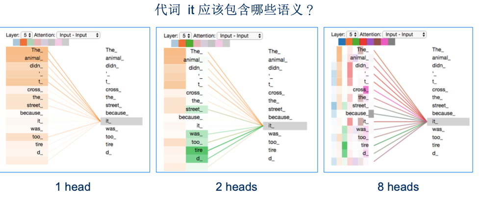
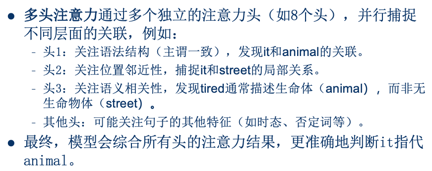
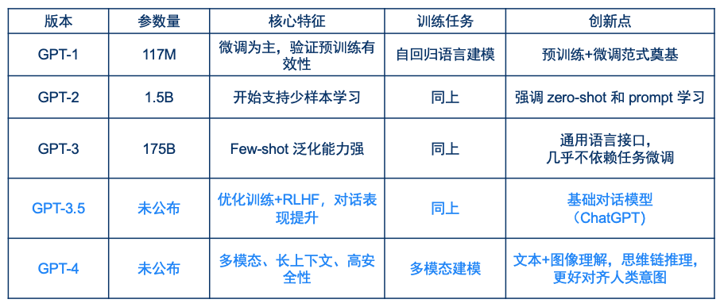
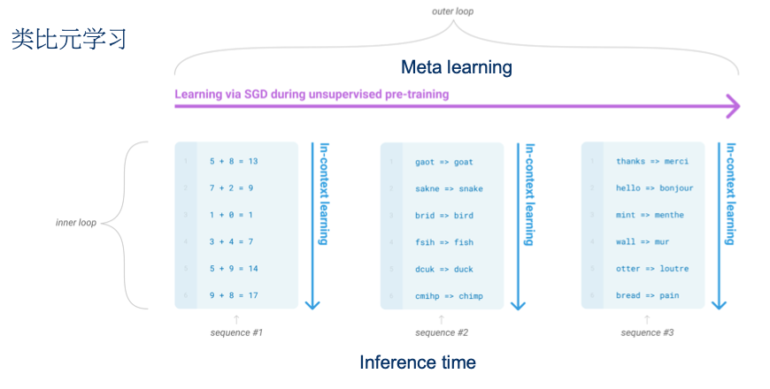
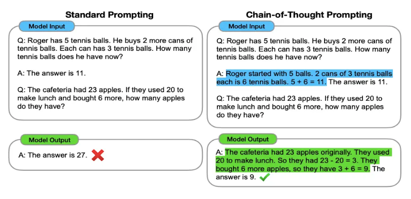
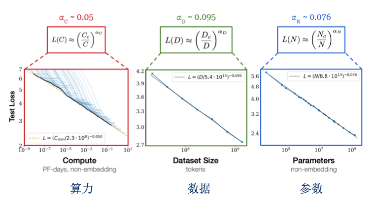
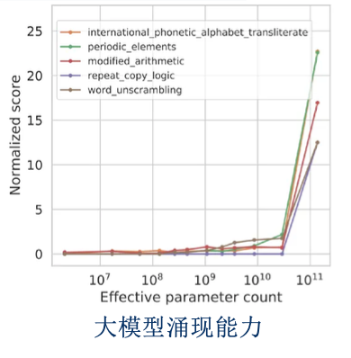

# 大语言模型

# 一、transformer

## 1.1 原理介绍

> 跟不上老师节奏，只知道大概在讲什么…  
> 不整理了

1. paper: https://arxiv.org/abs/1706.03762
2. 原理介绍: https://jalammar.github.io/illustrated-transformer/
    - 中文翻译版: https://zhuanlan.zhihu.com/p/54356280

#### 只记住了一个知识点

为什么采用Multi Head?

## 1.2 Attention VS FFN

> **Attention**关注序列中的不同token之间的关联性，进行跨token的信息交互。  
> **FFN**对每个token内部，进行独立处理，不会跨token交互。

### 1.2.1 Attention分析

1. 线性运算
    - 每一次Attention的计算相当于 是对$V$向量进行了加权平均，没有任何非线性变换
2. 多头注意力不会互相混合
3. 词向量各向异性
    - 词向量在向量空间中的分布不是均匀分布，而是聚集在某个狭窄区域。

### 1.2.2 FNN分析

1. 使用激活函数，引入非线性
2. 在特征纬度上，`升维 --> 筛选 --> 降维`
    - 实现特征重组
3. 实现知识存储
    1. 第一层线性变换是`Key Memory`，记住了一些pattern
    2. 第二层线性变换是`Value Memory`，根据记住的pattern，来预测输出词的分布

# 二、GPT

## 2.1 任务形式的统一

#### GPT-1时提出：

很多任务都可以用生成模型来做  
例如：文本分类、多选、计算文本相似度

## 2.2 GPT系列

#### 几个概念

#### 1) zero-shot

只使用预训练模型，不经过fine-tuning，直接去下游任务上评估效果

#### 2) in-context learning

**GPT-3**对之前的**zero-shot**进一步探索，提出一个新名词**in-context learning**，包括3种方式：

1. zero-shot prompting
2. one-shot prompting
3. few-shot prompting

#### 3) Meta learning

> 有学者将**in-context learning**与**Meta learning**进行类比

示意图

#### 4) Chain-of-Thought（COT）

示意图

#### 5) Scaling Law

示意图

> 随着计算量（C）、数据集大小(D)、模型参数量（N）的平滑增大，  
> 模型的性能（如预测损失、下游任务准确率）会按照**可预测的幂律关系**提升。

#### 6) 涌现能力

示意图

