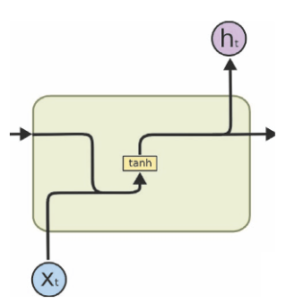
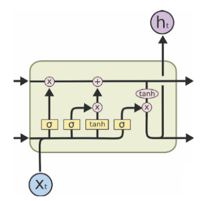
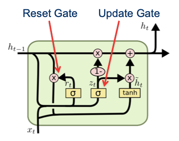
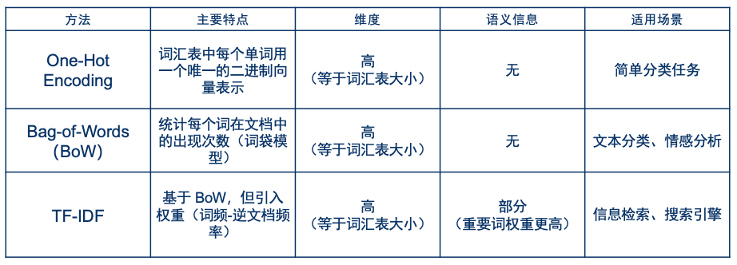
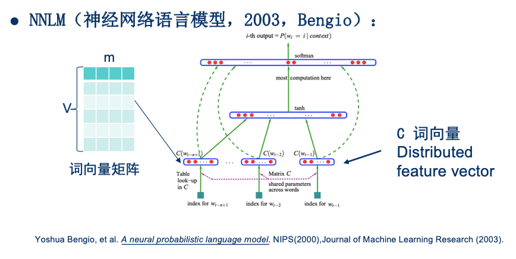
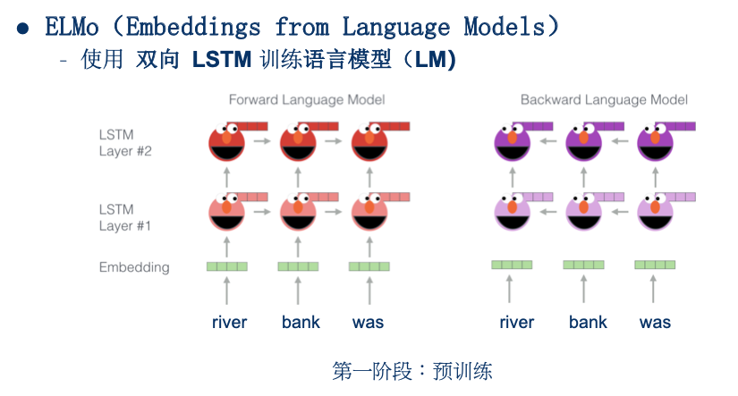
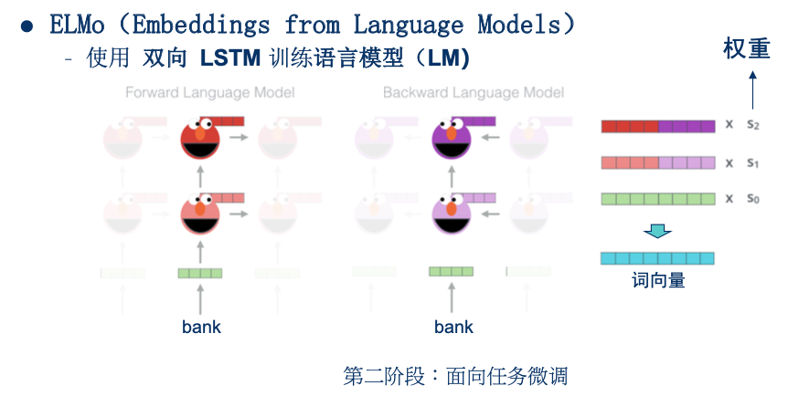

# 循环神经网络

# 一、RNN、LSTM、GRU

## 1.1 RNN

> **公式**：$H_t = \tanh (X_t W_{xh} + H_{t-1} W_{hh} + b_h)$

## 1.2 LSTM

> 1. **遗忘门**: $F_t = \sigma (X_t W_{xf} + H_{t-1} W_{hf} + b_f)$
> 2. **输入门**: $I_t = \sigma (X_t W_{xi} + H_{t-1} W_{hi} + b_i)$
> 3. **候选记忆细胞**: $\tilde{C}_t = \tanh (X_t W_{xc} + H_{t-1} W_{hc} + b_c)$
> 4. **记忆细胞**: $C_t = F_t \odot C_{t-1} + I_t \odot \tilde{C}_t$
> 5. **输出门**: $O_t = \sigma (X_t W_{xo} + H_{t-1} W_{ho} + b_o)$
> 6. **隐藏状态**: $H_t = O_t \odot \tanh (C_t)$

## 1.3 GRU

> 1. **重置门**: $R_t = \sigma (X_t W_{xr} + H_{t-1} W_{hr} + b_r)$
> 2. **候选隐藏状态**: $\tilde{H}_t = \tanh (X_t W_{xh} + (R_t \odot H_{t-1}) W_{hh} + b_h)$
>    - **重置门**帮助捕捉短期依赖关系，控制有多少过去信息用于生成新的“候选记忆”。
> 3. **更新门**: $Z_t = \sigma (X_t W_{xz} + H_{t-1} W_{hz} + b_z)$
> 4. **隐藏状态**: $H_t = Z_t \odot H_{t-1} + (1-Z_t) \odot \tilde{H}_t$
>    - **更新门**帮助捕捉长期依赖关系，控制有多少过去记忆被直接传递到未来。

# 二、`词嵌入`发展史

## 2.1 早期表示方法

## 2.2 N-gram

1. 已知前`n-1`个词，预测接下来最有可能出现哪个词  
    $$
    P(w_n | w_1, w_2, ..., w_{n-1})
    $$
2. 但是这样复杂度太高，难以计算。于是简化一下，只通过前`N-1`个词来预测
    $$
    P(w_n | w_{n-(N-1)}, w_{n-(N-2)}, ..., w_{n-1})
    $$

> 此时还是基于统计，来完成相应工作  
> 例如一段文本中，出现了`中华人民共和国`、`中国`，频次如下：  
> ||中国|中华人民共和国|
> |---|---|---|
> |频次|8|2|
> 
> 给了一个`中`字，预测下一个字的概率：
> $$
> \begin{cases}
>     P(国|中) = 0.8 \\
>     P(华|中) = 0.2
> \end{cases}
> $$

## 2.3 NNLM

> 利用神经网络来完成上面介绍的`N-gram`工作：  
> 输入前N个词，预测下一个词

> 目的是为了完成`N-gram`工作  
> 训练过程中，得到了一个副产品：**词向量矩阵**

## 2.4 Word2Vec

> 高效的**词向量**表示，一个词可以用`100-300维`的向量来表示。

#### 1) CBOW

利用上下文预测中心词，类似于`完形填空`。  

#### 2) Skip-gram

利用中心词，来预测上下文。

## 2.5 GloVe（Global Vector）

- `Word2Vec`出现之前，也有一些其他方法来获取词向量
    - 其中一种就是共现矩阵+SVD(降维)
    - 基于`全局`词共现统计信息，来构建
- **GloVe**结合了`全局统计信息`与`Word2Vec`

## 2.6 FastText

**Word2Vec**中，无法处理`未登录词`。  
**FastText**提出用`子词的集合`，来表示中心词。

> 例如：“\<where\>” 可以表示成这些`子词的集合`：  
> “<wh”、“whe”、“her”、“ere”、“re>”

## 2.7 ELMo

**Word2Vec**可以对每个单词进行编码，但无法解决多义词问题。  
例如"bank"，有两个常用含义，但是在word2vec中，只对应一行向量。  
ELMo的想法是根据上下文，去动态调整**词向量**

### 2.7.1 网络架构

1. Embedding层
2. 多个BiLSTM层

### 2.7.2 预训练阶段

> 同时训练两个任务  
> 1. 如左图所示，根据`river、bank`去预测`was`
> 2. 如右图所示，根据`bank、was`去预测`river`

### 2.7.3 微调阶段

> 1. 这个阶段固定模型参数  
>    - 输入一句话，就可以获取每个词在各层相应的**embedding**  
>    - 例如上图中`bank`在各层都有一个**embedding**
> 2. 在下游任务训练时，使用各层**embedding**的加权组合，来作为每个词最终的**embedding**。  
>    - 微调阶段，只学习各层的权重$s_0、s_1、s_2$，  
>    - 来调整每个词的最终表示。

## 2.8 BERT

> 学完**transformer**，基本就懂了。

# 三、tokenization

## 3.1 为什么要用token?

1. 处理未登录词，有效解决OOV（Out-of-Vocabulary）问题
    - 类似于**FastText**中的例子：
        - “unhappiness” 可以表示成“un”、“happi”、“ness”
        - 词表中可能没有“unhappiness”，但如果有3个子词，也可以。
2. 还可以提高模型的泛化能力
    - 使模型能够更好地捕捉词形变化和词根信息，提升对不同词形的理解能力。

## 3.2 几种方法

#### 1) BPE

> **GPT-1**中使用

详细流程

1. 首先对语料进行切词，统计词频，假设我们得到的结果为:
|word|频次|
|---|---|
|low|5|
|lower|2|
|newest|6|
|widest|3|

2. 在每个单词后加<\w>，如下:
|word|频次|
|---|---|
|low<\w>|5|
|lower<\w>|2|
|newest<\w>|6|
|widest<\w>|3|

3. 然后得到我们的初始化subword词表
|id|subword|频次|
|---|---|---|
|1|l|7|
|2|o|7|
|3|w|16|
|4|e|17|
|5|r|2|
|6|n|6|
|7|s|9|
|8|t|9|
|9|i|3|
|10|d|3|
|11|<\w>|16|

4. 合并其中最高频的 连续子词，这里就是`es`，频次9，更新subword词表如下
|id|subword|频次|
|---|---|---|
|1|l|7|
|2|o|7|
|3|w|16|
|4|e|17-9=8|
|5|r|2|
|6|n|6|
|7|s|9-9=0 `subword表中可以删掉这行`|
|8|t|9|
|9|i|3|
|10|d|3|
|11|<\w>|16|
|12|es|9|

5. 重复第4步，接下来就是`est`。
    - 之后一直重复，直到subword词表大小达到预期

**随着合并的次数增加，词表大小通常先增加后减小**

#### 2) WordPiece

> **BERT**中使用，BPE的变种

上面介绍的**BPE**，第四步合并时，选用`最高频`的连续子词。  
**WordPiece**则是选择能够`使语言模型概率提升最大`的连续子词

- 例如一句话$s=[t_1, t_2, t_3, ..., t_n]$，由n个子词组成  
    1. 原始语言模型概率为 $P(s) = P(t_1)P(t_2)P(t_3)...P(t_n)$  
    2. 合并$t_1、t_2$后，语言模型概率为 $P(s) = P(t_1t_2)P(t_3)...P(t_n)$  

#### 3) BBPE (byte level BPE)

> 目前大多数模型使用

在更小的单元byte上去运行**BPE**  
无论什么语言，统一用unicode编码，每个byte上，最多有$2^8=256$种可能

## 3.3 SentencePiece

> 工具包，实现**BPE**、**BBPE**等算法

1. Llama、Qwen等，都是使用**SentencePiece**来实现**BBPE**，  
2. GPT-2/3/4，则使用自研的**tiktoken**库来实现**BBPE**。