# 无监督学习

# 一、SOM（Self Organizing Map）

简单提了一下，没有详细介绍。  
**降维** + **聚类**

# 二、Hopfield网络

## 2.1 神经元

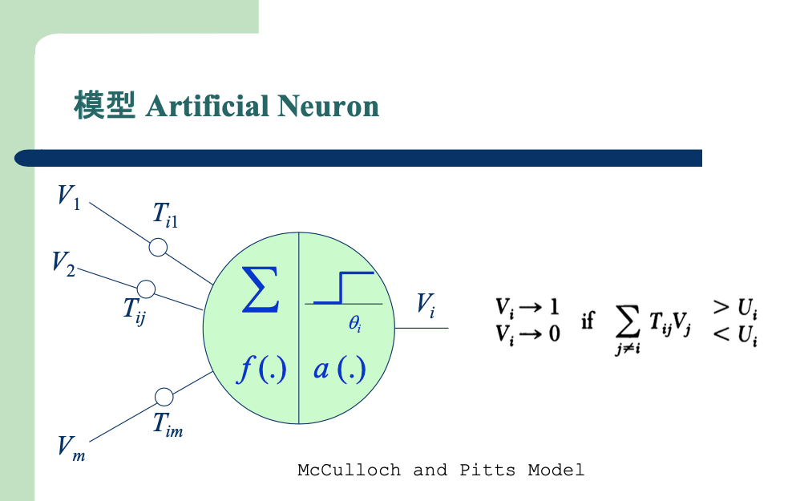

## 2.2 网络结构

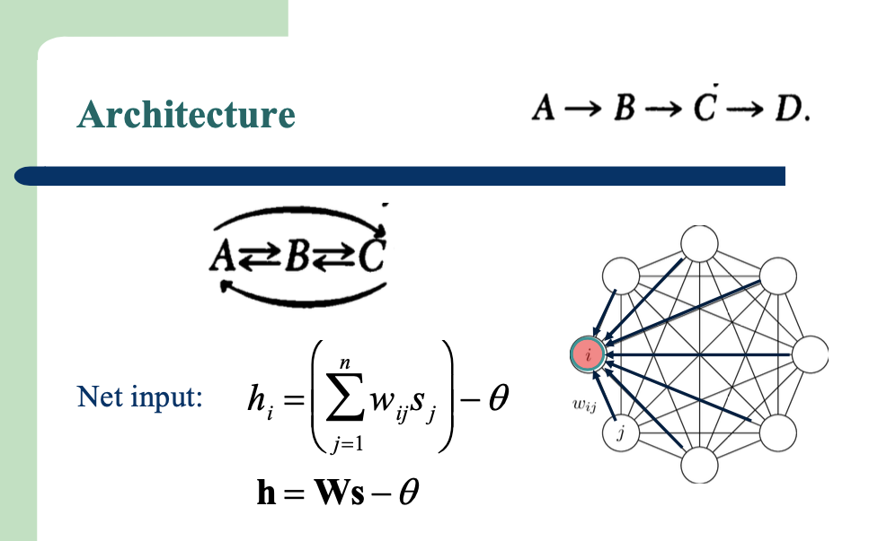

> 每两个神经元之间都有连接  
> $\theta = 0$

## 2.3 学习法则

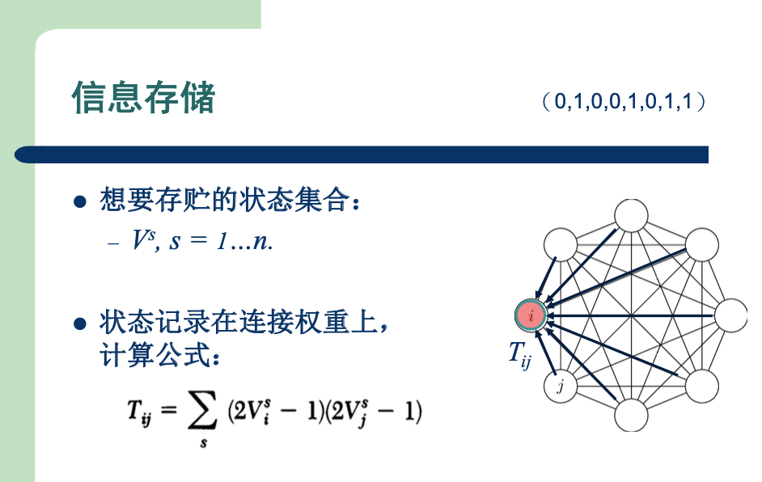

> - 例如我们要存储3个**模式**：
>    1. `(0, 1, 1, 0, 1, 1, 1, 0)`
>    2. (0, 1, 0, 0, 1, 0, 1, 0)
>    3. (1, 0, 1, 0, 0, 1, 1, 1)
> - 每个**模式**有8维，对应上图中的8个神经元

1. Hopfield网络的训练：
    - 用上图中的公式，直接计算出每条边的权重，训练就完成了。
2. 每条边的权重固定后，就可以计算Hopfield网络的能量：
    $$
    E = - \frac 1 2 \sum\limits_i \sum\limits_j T_{ij} V_i V_j
    $$

    

    
画出来大概是这样

    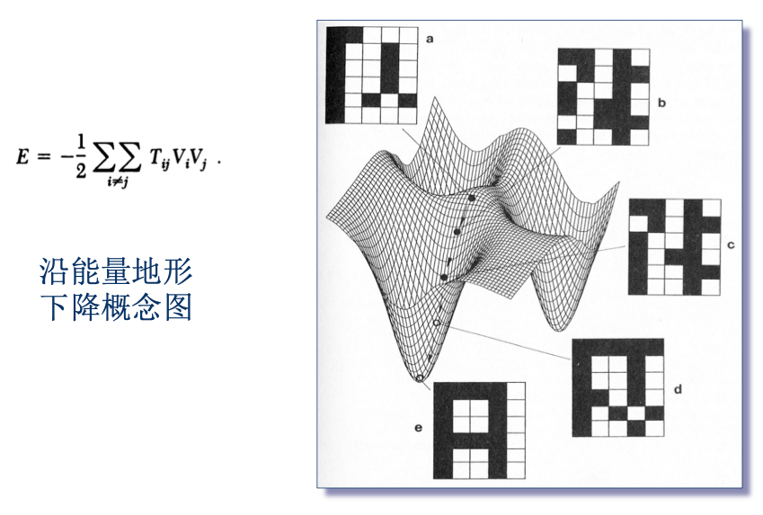

    

3. 如果某个神经元i的状态发生变化，对应的能量变化为：
    $$
    \Delta E = - \Delta V_i \sum\limits_{j \neq i} T_{ij} V_j
    $$

## 2.4 应用

还是对应这张图来理解：

1. 例如我随机输入一个模式：(0, 0, 0, 0, 1, 1, 1, 1)，可能对应上图中的点a
2. 随机选择一个神经元，利用其他神经元的状态，计算更新该神经元的状态
    - 例如选中第一个神经元，(`?`, 0, 0, 0, 1, 1, 1, 1)
    - 利用已有的权重、状态，就可以计算第一个神经元的状态
    - 假设计算结果为 (`1`, 0, 0, 0, 1, 1, 1, 1)，对应上图中的点b
3. 重复第二步，对应图中的c、d、e
    - 直到状态不再发生变化，对应图中的点e
    - 点e则对应我们已经存储好的某种**模式**，例如`(0, 1, 1, 0, 1, 1, 1, 0)`

**联想记忆**：随机输入了一个**模式**，**Hopfield网络**会返回之前已经见过的某种**模式**

#### 更多知识

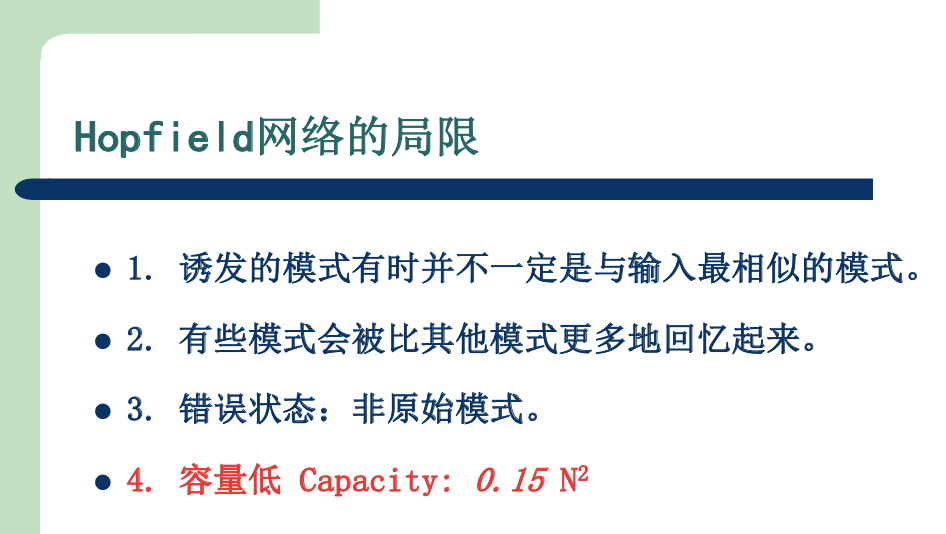

> `N`对应神经元的数量  
> 例如`N`=10，10个神经元组成的Hopfield网络大约能够存储15种**模式**

# 三、玻尔兹曼机

> 1985年，**Hinton**在**Hopfield网络**的基础上，提出了**玻尔兹曼机**

## 3.1 神经元

与**Hopfield网络**相同

## 3.2 网络结构

在**Hopfield网络**基础上，将神经元划分为两层：可见层、隐藏层
- 可见层：神经元与外部环境相连，用于接收输入数据（如图像的像素）和输出结果
- 隐藏层：神经元不与外部环境直接交互

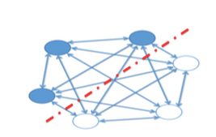

## 3.3 学习法则

### 3.3.1 最大似然估计

#### 1）每条数据的概率

1. 假设给定每条边的权重，即给定一组参数$w_{ij}$，就可以计算每个模式$x$对应的能量
    - 与**Hopfield网络**类似，$E(x) = - \sum\limits_{ij} w_{ij} x_i x_j$
    - 模式$x$是训练集中的一条数据。例如(1,0,0)，代表可见层每个神经元的状态，
2. 有了每个模式$x$对应的能量，就可以计算这个模式对应的概率
    - 玻尔兹曼分布：$P(E) = \frac {e^{-E/k T}} {Z(T)}$
    - 其中k是一个常数，$Z(T)$是归一化因子

        

        
详细解释

        1. 例如可见层共有3个神经元，可以组合出8中模式
            - (0,0,0)、(0,0,1)、(0,1,0)、(0,1,1)、(1,0,0)、(1,0,1)、(1,1,0)、(1,1,1)
        2. 每种模式，都可以计算出对应的能量
        3. 将它们汇总，即可得到
            $$
            Z(T) = \sum\limits_{all \ s} e^{-E(s) / T}
            $$

        

> 也就是说，给定一组参数$w_{ij}$，我们可以计算出数据集中，每条数据出现的概率

#### 2）整个数据集的概率

于是整个数据集的概率也可以计算了：

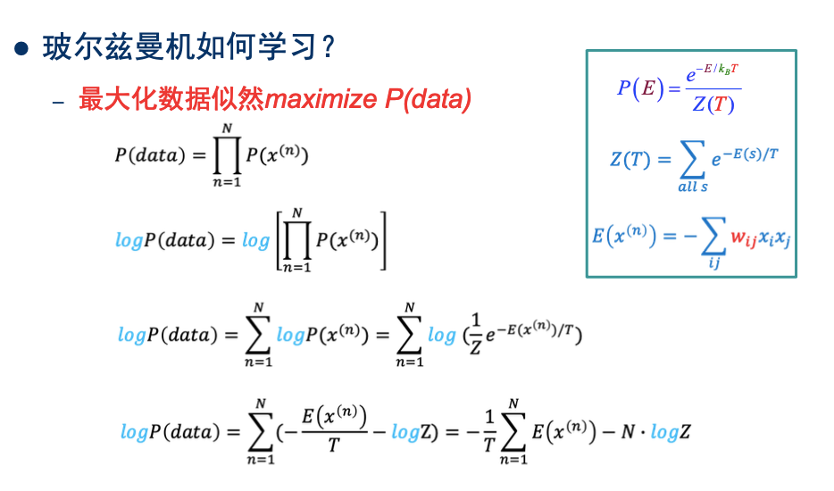

#### 3）最大似然估计

> 给定一组数据，我们就可以计算出在参数$w_{ij}$下，这组数据出现的概率。  
> 于是就可以用**最大似然估计**来估算最有可能的那组参数。

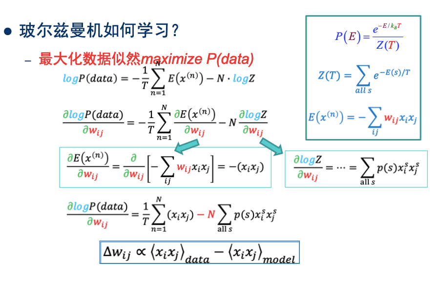

### 3.3.2 正相、负相

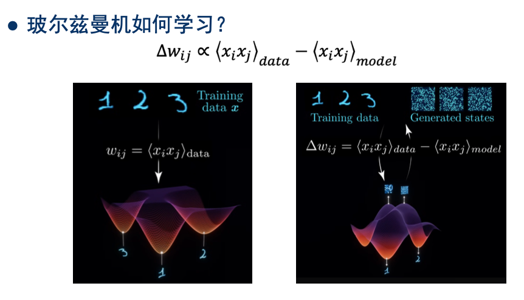

> 1. 第一项$<x_i x_j>_{data}$称之为**正相**
>    - 我们希望数据集中出现的数据，即真实数据，概率最大，对应上图中的能量最低。  
> 2. 第二项$<x_i x_j>_{model}$称之为**负相**
>    - 我们希望模型生成的数据，即虚拟数据，概率最小，对应上图中的能量最高。

### 3.3.3 MCMC

**负相**的计算比较复杂，例如前面介绍Z(T)时，3个神经元，就可以组合出$2^3$种模式。  
因此需要用**MCMC**来模拟

> 只知道有这么个概念，具体怎么模拟就不知道了…

# 四、受限玻尔兹曼机（Restricted Boltzmann Machine, RBM）

> **玻尔兹曼机**的训练极其困难且计算量巨大，1986年，**Hinton**又提出了**受限玻尔兹曼机**

## 4.1 网络结构

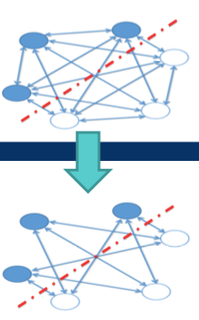
> - **层内无连接**：
>    1. 可见层的神经元互相之间没有连接  
>    2. 隐藏层的神经元互相之间没有连接  
> - **层间有连接**：可见层、隐藏层之间，有连接

## 4.2 学习法则

与**玻尔兹曼机**类似，只是这里将可见层、隐藏层区分开：

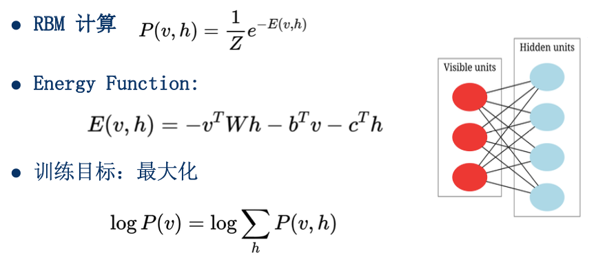

### 4.2.1 正相、负相

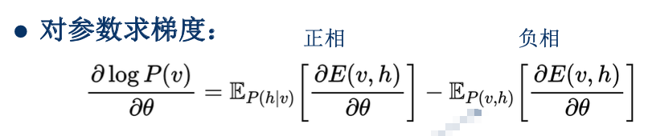

### 4.2.2 对比散度（Contrastive Divergence, CD）

> - **负相**的计算比较复杂
>    1. 拒绝采样法效率太低
>    2. MCMC代价也很大
>    - 2002年，**Hinton**提出了**对比散度**

1. 吉布斯采样，多次迭代后，它会收敛到一个平衡态。
    - 此时每次采样，可以被视为从`模型分布`中抽取的样本
2. 我们的训练目标，最大似然估计，等价于最小化`数据分布`与`模型分布`之间的KL散度
3. 也就是最小化`数据分布`与`吉布斯采样迭代n次后的分布`之间的KL散度
4. **Hinton**通过实验表明，n=1就可以取得很好的效果

于是我们计算**负相**部分时，干脆就用`吉布斯采样迭代1次后的分布`来代替`模型分布`

# 五、深度信念网络（Deep Belief Nets, DBN）

> 2006年，**Hinton**提出了**深度信念网络**  
> 在这之前，我们只是能训练`多层网络`，  
> **深度信念网络**的提出，证明`深度网络`也可以有效训练

## 5.1 预训练阶段

1. 先训练前两层，构成一个**RBM**
2. 接下来训练二、三层，构成一个**RBM**
3. 重复执行，直到所有层训练完

- 为整个网络找到一个良好的初始权重

## 5.2 微调

1. 判别式任务
    - 类似于现在的MLP模型
2. 生成式任务
    - 跟预训练阶段类似，只不过这次是更新所有层的权重

# 六、深度玻尔兹曼机（Deep Boltzmann Machine, DBM）

2009年，**Hinton**提出了**深度玻尔兹曼机**

> 所有层之间双向连接，整个模型一起训练
