# 机器学习基础

---

# 一、机器学习三要素

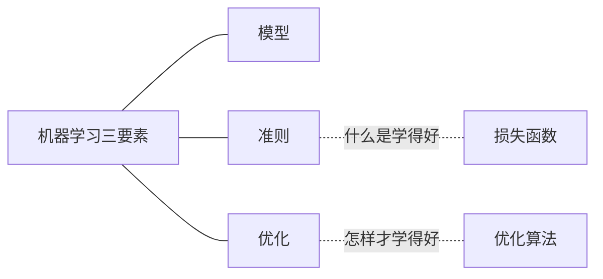

---

# 二、机器学习的三种范式

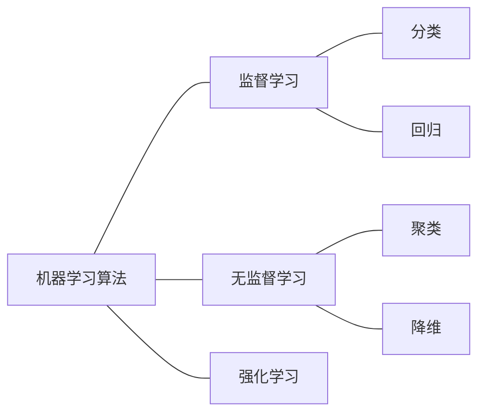

---

# 三、模型的评价指标

> 模型训练完，在测试集上评价。  
> 老师总结太全了！！

1. 通用指标

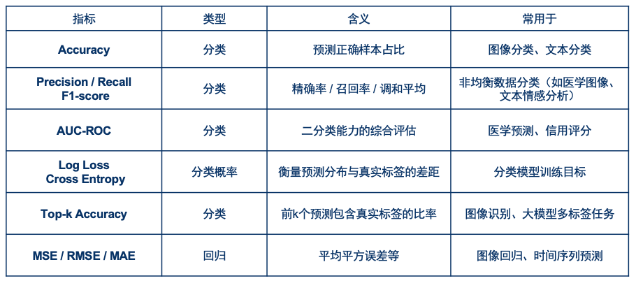

2. CV

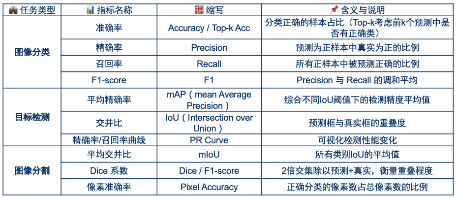
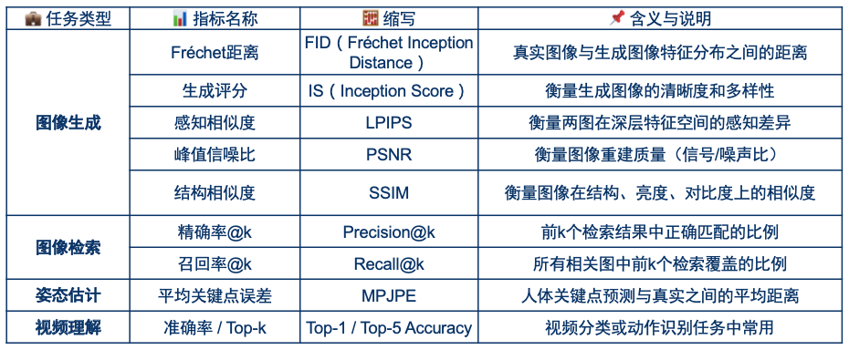

3. NLP

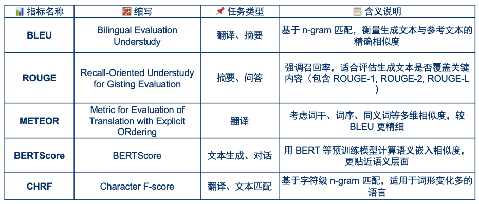
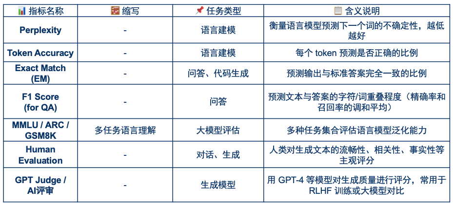

---

# 四、模型的泛化误差

训练阶段，我们的目标是`经验风险`最小化。可以帮助我们来拟合训练集。  
但我们真正关心的是`期望风险`，也就是`泛化误差`。  
让`泛化误差`来告诉我们，模型在未知数据上的预测能力

## 4.1 偏差-方差分解

1. 假设损失函数为`均方误差`，模型的泛化误差为：$E_{(x,y) \sim p(x,y)} [(y-f(x))^2]$
2. 由于存在噪声，令真实数据 $y = f^*(x) + \varepsilon$
- 于是：
    $$
    \begin{aligned}
    泛化误差 &= E_{(x,y) \sim p(x,y)} [(y-f(x))^2] \\
    &= E_{x \sim p(x)} [(f^*(x) + \varepsilon - f(x))^2] \\
    &= E[(f^*(x) - f(x))^2 + \varepsilon^2 + 2 (f^*(x) - f(x)) \varepsilon] \\
    &= E[(f^*(x) - f(x))^2] + E[\varepsilon^2] + E[2 ( \underbrace{f^*(x) - f(x)}_{训练数据的误差} ) \varepsilon] & \varepsilon则可以看作测试数据的噪声\\
    &= E[(f^*(x) - f(x))^2] + E[\varepsilon^2] + E[2 (f^*(x) - f(x))]E[\varepsilon] & 训练、测试相互独立 \\
    &= E[(f^*(x) - f(x))^2] + E[\varepsilon^2] & E[\varepsilon]=0 \\
    \end{aligned}
    $$
3. 上式中，$E[\varepsilon^2]$是由噪声带来的，无法消除。称为`不可约误差`

---

于是我们只需要观察前半部分：
> 为了推导更简练一点，符号做一些简化  
> 1. 真实值$f^*(x)，记为f^*$
> 2. 预测值$f(x)，记为f$
> 3. 预测值的期望$E[f(x)]，记为\tilde{f}$

$$
\begin{aligned}
E[(f^*(x) - f(x))^2] &= E[(f^* - f)^2] \\
&= E[(f^* - \tilde{f} + \tilde{f} - f)^2] \\
&= E[(f^* - \tilde{f})^2 + (\tilde{f} - f)^2 + 2(f^* - \tilde{f})(\tilde{f} - f)]
\end{aligned}
$$

1. 第一部分 $E[(f^* - \tilde{f})^2] = (f^* - \tilde{f})^2$
    - $(真实值-平均预测值)^2$。也就是`偏差`的平方
2. 第二部分 $E[(\tilde{f} - f)^2]$
    - $E[(平均预测值 - 预测值)^2]$。正好是`方差`的计算公式
3. 第三部分
    $$
    \begin{aligned}
    E[2(f^* - \tilde{f})(\tilde{f} - f)] &= 2E[(f^* - \tilde{f})]E[(\tilde{f} - f)] \\
    &= 2(f^* - \tilde{f}) E[(\tilde{f} - f)] \\
    &= 2(f^* - \tilde{f}) [\tilde{f} - E(f)] \\
    &= 2(f^* - \tilde{f}) [\tilde{f} - \tilde{f}] \\
    &= 0
    \end{aligned}
    $$

#### 结论：泛化误差 =  `偏差²` + `方差` + `不可约误差`

## 4.2 模型选择

结合这张图来加深一下理解：

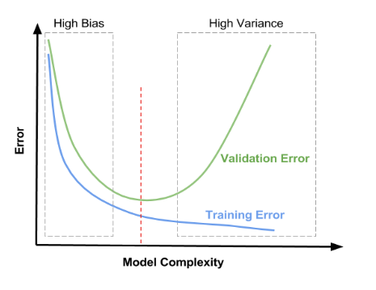
> 1. 模型比较简单的时候，例如决策树深度只有1
>    - 对于某个样本，以及该点附近的很多样本，预测值距离真实值一定很远。
>    - 也就是`平均预测值`与`真实值`相差很大，即`偏差`较大
>    - 此时的`泛化误差`，主要是由`偏差`引起的
> 2. 模型比较复杂的时候，例如完全生长的决策树
>    - 对训练集拟合的很好。但是对噪声很敏感。
>    - 在测试集上，即使测试样本距离某个训练样本很近，它们的预测值也可能有很大差异。
>    - 也就是`预测值`与`平均预测值`相差很大，即`方差`较大
>    - 此时的`泛化误差`，主要是由`方差`引起的

## 4.3 交叉验证

数据集有限的情况下（单独划分验证集，验证集会非常小），  
怎么利用上述曲线来选择模型呢？  

**交叉验证**

## 4.4 PAC理论

如果我们希望`经验风险`尽量接近于`期望风险`（即`泛化误差`），至少需要准备多少样本呢？  
**PAC理论**告诉我们答案：

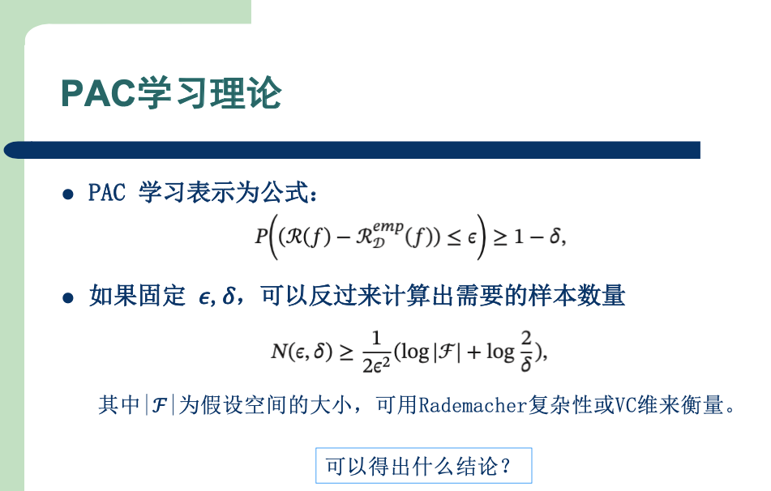

## 4.5 VC维

#### 1) 定义

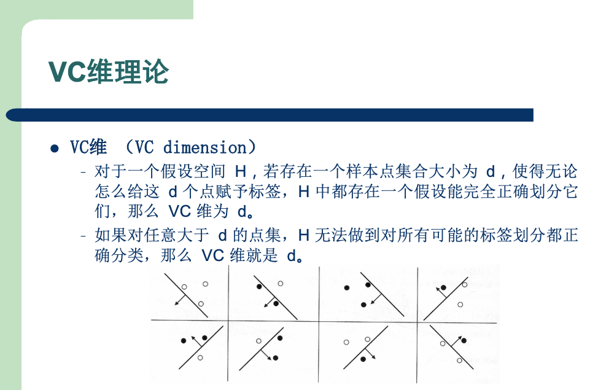

#### 2）示例

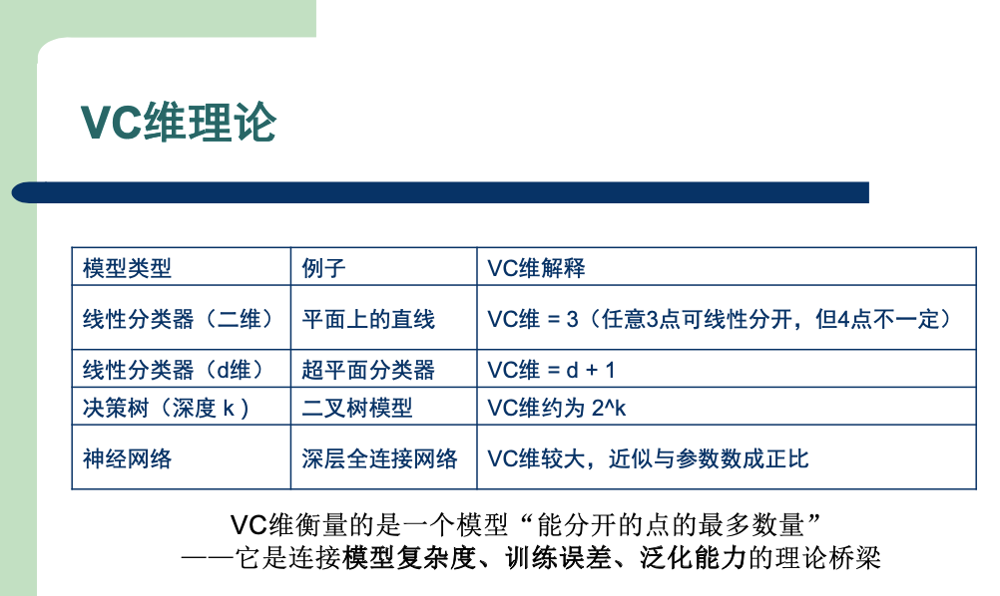
