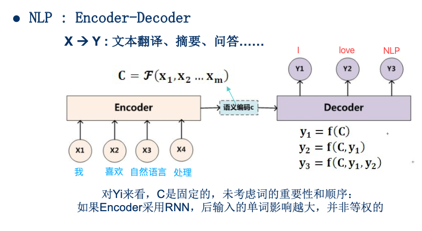
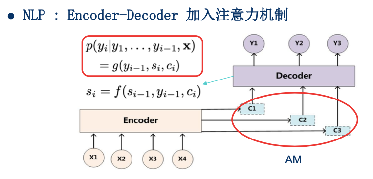
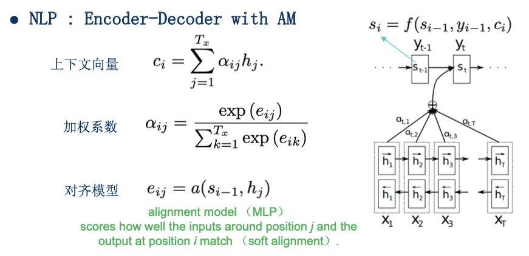
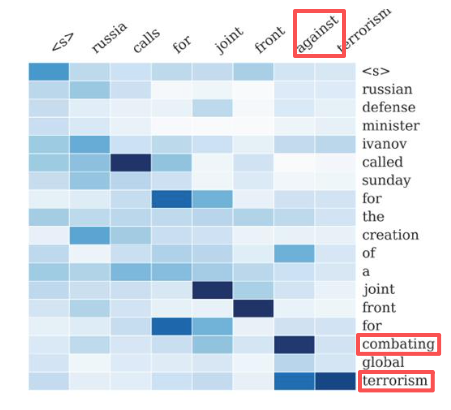
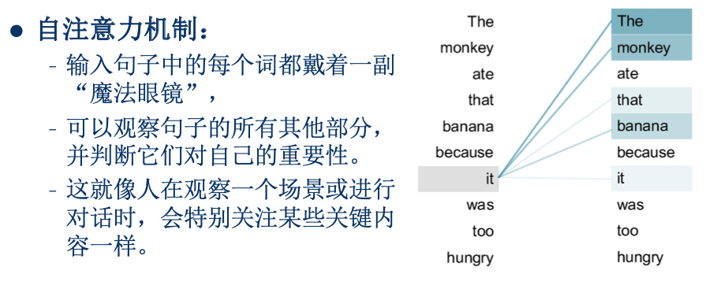

# 注意力机制

# 一、Encoder-Decoder架构

> 以文本翻译为例：
> 1. 输入一句话“我喜欢自然语言处理”，经过**Encoder**编码成一个向量`语义编码c`
>    - 类似于我们在脑海中，明白了这句话的意思
> 2. 使用**Decoder**来翻译成英语
>    1. 使用`语义编码c`，生成第一个单词`I`
>    2. 使用`语义编码c + I`，生成第二个单词`love`
>    3. 使用`语义编码c + I + love`，生成下一个单词`NLP`

- 存在的问题：
    - 生成每个单词$y_i$时，都是使用同一个`语义编码c`
    - 而我们翻译的时候，可能需要关注原始语句中的不同词汇
        - 例如生成第二个单词`love`时，更关注输入中的第二个词`喜欢`。

# 二、注意力机制

> **解决办法**：生成每个单词$y_i$时，使用不同的`c1`、`c2`、`c3`

详细流程

**结合这张示意图来理解**：

> 已知`t-1`时刻，对应的隐藏状态$s_{t-1}$，我们来看看如何计算$s_t$，并在此基础上预测$y_t$  
> 左侧的数学公式中，下标使用的`i-1`，一样的意思。

1. 计算$c_i$
    1. $e_{ij} = a(s_{i-1}, h_j)$
        - 隐藏状态$s_{i-1}$ 与**Encoder**中每个隐藏状态$h_j$做对齐，计算出相应分值$e_{ij}$
        - 例如 两个向量直接做点积
    2. 加权系数$\alpha_{ij}$
        - 对$e_{ij}$做softmax，转化成概率分布
        - 这里的$\alpha_{ij}$，就是所谓的`注意力`
    3. 对**Encoder**中每个隐藏状态$h_j$加权求和，计算$c_i$
2. $s_i = f(s_{i-1}, y_{i-1}, c_i)$
    - 有了$c_i$后，就可以计算$s_i$
3. $p(y_i) = g(y_{i-1}, s_i, c_i)$
    - 利用$y_{i-1}、s_i、c_i$，预测$y_i$

老师还给了两个具体示例，这里介绍一下第二个。

文本摘要

> 摘要中生成单词`against`时，  
> 更关注原始输入中的`combating`、`terrorism`两个单词

---

# 三、自注意力机制

> 如果输入、输出相同，就变成了**自注意力**  
> 例如上图中的单词`it`，判断句子中的其他部分，哪些对自己更重要