# 生成式模型

# 一、生成式模型的框架

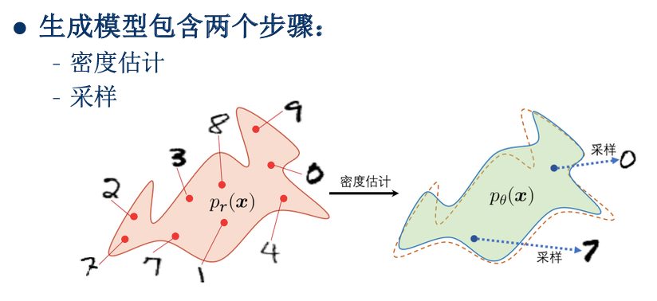

## 1.1 密度估计

- 两种方式：
    1. 直接建模数据的总体分布$p(x)$，或者联合分布$p(x,y)$
        - 例如**朴素贝叶斯方法**，建模$p(x,y)$
    2. 直接建模$p(x)$比较困难，引入`隐变量z`来简化模型，建模$p(x,z)$
        - 再通过公式$p(x,z) = p(z) p(x|z)$，将问题转化为建模$p(z)$、$p(x|z)$
        - 例如**高斯判别模型**

## 1.2 采样（样本生成）

- 对应**密度估计**的两种形式，有两种采样方式：
    1. 给定一个概率密度函数$p(x)$，我们就可以直接采样
    2. 先从$p(z)$采样，得到样本$z$；然后从$p(x|z)$采样，得到样本$x$

# 二、自编码器（Autoencoder，AE）

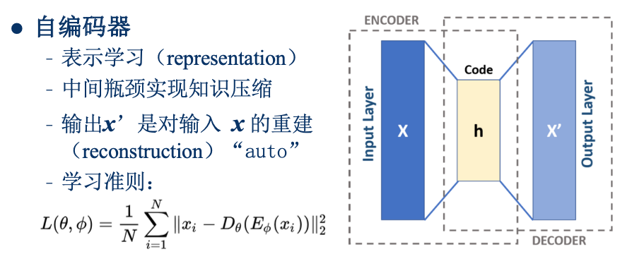

> 给定输入$x$，我们先经过`encoder`，将$x$编码成一个低维向量$h$；  
> 然后再使用`decoder`，将$h$还原为$x'$。  

类似于我们读一句话，或者看一篇文章$x$，  
在脑海中明白了它的意思$h$；  
然后尝试把它复述出来$x'$。  

#### 使用低维向量$h$来表示原始的输入$x$，实现了一种信息压缩

示意图

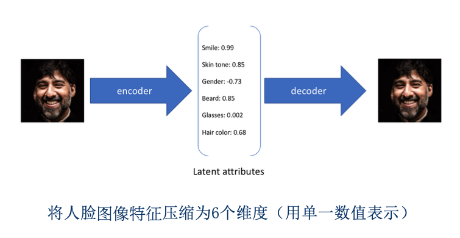

---

# 三、变分自编码器（Variational Autoencoder，VAE）

## 3.1 基本思想

如何利用**AE**来做生成呢？

1. `encoder`的输出，不再是具体数值$h$，而是一个概率分布$z$
    

    
示意图

    
    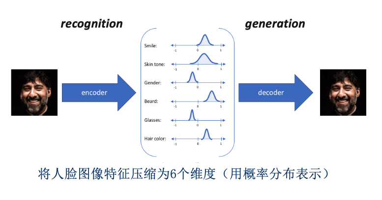

    

2. 从分布$z$中采样出一组数值$h$，然后再用`decoder`去还原
    

    
示意图

    
    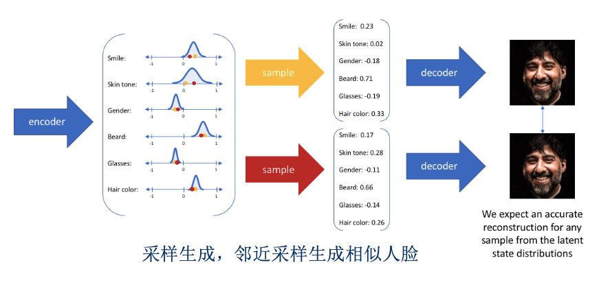

    

## 3.2 模型结构

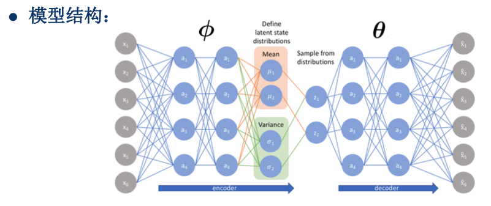

## 3.3 目标函数

1. 对于每个输入$x$，我们也希望模型输出$x$的概率最大，即$p(x)$最大
    - 直接优化比较困难，所以我们找了$\log p(x)$的一个下界：**证据下界**(ELBO)
    - 简化训练目标：$最大化p(x) \Rightarrow 最大化\log p(x) \Rightarrow $ `近似于`最大化ELBO

        

        
ELBO详细推导

        
        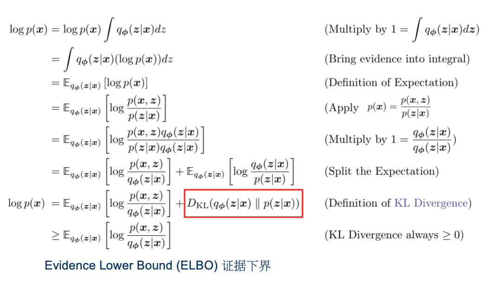

        

2. 怎么来理解ELBO呢？
    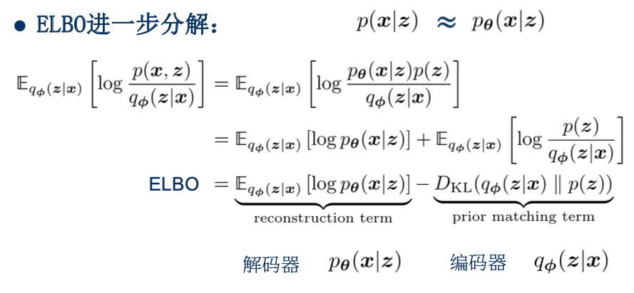
    - **第一项**，是解码器的任务：给定$z$，我们希望$p_{\theta}(x|z)$最大
    - **第二项**，是编码器的任务：先验分布$p(z)$与编码器预测的后验分布$q_{\phi}(z|x)$，差异最小
3. 蒙特卡洛近似
    - **第一项**中，求期望的操作，只能近似计算（多次采样后求平均）。
    - 即：$E_{q_\phi(z|x)} [log p_\theta] = \frac 1 L \sum\limits_{l=1}^L [log p_\theta]$
4. 进一步简化
    1. 假设先验分布$p(z) = \mathcal{N}(z; 0, I)$，后验分布$q_{\phi}(z|x) = \mathcal{N}(z; \mu_{\phi}(x), \sigma_{\phi}^2(x))$
        - 均服从高斯分布
        - 那么**第二项**可以这样来计算：$KL \left[ \mathcal{N}(\mu_{\phi}, \sigma_{\phi}^2), \mathcal{N}(0, I) \right]$
    2. 假设$p_{\theta}(x|z) = \mathcal{N}(x; \mu_{\theta}(z), \lambda I)$
        - **第一项**中的$\log p_{\theta} (x|z)$就可以写为：$- \frac 1 {2\sigma^2} ||x-\mu_{\theta}||^2$ + `常数`
5. 经过一系列化简后，目标函数就可以写为：
    $$
    \mathcal{L}(\phi,\theta|D) = - \frac 1 2 ||x-\mu_{\theta}||^2 - \beta KL \left[ \mathcal{N}(\mu_{\phi}, \sigma_{\phi}^2), \mathcal{N}(0, I) \right]
    $$

## 3.4 再参数化（reparameterization）

> 训练过程中，涉及到采样操作：
>    1. 输入$x$，经过`encoder`后，预测出$\mu_{\phi}、\sigma_{\phi}$
>    2. 采样出$z \sim \mathcal{N}(\mu_{\phi}, \sigma_{\phi}^2)$
>        - `这步采样操作是没办法计算梯度的`

- 怎么办呢？可以这样来计算$z$
    1. 采样$\epsilon \sim \mathcal{N}(0, I)$
    2. 然后通过这个公式来计算$z$：$z = \mu_{\phi} + \sigma_{\phi} \odot \epsilon$
    - `这样就可以计算梯度了`

示意图

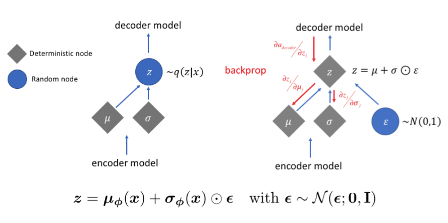

---

# 四、扩散模型

## 4.1 VAE --> MHAVE

在<b>VAE</b>基础上，进一步扩展

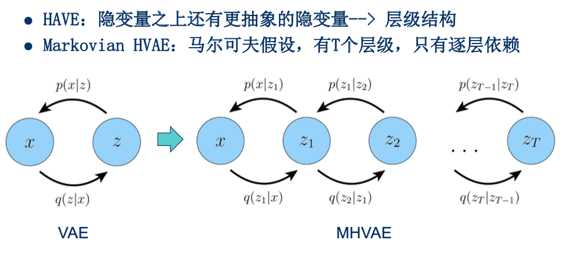

## 4.2 MHAVE --> VDM

在<b>MHAVE</b>基础上，添加约束

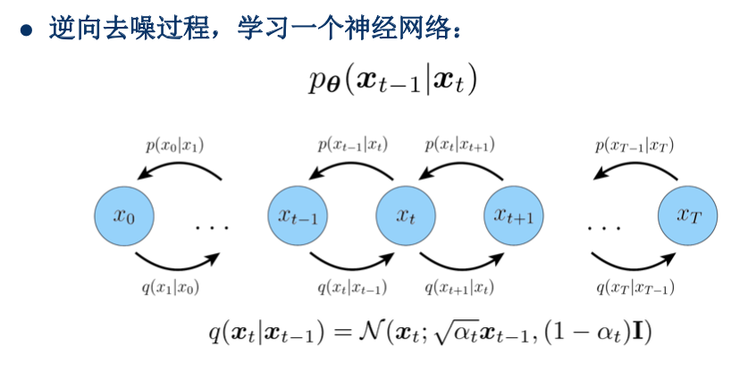
> 1. 潜在空间的维度与数据的维度完全相同
> 2. 每个时间步的`潜在encoder输出`不再用模型来拟合，而是预定义好的高斯分布
>    - 只训练`decoder`

- 怎么来理解呢？
    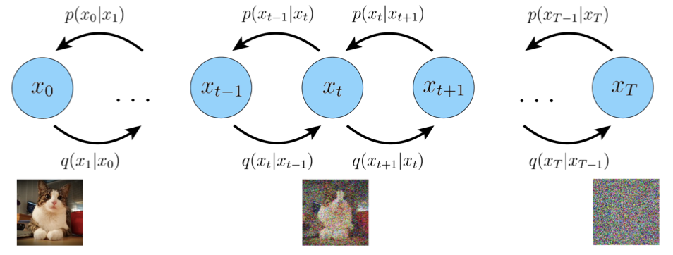
    > 1. 一张图片随着时间迁移，会越来越模糊
    >    - 相当于每过一个时间步，就添加一个高斯噪声。
    > 2. 模型的任务，则是通过`decoder`来一步步降噪

## 4.3 DDPM

> **VDM**的具体实现

## 4.4 DDPM --> DDIM

> 听不懂，看不懂...  
> 需要理解**DDPM**完整的推导过程，才能理解**DDIM**吧

## 4.5 LDM（Latent Diffusion Models）

**DDPM的问题**：在原始的图像空间扩散，计算loss，算力要求高。  
**LDM**：先使用**VAE**的`encoder`降维，转换到`Latent`空间，再去扩散。

# 五、GAN

**艾老师**的[GAN网络](计算机视觉/基于神经网络的计算机视觉技术/GAN网络.md)这堂课详细介绍了。