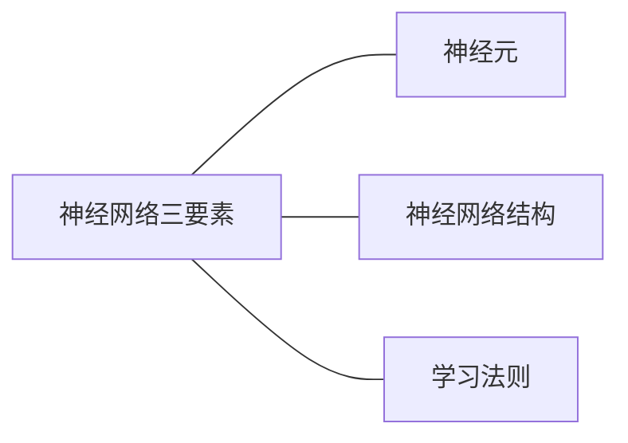
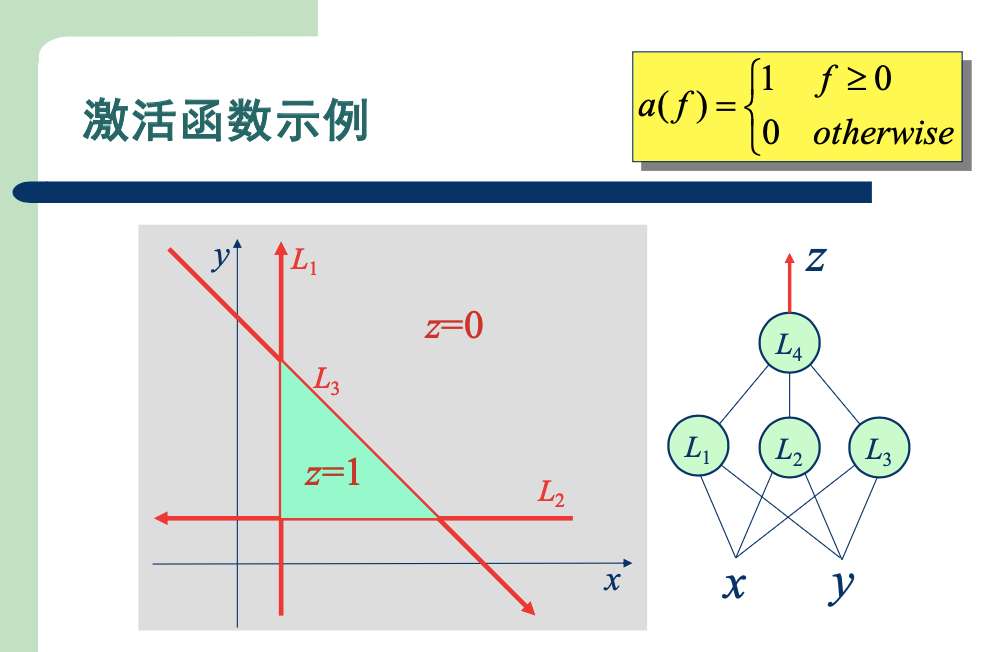
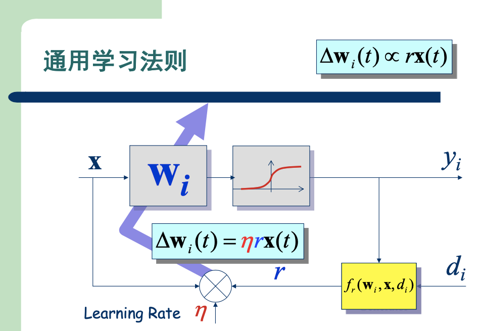
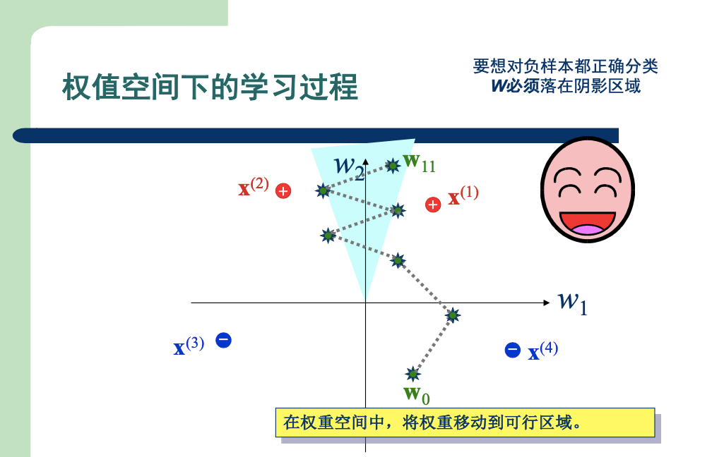
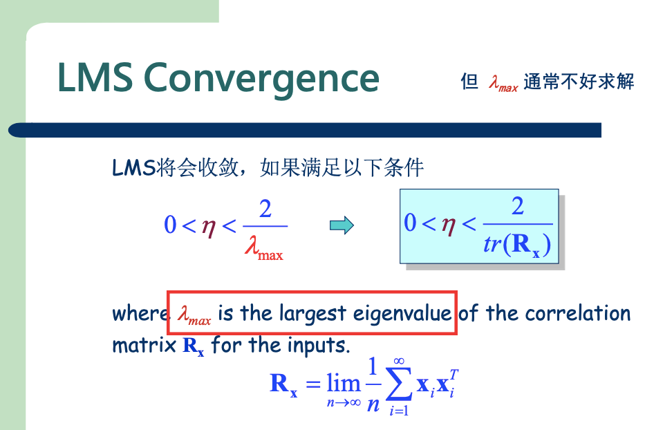
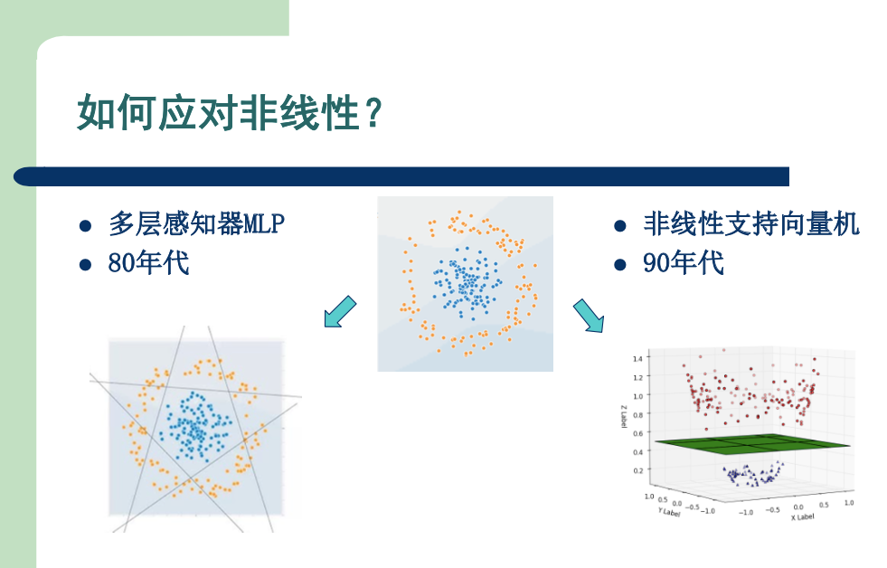

# 神经网络基础

# 一、神经网络三要素

## 1.1 神经元

重点介绍了**激活函数**

### 1.1.1 示例

> 在$L_1、L_2、L_3$使用了简单的`阶跃函数`  
> 图中右方的网络模型，就可以挑选出左方高亮的三角区域

### 1.1.2 常见激活函数

> 需要自己遇到，慢慢总结了

## 1.2 神经网络结构

1. 前馈型网络
2. 反馈型网络
3. 图神经网络

## 1.3 学习法则

> - $y_i$是模型预测结果，$d_i$是真实标签
> - $r = f_r(w_i, x, d_i)$，可以理解为损失函数
> - 第一次看这张图有点懵，为什么 $\Delta W = \eta$ * `损失函数值` * `输入X`?
>    - 因为这时候还没有介绍到**梯度下降法**，这里更符合**感知器**的学习法则
>    - 下节课老师会逐步介绍 学习法则的发展历史

# 二、感知器（Perceptron）

## 2.1 感知器介绍

> 略

## 2.2 学习法则

### 2.2.1 公式

$$
\Delta W = \eta \cdot r \cdot X
$$

### 2.2.2 动态演示

#### 1) 输入空间下

1. 将训练数据$X$当作空间中的点
2. 将权重$W$当作空间中的向量
- 每次迭代，调整`向量W`的朝向

#### 2) 权重空间下

1. 将训练数据$X$当作空间中的向量
2. 将权重$W$当作空间中的点
- 每次迭代，调整`点W`的位置

### 2.2.3 收敛性

#### 如果数据集`线性可分`，那么学习过程将在有限步骤内收敛

可以从这张图来感受一下：

> 数据集`线性可分`，也就是权重空间中存在这样的`可行区域`。  
> 随着一步步迭代，`可行区域`越来越“宽”，而步长是一定的。
> - `点W`最终会落在这个区域

# 三、Adaline

> 第一个将梯度下降法引入到神经网络模型

## 3.1 学习法则

$$
\Delta W = \eta \cdot \nabla f
$$

## 3.2 收敛性

#### 个人理解

> Adaline训练过程其实就是 训练一个线性回归模型

# 四、逻辑回归

> 最后介绍的$\delta-$学习法则，听起来就是逻辑回归模型  
> 老师是从学习法则的角度，依次介绍：
> 1. 感知器的学习法则
> 2. Adaline的学习法则
> 3. 逻辑回归模型的学习法则

# 五、MLP & SVM

> 之前介绍的模型只能处理线性可分数据集，如何应对非线性？

这张图挺直观的：

