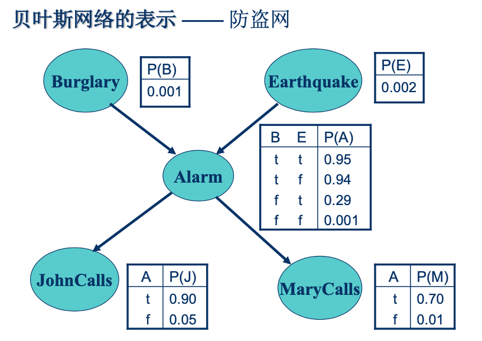
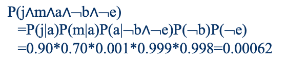
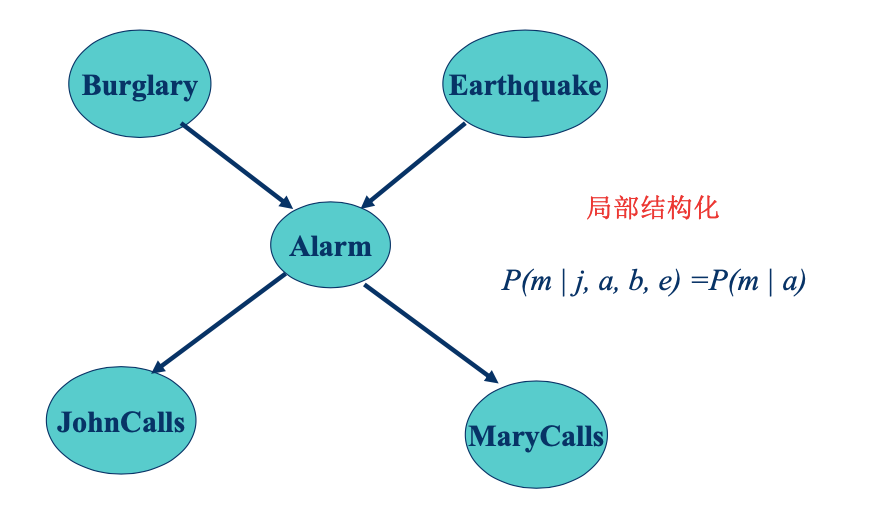
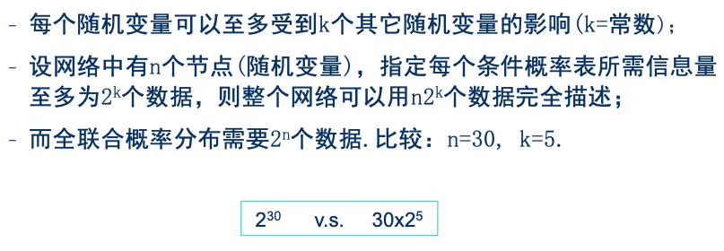
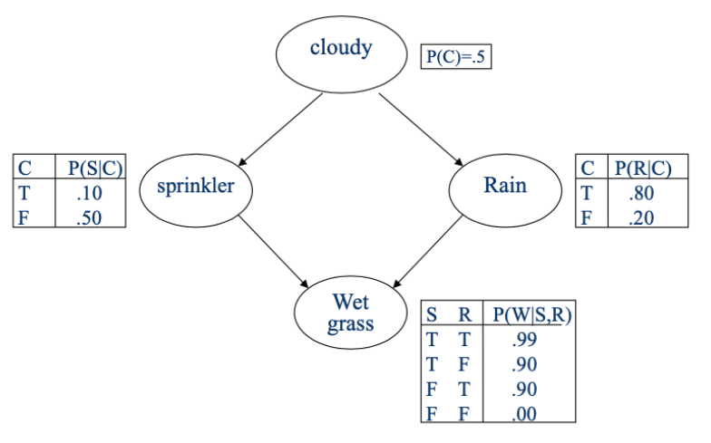
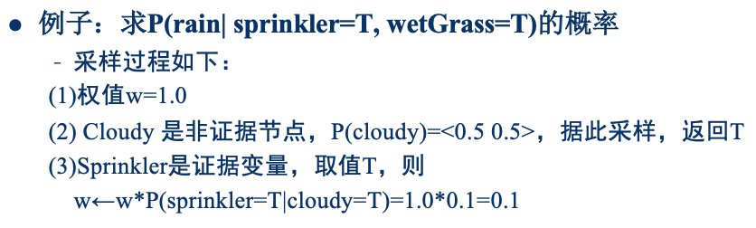
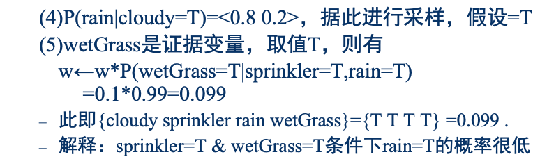
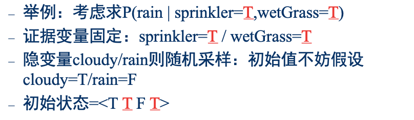
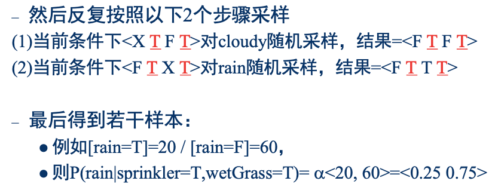

# 概率推理

# 一、回顾

> 概率论的一些基础，以及**朴素贝叶斯**

# 二、贝叶斯网络

> 提供了联合概率分布的`紧凑`表示

## 2.1 贝叶斯网络的语义

示例

## 2.2 局部结构化

示例

## 2.3 推理

### 2.3.1 精确推理

例如我们需要计算: $P(b|j,¬m)$

$$
\begin{aligned}
P(b|j,¬m) =& \alpha P(b|j,¬m) & \alpha是缩放因子，做归一化 \\
=& \alpha \sum\limits_{E} \sum\limits_{A} P(b,E,A,j,¬m) & 计算所有可能的E、A \\
=& \alpha \sum\limits_{E} \sum\limits_{A} P(b)P(E)P(A|b,E)P(j|A)P(¬m|A) & 按照贝叶斯网络展开 \\
=& \alpha P(b) \sum\limits_{E} \sum\limits_{A} P(E)P(A|b,E)P(j|A)P(¬m|A) \\
=& \alpha P(b) \cdot P(e)P(a|b,e)P(j|a)P(¬m|a) & e, a\\
&+ \alpha P(b) \cdot P(e)P(¬a|b,e)P(j|¬a)P(¬m|¬a) & e, ¬a \\
&+ \alpha P(b) \cdot P(¬e)P(a|b,¬e)P(j|a)P(¬m|a) & ¬e, a \\
&+ \alpha P(b) \cdot P(¬e)P(¬a|b,¬e)P(j|¬a)P(¬m|¬a) & ¬e, ¬a \\
=& \alpha \cdot 0.0002568
\end{aligned}
$$

同样，可以计算出: $P(¬b|j,¬m) = \alpha \cdot 0.0499$

**归一化**： $P(b|j,¬m) = \alpha <0.0003, 0.0499> = <0.006,0.994>$

#### 更多知识

计算过程中，可以使用**变量消元法**，避免一些重复、或者冗余计算，从而加速。

### 2.3.2 近似推理

如果是**多连通网络**，精确推理的复杂度很高。  
因此需要寻找**近似算法**

<b>多连通网络</b>示例

> 如何**近似**呢？ --- **采样**

#### 2.3.2.1 直接采样

**1) 拒绝采样算法**

1. 依据已知概率来生成样本
2. 拒绝采样算法
    1. 例如第一步采样了100个样本
        - 73个为`XFXX`，27个为`XTXX`
    2. 当我们计算P(Rain|Sprinkler=T)时，只需关注这27个`XTXX`
        - 8个`XTTX`，19个`XTFX`
    3. 于是
$$
\begin{aligned}
    P(Rain|Sprinkler=T) &= \alpha <8, 19> \\
    &= <0.296, 0.704>
\end{aligned}
$$

**2) 似然加权算法**

> 只采样`XTXT`的样本，并给每个样本分配相应权重

#### 2.3.2.2 马尔科夫链采样

