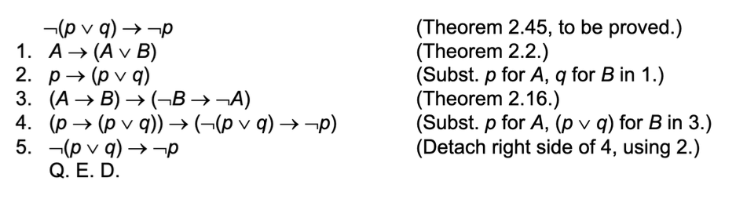
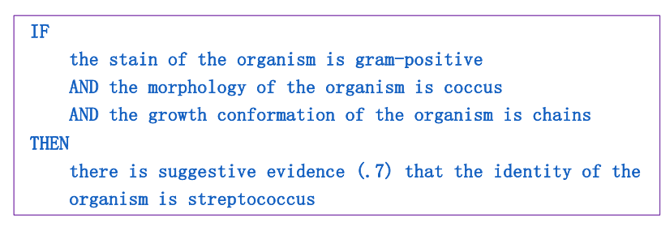

# 逻辑推理

介绍了几个基于符号表示的推理

# 一、基于逻辑表示的推理

## 1.1 Logic Theorist

> 使用逻辑符号(如命题逻辑公式)表示数学命题和推理规则。

示例

## 1.2 SHRDLU

## 1.3 wumpus世界

> 略

# 二、 基于产生式系统的推理

## MYCIN

> 使用(IF-THEN)来表示知识， 并通过匹配和执行规则进行推理。

示例

