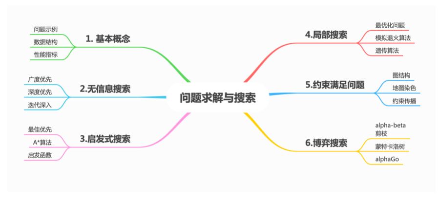

# 搜索

<b>课程大纲</b>

1. [基本概念](人工智能原理/搜索/基本概念.md)
2. [无信息搜索](人工智能原理/搜索/无信息搜索.md)
3. [启发式搜索](人工智能原理/搜索/启发式搜索.md)
4. [局部搜索](人工智能原理/搜索/局部搜索.md)
5. [约束满足问题](人工智能原理/搜索/约束满足问题.md)
6. [博弈搜索](人工智能原理/搜索/博弈搜索.md)
