# 博弈搜索

# 一、Minimax算法

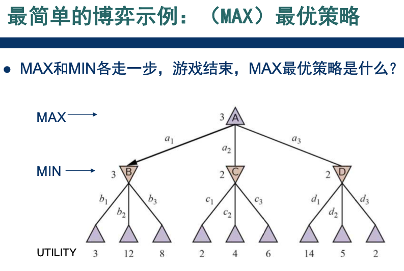
> 已知MIN会选择最小值  
> MAX怎么选才能拿到最大值？

- 遍历搜索，复杂度为$O(b^m)$
    - $b$为分支数，$m$为树的深度

# 二、$\alpha-\beta$ 剪枝

## 2.1 剪枝示意图

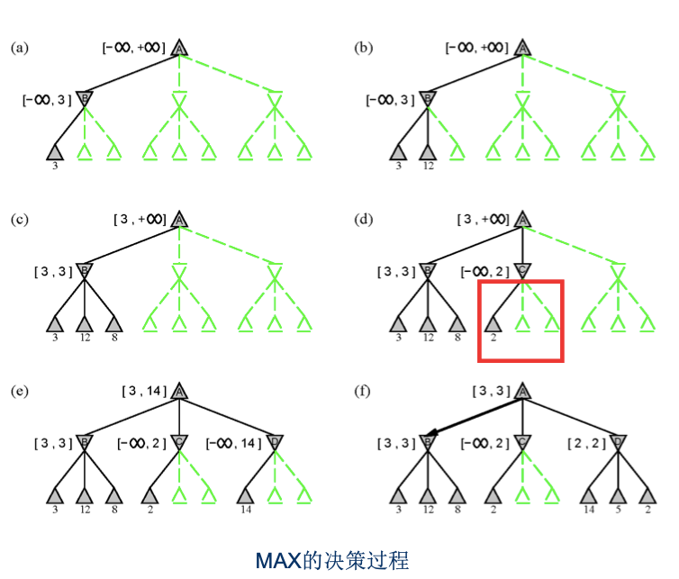

#### 更多知识

1. 通过维护$(\alpha, \beta)$，来剪枝
2. 剪枝的效率很大程度上，取决于**后继的顺序**
    - 例如上图中，最后一个MIN节点。如果子节点顺序为[2,5,14]，也可以剪枝。

## 2.2 引入 启发式

> 即使$\alpha-\beta$剪枝，也搜索不完，怎么办？

<details>
<summary>两种策略</summary>

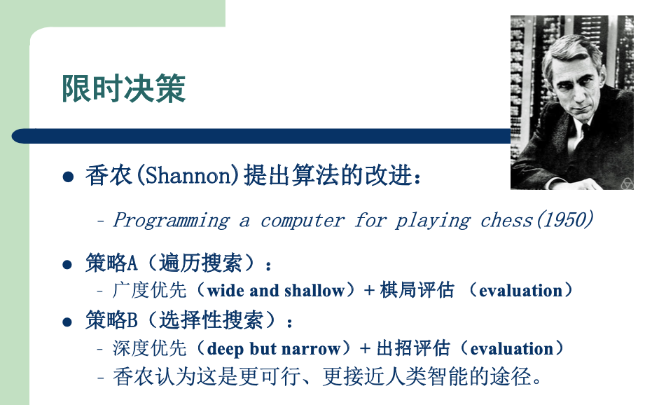

</details>

### 2.2.1 策略A：限制树的深度

例如我只搜索到第7层。  
1. 如果棋局已经结束，当然可以知道真实得分
2. 如果棋局未结束，用一个**评估函数**，来估算得分。当作最终对局结束的分值

### 2.2.2 策略B：只考虑少数分支

例如我们下象棋，开局几步总是优先考虑`车`、`马`、`炮`，没必要考虑所有情况。

# 三、蒙特卡洛树搜索

> ```mermaid
> graph LR
>     MCTS & UCB1 --- UCT
> ```

## 3.1 MCTS

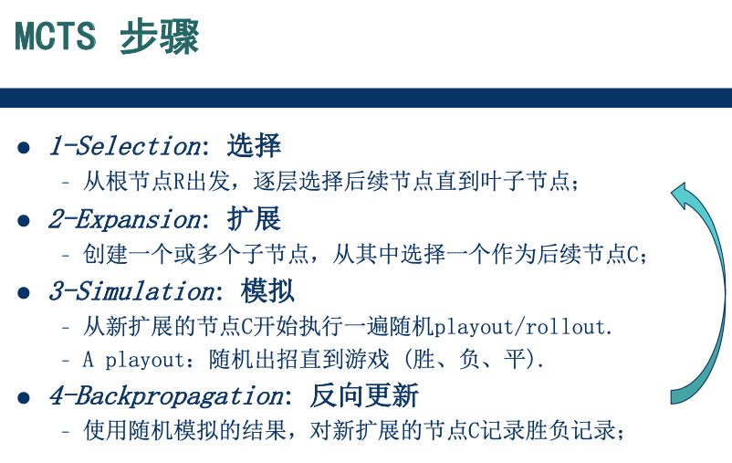

## 3.2 上置信界算法UCB1

> 随机模拟，效率较低  
> 需要引导博弈树去探索更有可能取胜的分支  
> 于是介绍了一下**UCB1**  
> ~~作业里要自己实现的，这里就不详细记了~~

## 3.3 UCT

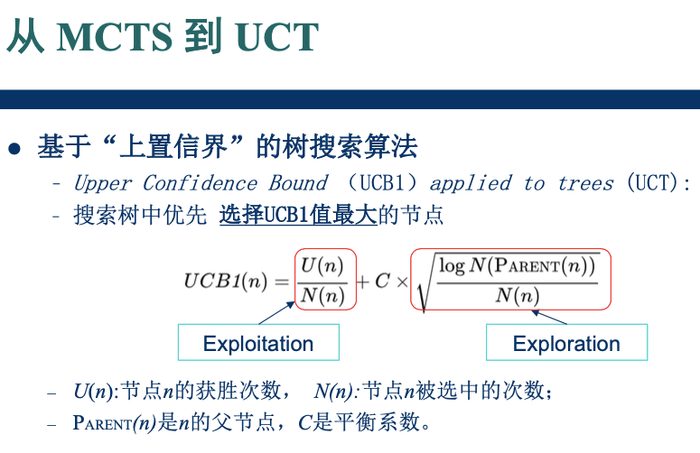

## 3.4 详细流程

<details>
<summary>1. 选择</summary>

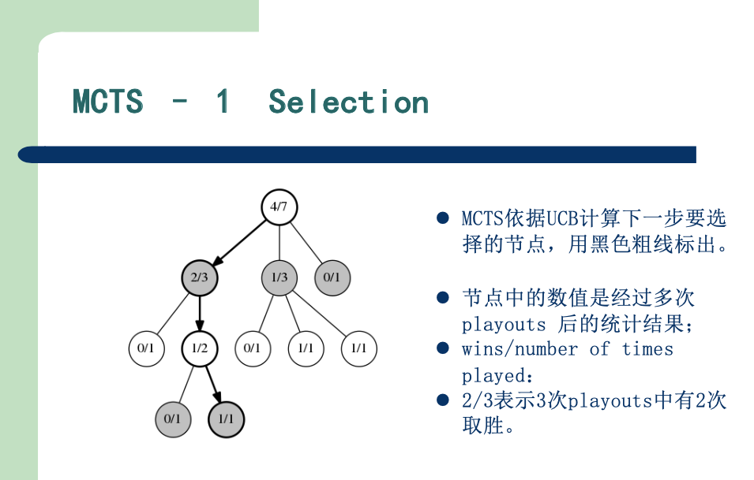

</details>

<details>
<summary>2. 扩展</summary>

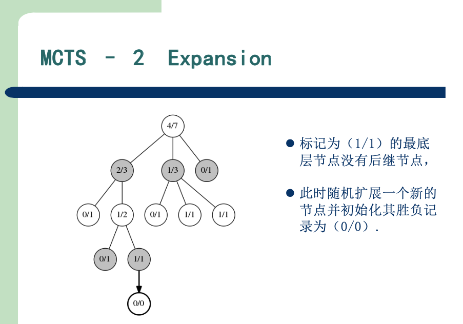

</details>

<details>
<summary>3. 模拟</summary>

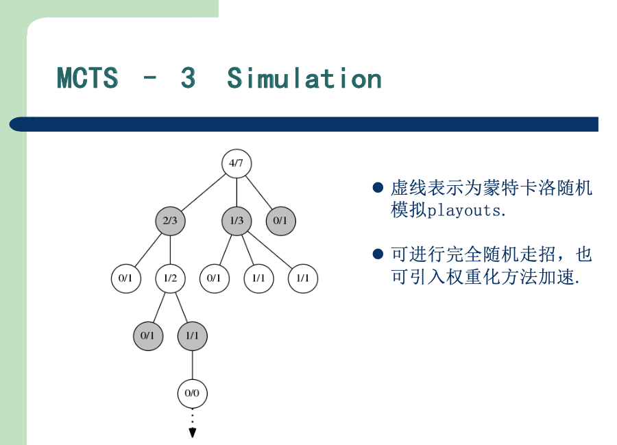

</details>

<details>
<summary>4. 更新</summary>

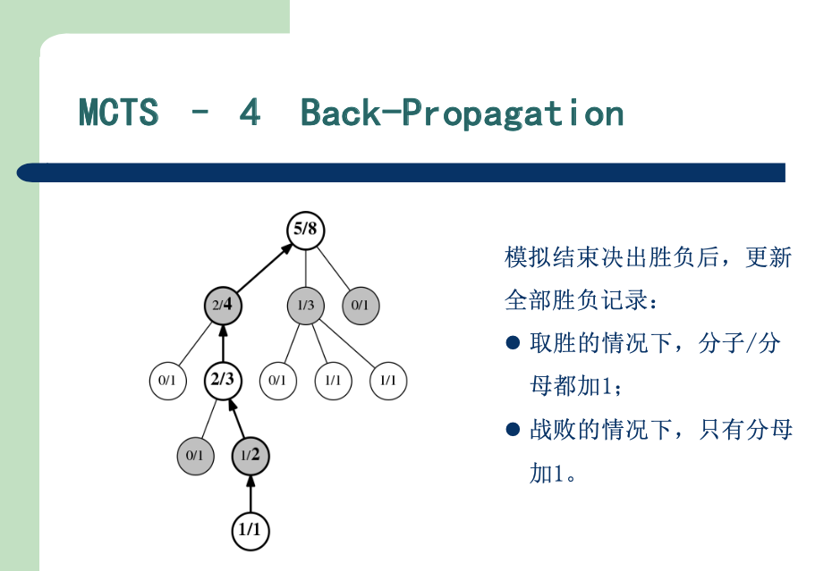

</details>

---

> 最后这部分很难  
> 可以学完**强化学习**课程，了解一些基本概念后，再来回顾

# 四、AlphaGo

## 4.1 几个网络

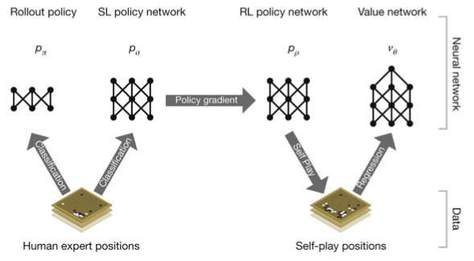

- 首先训练好这4个网络：
    1. 通过监督学习，训练两个网络 $p_\pi、p_\sigma$
    2. 通过强化学习，在$p_\sigma$基础上，训练$p_\rho$
    3. 训练$v_\theta$
        1. 有了$p_\rho$，通过自我对局生成数据集
        2. 然后通过监督学习，训练$v_\theta$

## 4.2 AlphaGo中的启发式

通过`策略网络`和`价值网络`改进 **MCTS**

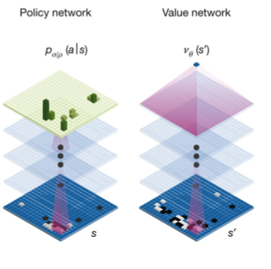

> 1. `策略网络` $p_\sigma$
>    - 对应**策略B**，鼓励我们去探索少数分支
> 2. `价值网络` $v_\theta$
>    - 对应**策略A**，探索到一定深度，我们评估一下最终得分，直接返回

## 4.3 MCTS --> AlphaGo

我们来具体看看**AlphaGo**中，这4步是怎么做的。

<details>
<summary>1. 选择</summary>

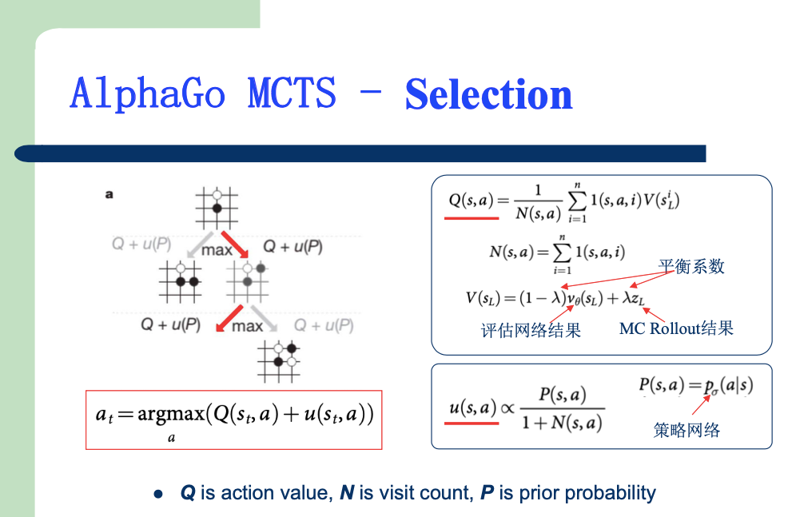

> 1. $Q(s, a)$ 代表处于棋局状态s时，采取某个动作a后的`胜率`
>    - 详细解释在 **3模拟**、**4更新** 两部分
>    - exploitation
> 2. $u(s, a)$ 我是这样来理解的：
>    1. 分子 $P(s, a) = p_{\sigma}(a|s)$
>       - 代表处于状态s时，采取动作a的`概率`
>       - 分子越大，我们越倾向于探索这个分支
>    2. 分母 $1+N(s, a)$
>       - 代表处于状态s时，已经采取过a多少次
>       - 分母越大，我们越倾向于探索其他分支
>    - exploration

</details>

<details>
<summary>2. 扩展</summary>

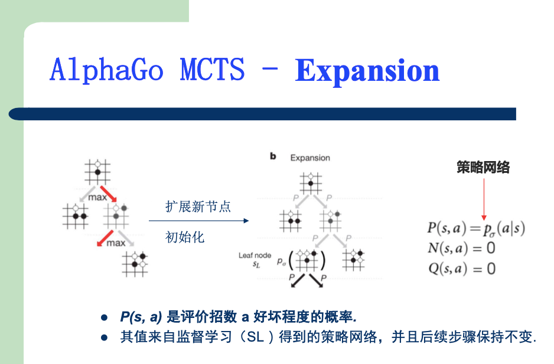
> MCTS中随机扩展一个节点  
> 这里则根据`策略网络`$p_{\sigma}$来选择，扩展某个节点

</details>

<details>
<summary>3. 模拟</summary>

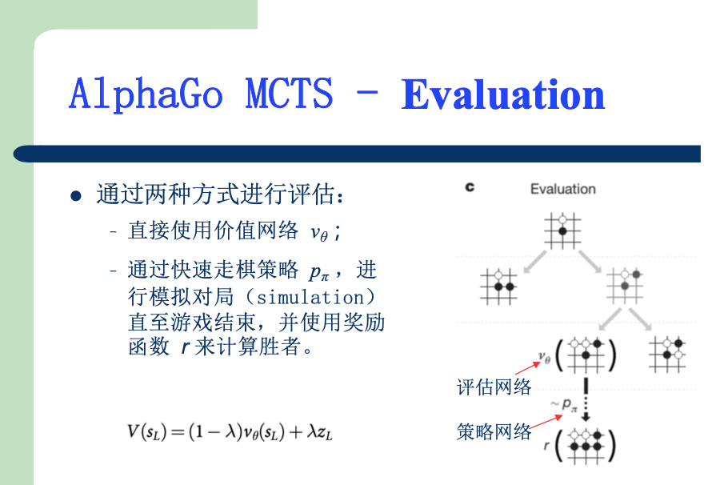
> **对局策略**  
> MCTS中模拟对局，随机走棋  
> 这里则根据`快速走棋策略`$p_{\pi}$来模拟对局
>
> **最终胜负**  
> MCTS中直接使用模拟对局的结果  
> 这里使用`价值网络` $v_\theta$ 与 模拟对局结果 的加权平均  

</details>

<details>
<summary>4. 更新</summary>

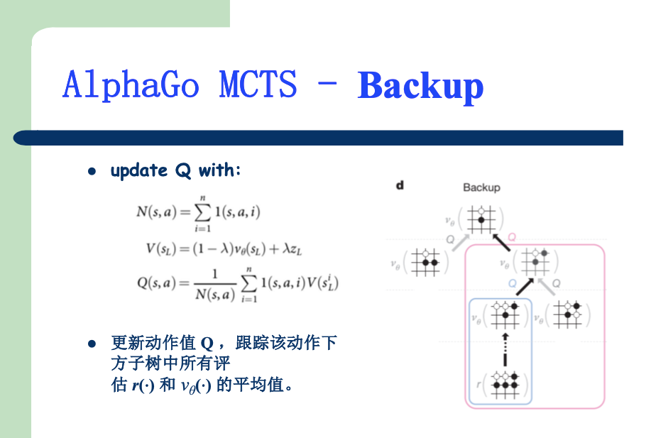
> MCTS中使用 模拟对局的统计结果 作为胜率  
> 这里计算 $Q(s, a)$ 作为胜率

</details>