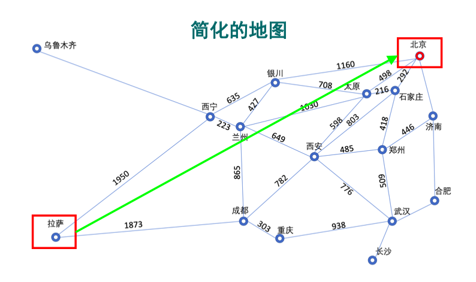
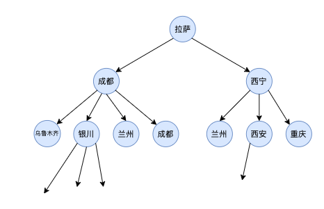

# 基本概念

# 一、“问题”举例

1. 路径规划问题
    - 寻找起点到终点的路径，例如寻找拉萨到北京的最短路径
2. 棋类游戏
3. 资源分配问题
4. 调度问题
5. 优化问题
    - 例如神经网络模型，参数优化
6. 逻辑推理问题

> 后面介绍几个概念的时候，以**路径规划问题**为例，具体说明。
> 

> 
<b>路径规划问题示意图</b>

>
> 
>
> 

# 二、问题求解的形式化

1. **初始状态**：智能体开始搜索时所处的位置
    - 例如路径规划中，刚开始位于`拉萨`
2. **后继函数**：可采取的行动，使得智能体从一个状态到另一个状态
    - 当前位于`拉萨`，可采取的行动有：`去成都`、`去西宁`
    - **初始状态**和**后继函数**，决定了整个**状态空间**
3. **目标测试**：检查给定的状态是不是目标
    - 检查我当前所处的位置，是不是目的地`北京`
4. **路径耗散**：每一步行动，付出的代价
    - 城市之间的距离

# 三、数据结构相关

1. **状态图**：把每个状态看作一个结点，整个状态空间就是一张图
    > 

    > 
例如上面的“路径规划问题示意图”

    >
    > 
    >
    > 

2. **搜索树**：整个搜索过程，可以用树来表示
    > 

    > 
搜索示意图

    >
    > 
    >
    > 

# 四、性能指标

1. **完备性**：当问题有解时，算法是否保证找到一个解
    - 能否找到`拉萨`到`北京`的路径？
2. **最优性**：算法能否找到最优解
    - 找到的路径，是否为最短路径？
3. **时间复杂性**：找到一个解需要多少时间
4. **空间复杂性**：搜索过程中需要多少内存