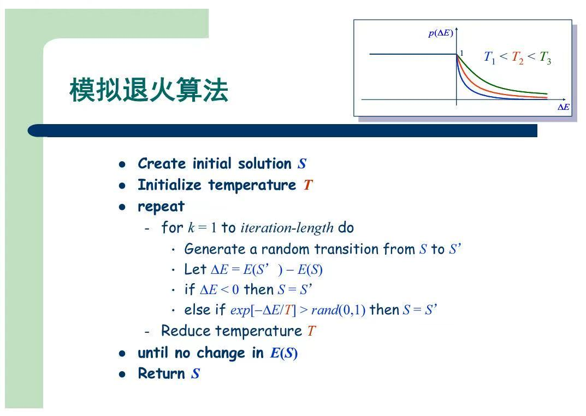
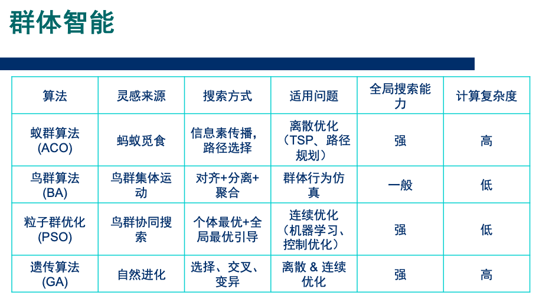

# 局部搜索

# 一、爬山搜索

> ~~概念部分略~~

- 几种变体（为了引入随机性）
    1. **随机爬山法**
        - 在上坡行动中，随机选择一个方向
        - 选择的概率 与 上坡的陡度相关
    2. **首选爬山法**
        - 每次行动前，不断地随机生成新方向，直到这个方向可以指导我们往上爬
        - 不一定是爬升最快的那个方向
    3. **随机重启爬山法**
        - 执行n次爬山法，每次随机选择一个初始点

# 二、模拟退火算法

爬山法容易陷入局部最大值。  
纯粹的随机游走，效率很低。  
**模拟退火**尝试将两者结合起来

## 2.1 基本思想

- 每次随机选择一个方向，但是不立刻行动，而是先进行评估（$\varDelta E$）
    1. 如果这个方向，能达到一个更好的状态（$\varDelta E \le 0$），就可以直接行动
    2. 如果这个方向，会达到一个更差的状态（$\varDelta E > 0$）
        - 以$e^{- \varDelta E / T}$的概率，采取这次行动

> $e^{- \varDelta E / T}$ 为**玻尔兹曼分布**  
> $T$是一个超参，对应模拟退火中的温度  
> 1、2这两步行动准则，称为**Metropolis准则**

## 2.2 伪代码

## 2.3 一些重要概念

> 简单了解一下算了

1. 温度更新函数
    1. 经典退火方式
    2. 快速退火方式
2. 内循环终止准则
3. 外循环终止准则

## 2.4 延伸阅读
1. 禁忌搜索
2. 量子退火

# 三、遗传算法

## 3.1 课程内容

**模式识别与机器学习**的课程中整理过：[遗传算法](模式识别与机器学习/监督学习/遗传算法.md)

## 3.2 延伸阅读

