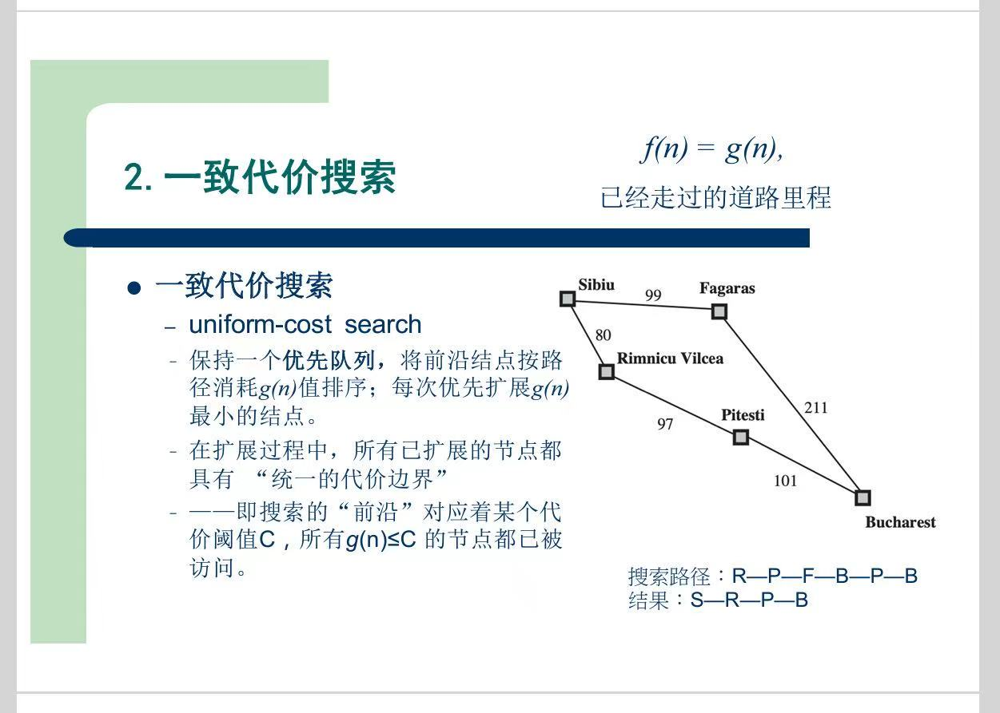

# 无信息搜索

# 一、BFS
> 略

# 二、一致代价搜索

简化版的**Dijkstra算法**

- 老师讲的时候没跟上，按照自己的理解再过一遍

    
    1. 出发点`S`的距离为0
    2. 搜索`[F, R]`，`F`的距离为99，`R`的距离为80，选取`R`
    3. 搜索`[F, P]`，`F`的距离为99，`P`的距离为80+97=177，选取`F`
    4. 搜索`[P, B]`，选取`P`
    5. 搜索`[B]`，选取`B`
> 总感觉老师给的这个**搜索路径**不对劲...

# 三、DFS

- **不完备**：如果搜素树深度=$\infty$，会在某个分支，一直递归下去...
- **深度有限搜索**：最多往下搜索 $l$ 层
    - 解决了无限路径问题，但如果目标在 $d$ 层，$l<d$ 时，也找不到解

# 四、叠代深入深度优先搜索

1. 第一次限制深度为1，做一次**DFS**
2. 第二次限制深度为2，做一次**DFS**
3. 第二次限制深度为3，做一次**DFS**
4. ...

# 五、双向搜索

`起点`、`终点`都已知的话，`起点`往后找，`终点`往前找

# 六、图搜索

- 搜索过程中会出现重复的状态，应该避免
- 我理解应该就是 搜索树中的“**剪枝**”