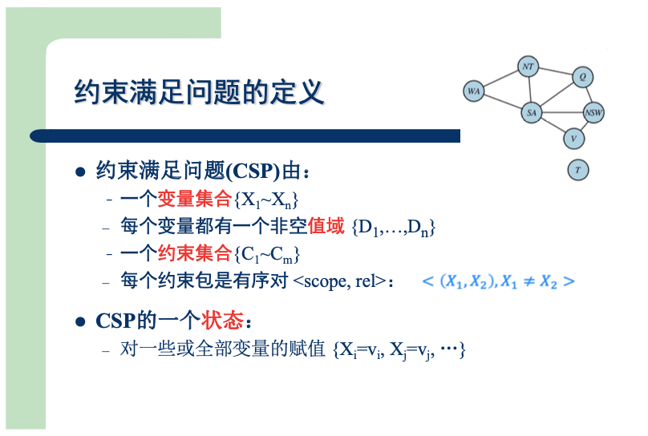
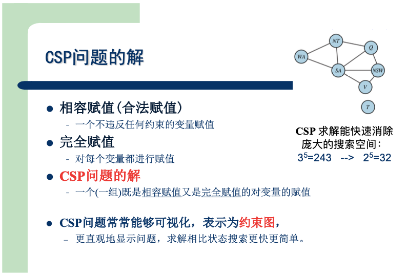
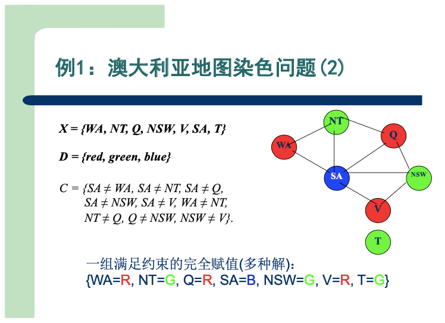
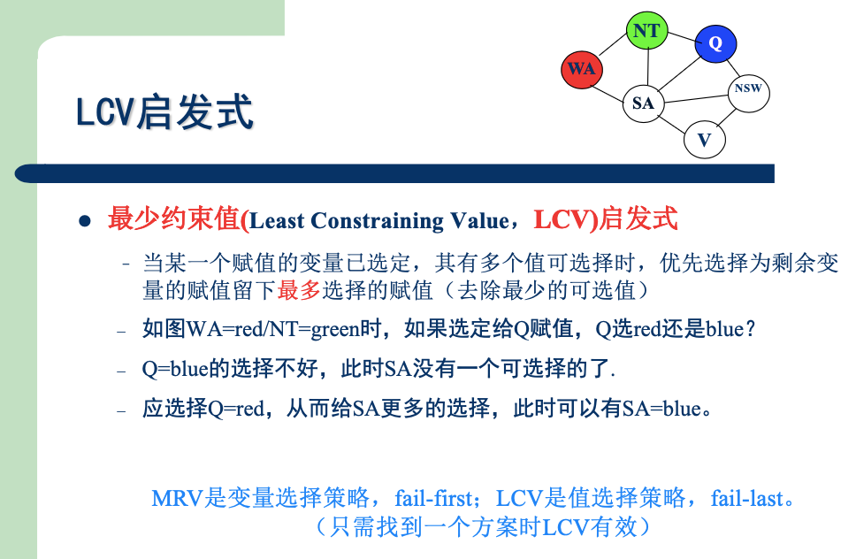
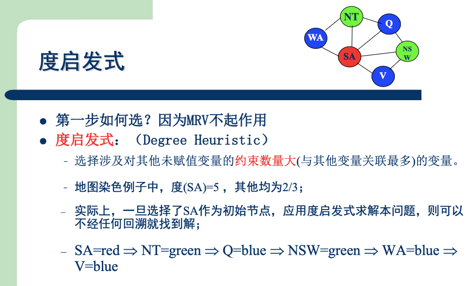
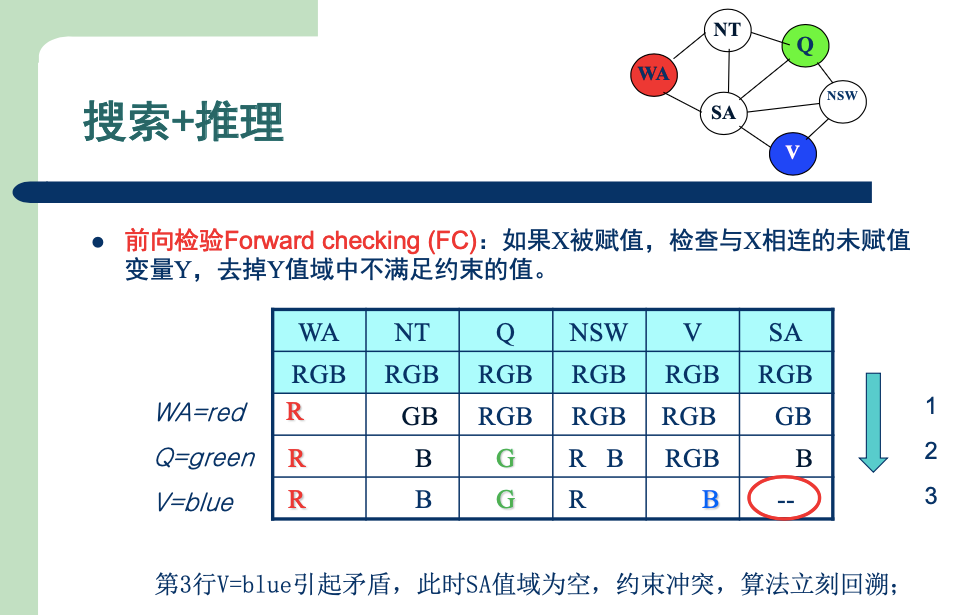
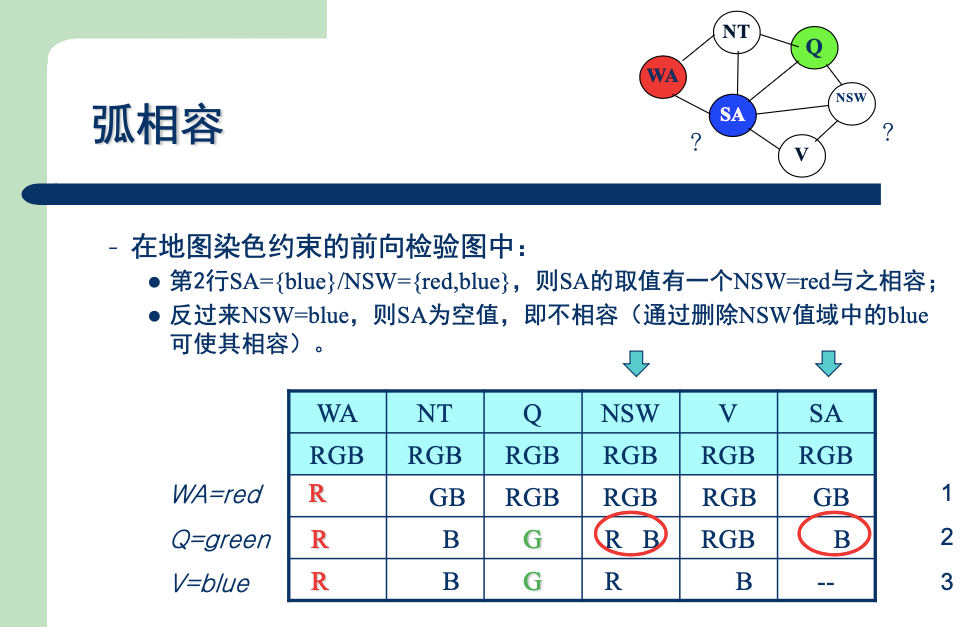
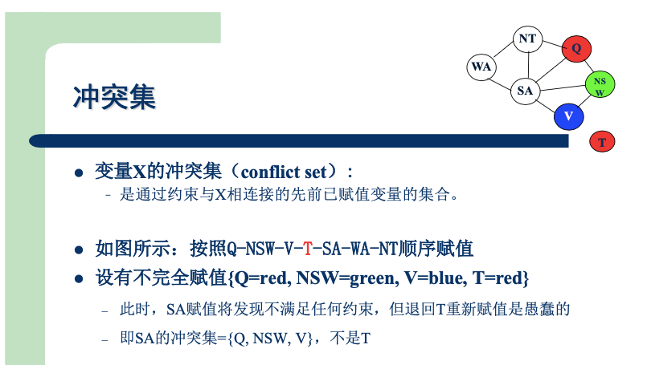
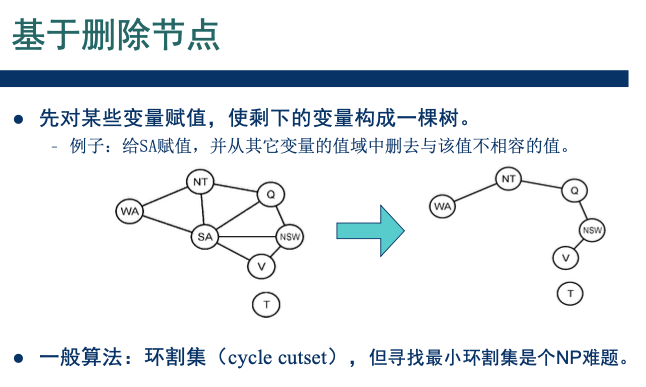

# 约束满足问题

# 一、基本概念

1. 约束满足问题的<b>定义</b>

2. 约束满足问题的<b>解</b>

> 具体示例，来加深一下理解：
>
>   

>   
地图染色问题

>
>   
>
>   

# 二、搜索方法

## 2.1 BFS

1. 第一层，有`n`个变量可以染色，每个变量有`d`种颜色。共有`nd`个分支
2. 第二层，有`n-1`个变量可以染色，每个变量有`d`种颜色。共有`(n-1)d`个分支
3. ...

- 复杂度为 $O(n!d^n)$

## 2.2 DFS+回溯

**剪枝**：给某个变量赋值后，不满足约束就回溯。

### 2.2.1 启发式

> 如何让回溯搜索更高效？

1. 优先选择哪个变量？

2. 选择好变量后，优先赋哪个值？

3. 第一步，选择哪个变量？

### 2.2.2 何时回溯

> 怎么判断**是否满足约束**?

#### 2.2.2.1 前向检验

> 维护这样一张表格：
> 1. 初始时，每个节点都可以选择“RGB”
> 2. `WA`染成“R”，与`WA`相邻的`NT`、`SA`，删去“R”
> 3. `Q`染成“G”，与`Q`相邻的`NT`、`SA`、`NSW`，删除“G”
> 4. `V`染成“B”，与`V`相邻的`SA`、`NSW`，删除“B”
>     - 此时发现`SA`无法再染色，剪枝

#### 2.2.2.2 前向检验存在的问题

例如刚才介绍的流程中，第4步`V`染成“B”。  
发现冲突后，回退，将`V`染成“G”，继续往下搜索...

实际上，人为观察的话就能发现：
第3步`Q`染成“G”后，`NT`、`SA`都只能染成“B”了。  
而它们俩又相邻，所以不可能这样染

也就是说，第3步`Q`染成“G”后，后面已经不可能有答案了，没必要再往下搜索。  
我们可以尽早剪枝

#### 2.2.2.3 弧相容

**弧相容**，可以尽早地发现问题

> 比前向检验多做一些检查：  
> 例如`Q`染成“G”后，修改完前向表，我们再依次检查所有的弧
> 1. `NSW`、`SA`相邻，而此时`SA`只能染成“B”，完全可以将`NSW`中的“B”删去
> 2. `NT`、`SA`相邻，它们俩都只能染成“B”，此时发现冲突
>     - 及时剪枝

### 2.2.3 回溯到哪里

> 假设染色顺序为：Q-NSW-V-`T`-SA-WA-NT  
> 给`SA`染色，发现冲突时，可以直接回退到`V`  
> 具体做法，可以通过维护一个**冲突集**来实现。

## 2.3 利用图的结构

> 还可以利用问题的结构，来加速搜索

### 2.3.1 将约束图分解为几个连通图

> 略

### 2.3.2 删除节点

示意图

### 2.3.3 合并节点

示意图

> 1. 第一个子问题，有6种染色方案
> 2. `NT`、`SA`确定后，第二个子问题，只有一种方案了
> 3. 同样第三个、第四个子问题，也只有一种了

