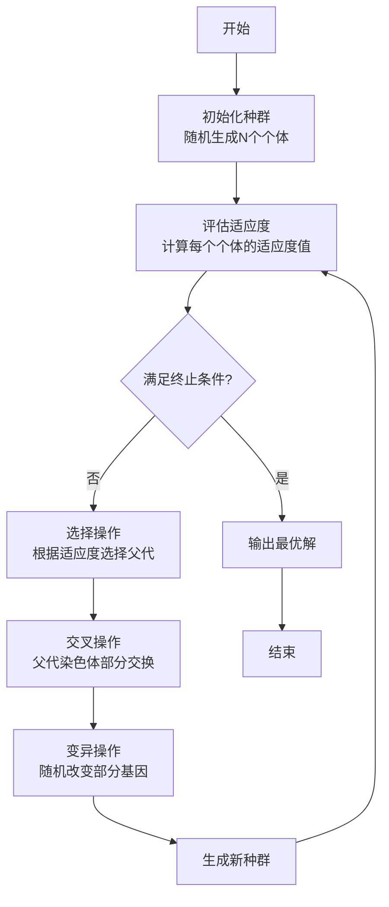

# 人工智能原理 期末题库

> 本题库基于课程知识点整理，包含2022年秋季测试原题及扩展题目

---

## 一、选择题（每题4分）

### 1. 以下哪一种搜索算法属于启发式搜索算法？

A. 模拟退火算法  
B. 迭代深入深度优先算法  
C. 蒙特卡洛树搜索算法  
D. A*搜索算法

**答案：D**

**解析：**
- A*搜索算法是典型的启发式搜索算法，使用评价函数 $f(n) = g(n) + h(n)$，其中 $g(n)$ 是实际路径耗散，$h(n)$ 是启发函数
- 模拟退火算法属于局部搜索算法
- 迭代深入深度优先算法属于无信息搜索算法
- 蒙特卡洛树搜索算法属于博弈搜索算法

---

### 2. 以下人工神经元网络中，计算复杂度最高的是：

A. Hopfield  
B. SOM (Self-Organizing Map)  
C. DBM (Deep Boltzmann Machine)  
D. DBN (Deep Belief Network)

**答案：C**

**解析：**
- DBM（深度玻尔兹曼机）所有层之间双向连接，整个模型一起训练，计算复杂度最高
- Hopfield网络结构相对简单，计算复杂度较低
- SOM是自组织映射网络，复杂度中等
- DBN采用逐层预训练的方式，虽然深度但训练相对高效

---

### 3. 以下关于 Sigmoid 函数正确的说法是：

A. 凸函数  
B. 输出可以有负值  
C. 无法配合交叉熵损失使用  
D. 输入过大或过小时会产生梯度消失问题

**答案：D**

**解析：**
- Sigmoid函数输出范围是(0,1)，不能输出负值
- Sigmoid函数不是凸函数
- Sigmoid函数可以配合交叉熵损失使用，常用于二分类问题
- 当输入过大或过小时，Sigmoid函数的梯度接近0，会导致梯度消失问题

---

### 4. 以下哪一项不是图灵在1950年论文《Computing Machinery and Intelligence》中提出的思想？

A. 机器学习  
B. 自动差分机  
C. 模仿游戏  
D. 数字计算机

**答案：B**

**解析：**
- 图灵在1950年的论文中提出了"模仿游戏"（即图灵测试）、数字计算机的概念，以及机器学习的早期思想
- 自动差分机（Difference Engine）是19世纪巴贝奇提出的机械计算设备，不是图灵在1950年论文中提出的

---

### 5. 以下哪一位学者是连接主义运动中PDP学派的代表性学者？

A. Frank Rosenblatt  
B. David E. Rumelhart  
C. Marvin Minsky  
D. LeCun Yann

**答案：B**

**解析：**
- David E. Rumelhart是PDP（并行分布式处理）学派的代表性学者，与James McClelland共同编写了《并行分布式处理》一书
- Frank Rosenblatt是感知器的发明者
- Marvin Minsky是符号主义学派的代表人物
- LeCun Yann是深度学习的先驱之一，但属于更晚期的学者

---

### 6. 以下哪种搜索算法是完备且最优的？

A. 深度优先搜索  
B. 广度优先搜索  
C. 贪婪最佳优先搜索  
D. 迭代深入深度优先搜索

**答案：B**

**解析：**
- 广度优先搜索（BFS）在路径耗散为常数时是完备且最优的
- 深度优先搜索不完备（可能陷入无限深度）
- 贪婪最佳优先搜索不完备也不一定最优
- 迭代深入深度优先搜索完备但不一定最优

---

### 7. A*搜索算法中，如果启发函数 $h(n)$ 是可采纳的，则算法具有：

A. 完备性和最优性  
B. 仅完备性  
C. 仅最优性  
D. 都不保证

**答案：A**

**解析：**
- 如果启发函数 $h(n)$ 是可采纳的（即从来不过高估计从节点n到目标节点的路径耗散），使用该启发函数的A*算法既是完备的也是最优的

---

### 8. 在博弈搜索中，Minimax算法的时间复杂度是：

A. $O(b)$  
B. $O(b^m)$  
C. $O(m)$  
D. $O(b \cdot m)$

**答案：B**

**解析：**
- Minimax算法需要遍历整个博弈树，其中 $b$ 为分支数，$m$ 为树的深度，时间复杂度为 $O(b^m)$

---

### 9. 蒙特卡洛树搜索（MCTS）算法的四个主要步骤是：

A. 选择、扩展、模拟、更新  
B. 初始化、选择、扩展、更新  
C. 选择、交叉、变异、更新  
D. 初始化、扩展、模拟、更新

**答案：A**

**解析：**
- MCTS算法的四个主要步骤是：选择（Selection）、扩展（Expansion）、模拟（Simulation）、更新（Backpropagation）

---

### 10. 以下关于感知器的说法正确的是：

A. 可以解决XOR问题  
B. 只能处理线性可分问题  
C. 使用梯度下降法训练  
D. 可以处理非线性问题

**答案：B**

**解析：**
- 感知器只能处理线性可分问题，无法解决XOR问题
- 感知器使用感知器学习法则，不是梯度下降法（Adaline才使用梯度下降法）
- 单层感知器无法处理非线性问题，需要多层网络

---

### 11. 以下关于Hopfield网络的描述错误的是：

A. 每两个神经元之间都有连接  
B. 可以用于联想记忆  
C. 存储容量约为 $0.15N$（N为神经元数量）  
D. 只能存储一个模式

**答案：D**

**解析：**
- Hopfield网络可以存储多个模式（约 $0.15N$ 个），用于联想记忆
- 网络结构是全连接的，每两个神经元之间都有连接

---

### 12. 受限玻尔兹曼机（RBM）与玻尔兹曼机的主要区别是：

A. RBM没有隐藏层  
B. RBM层内无连接，层间有连接  
C. RBM只能用于分类任务  
D. RBM不使用能量函数

**答案：B**

**解析：**
- RBM的关键特征是：可见层内神经元无连接，隐藏层内神经元无连接，但可见层和隐藏层之间有连接
- 这使得RBM的训练比完全连接的玻尔兹曼机更高效

---

### 13. 深度信念网络（DBN）的训练方式是：

A. 端到端训练  
B. 逐层预训练 + 微调  
C. 随机初始化后直接训练  
D. 只训练最后一层

**答案：B**

**解析：**
- DBN采用逐层预训练的方式：先训练前两层构成RBM，然后训练二、三层构成RBM，依此类推
- 预训练完成后，再进行微调（判别式或生成式任务）

---

### 14. 以下关于监督学习和强化学习的区别，错误的是：

A. 监督学习有明确的标签，强化学习只有奖励信号  
B. 监督学习的反馈是即时的，强化学习的反馈可能延迟  
C. 监督学习的数据是静态的，强化学习的数据是动态交互产生的  
D. 两者都需要反馈信息来改进性能

**答案：B**

**解析：**
- 监督学习的反馈通常是即时的（每个样本都有标签）
- 强化学习的反馈通常是延迟的（需要执行一系列动作后才能获得奖励）
- 其他选项描述正确

---

### 15. 贝叶斯网络不能进行精确推理的主要原因是：

A. 网络结构太复杂  
B. 多连通网络导致计算复杂度指数增长  
C. 条件概率表不完整  
D. 变量数量太多

**答案：B**

**解析：**
- 在多连通网络中，精确推理的复杂度是指数级的，因此需要近似推理方法
- 单连通网络（树结构）可以进行高效的精确推理

---

### 16. 以下哪种方法不是贝叶斯网络的近似推理方法？

A. 拒绝采样  
B. 似然加权  
C. 马尔科夫链蒙特卡洛（MCMC）  
D. 变量消元法

**答案：D**

**解析：**
- 变量消元法是精确推理方法，用于加速精确推理计算
- 拒绝采样、似然加权、MCMC都是近似推理方法

---

### 17. 遗传算法中，交叉操作的概率通常是：

A. $0.0001 \sim 0.1$  
B. $0.1 \sim 0.4$  
C. $0.4 \sim 0.99$  
D. $1.0$

**答案：C**

**解析：**
- 交叉操作模拟基因重组，概率一般为 $0.4 \sim 0.99$
- 变异操作的概率较小，一般为 $0.0001 \sim 0.1$

---

### 18. 以下关于模拟退火算法的描述正确的是：

A. 只接受更好的解  
B. 只接受更差的解  
C. 以一定概率接受更差的解  
D. 随机选择解

**答案：C**

**解析：**
- 模拟退火算法使用Metropolis准则：如果新状态更好（$\Delta E \leq 0$），直接接受；如果新状态更差（$\Delta E > 0$），以概率 $e^{-\Delta E / T}$ 接受
- 这样可以避免陷入局部最优

---

### 19. 在机器学习中，泛化误差可以分解为：

A. 偏差 + 方差  
B. 偏差² + 方差 + 不可约误差  
C. 偏差 + 方差 + 噪声  
D. 偏差² + 方差²

**答案：B**

**解析：**
- 泛化误差 = 偏差² + 方差 + 不可约误差
- 偏差反映模型预测的平均值与真实值的差异
- 方差反映模型预测值的变化程度
- 不可约误差由数据中的噪声引起，无法消除

---

### 20. 以下关于PAC理论的描述正确的是：

A. 告诉我们如何选择最优模型  
B. 告诉我们至少需要多少样本才能保证经验风险接近期望风险  
C. 只适用于线性模型  
D. 与VC维无关

**答案：B**

**解析：**
- PAC（Probably Approximately Correct）理论告诉我们，在给定置信度和精度要求下，至少需要多少样本才能保证经验风险接近期望风险
- PAC理论与VC维密切相关

---

### 21. 在约束满足问题（CSP）中，MRV启发式的含义是：

A. 最大剩余值  
B. 最小剩余值  
C. 最大剩余变量  
D. 最小剩余变量

**答案：D**

**解析：**
- MRV（Minimum Remaining Values）是最小剩余值启发式，优先选择剩余合法值最少的变量
- 这样可以尽早发现冲突，提高搜索效率

---

### 22. 前向检验（Forward Checking）在CSP中的作用是：

A. 预测未来状态  
B. 维护每个未赋值变量的合法值域  
C. 回溯到上一个状态  
D. 选择下一个变量

**答案：B**

**解析：**
- 前向检验在给变量赋值后，更新所有未赋值变量的合法值域
- 如果某个变量的合法值域变为空，则立即回溯

---

### 23. 弧相容（Arc Consistency）比前向检验更强的原因是：

A. 检查所有约束  
B. 检查所有弧的相容性，能更早发现冲突  
C. 使用更复杂的算法  
D. 需要更多计算资源

**答案：B**

**解析：**
- 弧相容不仅维护值域，还检查所有弧的相容性
- 可以比前向检验更早发现冲突，实现更早的剪枝

---

### 24. α-β剪枝算法中，α和β分别代表：

A. 最大值和最小值  
B. MAX玩家的最佳值和MIN玩家的最佳值  
C. 上界和下界  
D. 搜索深度和分支数

**答案：B**

**解析：**
- α表示MAX玩家到目前为止找到的最佳值（下界）
- β表示MIN玩家到目前为止找到的最佳值（上界）
- 当α≥β时，可以剪枝

---

### 25. 以下关于LSTM的描述错误的是：

A. 使用遗忘门控制历史信息  
B. 使用输入门控制新信息  
C. 可以解决梯度消失问题  
D. 比RNN计算复杂度更低

**答案：D**

**解析：**
- LSTM通过门控机制解决梯度消失问题，但计算复杂度比RNN更高
- LSTM包含遗忘门、输入门、输出门等多个门控单元

---

### 26. GRU相比LSTM的主要优势是：

A. 表达能力更强  
B. 参数更少，训练更快  
C. 可以处理更长的序列  
D. 准确率更高

**答案：B**

**解析：**
- GRU（Gated Recurrent Unit）只有重置门和更新门，参数比LSTM少
- 训练速度更快，但表达能力可能略弱于LSTM

---

### 27. 以下关于RNN的描述正确的是：

A. 只能处理固定长度序列  
B. 可以处理变长序列  
C. 没有记忆能力  
D. 不能用于序列建模

**答案：B**

**解析：**
- RNN通过隐藏状态传递历史信息，可以处理变长序列
- 这是RNN相比前馈网络的主要优势

---

### 28. 在强化学习中，折扣因子γ的作用是：

A. 控制探索与利用的平衡  
B. 权衡即时奖励和未来奖励  
C. 决定动作选择策略  
D. 调整学习率

**答案：B**

**解析：**
- 折扣因子γ（0≤γ≤1）用于权衡即时奖励和未来奖励
- γ接近1时更重视长期奖励，γ接近0时更重视即时奖励

---

### 29. Q-learning算法属于：

A. 基于策略的方法  
B. 基于价值的方法  
C. Actor-Critic方法  
D. 策略梯度方法

**答案：B**

**解析：**
- Q-learning是典型的基于价值的方法，学习动作价值函数Q(s,a)
- 然后选择Q值最大的动作

---

### 30. 以下关于REINFORCE算法的描述正确的是：

A. 基于价值的方法  
B. 策略梯度方法，使用累积奖励作为回报  
C. 需要价值函数  
D. 只能用于离散动作空间

**答案：B**

**解析：**
- REINFORCE是策略梯度方法，使用蒙特卡洛方法估计累积奖励
- 通过策略梯度更新策略参数

---

### 31. 玻尔兹曼机使用什么分布来建模概率？

A. 高斯分布  
B. 玻尔兹曼分布  
C. 均匀分布  
D. 泊松分布

**答案：B**

**解析：**
- 玻尔兹曼机使用玻尔兹曼分布（Gibbs分布）来建模概率
- 概率与能量函数相关：$P(E) = \frac{e^{-E/kT}}{Z(T)}$

---

### 32. RBM训练中的"正相"和"负相"分别指：

A. 正向传播和反向传播  
B. 数据分布和模型分布  
C. 训练阶段和测试阶段  
D. 编码和解码

**答案：B**

**解析：**
- 正相：数据分布，希望真实数据的概率最大（能量最低）
- 负相：模型分布，希望模型生成的数据概率最小（能量最高）

---

### 33. 对比散度（CD）算法的主要思想是：

A. 使用完整的MCMC采样  
B. 使用吉布斯采样迭代1次来近似负相  
C. 拒绝所有负样本  
D. 只使用正样本

**答案：B**

**解析：**
- 对比散度（Contrastive Divergence）使用吉布斯采样迭代1次来近似模型分布
- 大大提高了RBM的训练效率

---

### 34. 以下关于Adaline的描述正确的是：

A. 使用感知器学习法则  
B. 第一个引入梯度下降的神经网络模型  
C. 可以解决XOR问题  
D. 使用阶跃函数作为激活函数

**答案：B**

**解析：**
- Adaline（Adaptive Linear Neuron）是第一个将梯度下降法引入神经网络的模型
- 使用线性激活函数，通过最小化均方误差来训练

---

### 35. 感知器学习法则的公式是：

A. $\Delta W = \eta \cdot r \cdot X$  
B. $\Delta W = \eta \cdot \nabla f$  
C. $\Delta W = W - \eta \nabla L$  
D. $\Delta W = \alpha W + \eta \nabla L$

**答案：A**

**解析：**
- 感知器学习法则：$\Delta W = \eta \cdot r \cdot X$
- 其中$\eta$是学习率，$r$是误差信号，$X$是输入

---

### 36. 以下关于一致代价搜索（UCS）的描述正确的是：

A. 使用启发函数  
B. 总是扩展路径耗散最小的节点  
C. 不完备  
D. 不一定最优

**答案：B**

**解析：**
- 一致代价搜索总是扩展路径耗散$g(n)$最小的节点
- 不使用启发函数，是完备且最优的（当所有边耗散>0时）

---

### 37. 迭代深入深度优先搜索（IDDFS）的主要优势是：

A. 空间复杂度低  
B. 时间复杂度低  
C. 可以找到最优解  
D. 不需要存储状态

**答案：A**

**解析：**
- IDDFS结合了BFS的最优性和DFS的空间效率
- 空间复杂度为$O(bd)$，其中$b$是分支因子，$d$是深度

---

### 38. 双向搜索的主要优势是：

A. 时间复杂度降低  
B. 从$O(b^d)$降低到$O(b^{d/2})$  
C. 空间复杂度降低  
D. 可以处理无限状态空间

**答案：B**

**解析：**
- 双向搜索从起点和终点同时搜索
- 时间复杂度从$O(b^d)$降低到$O(b^{d/2})$，其中$d$是解的深度

---

### 39. 贪婪最佳优先搜索使用什么作为评价函数？

A. $f(n) = g(n) + h(n)$  
B. $f(n) = g(n)$  
C. $f(n) = h(n)$  
D. $f(n) = g(n) - h(n)$

**答案：C**

**解析：**
- 贪婪最佳优先搜索只使用启发函数：$f(n) = h(n)$
- 总是选择看起来最接近目标的节点

---

### 40. 以下关于启发函数一致性的描述正确的是：

A. 一致性是可采纳性的必要条件  
B. 一致性是可采纳性的充分条件  
C. 一致性比可采纳性要求更严格  
D. 一致性和可采纳性无关

**答案：C**

**解析：**
- 一致性（单调性）比可采纳性要求更严格
- 满足一致性的启发函数一定满足可采纳性，但反之不一定

---

### 41. 在遗传算法中，变异操作的主要作用是：

A. 选择优秀个体  
B. 增加种群多样性  
C. 加速收敛  
D. 减少计算量

**答案：B**

**解析：**
- 变异操作以较小概率随机改变基因，增加种群多样性
- 防止算法过早收敛到局部最优

---

### 42. 遗传算法的终止条件通常不包括：

A. 达到最大迭代次数  
B. 适应度满足要求  
C. 种群完全收敛  
D. 找到全局最优解

**答案：D**

**解析：**
- 遗传算法是启发式算法，不能保证找到全局最优解
- 终止条件包括：最大迭代次数、适应度阈值、种群多样性等

---

### 43. 模拟退火算法中的温度参数T的作用是：

A. 控制搜索范围  
B. 控制接受劣解的概率  
C. 决定初始状态  
D. 限制搜索深度

**答案：B**

**解析：**
- 温度T控制接受劣解的概率：$P = e^{-\Delta E / T}$
- T高时更容易接受劣解（探索），T低时更倾向于接受优解（利用）

---

### 44. 以下关于爬山法的描述错误的是：

A. 可能陷入局部最优  
B. 总是选择最优的邻居  
C. 是完备的  
D. 可能无法找到全局最优

**答案：C**

**解析：**
- 爬山法不完备，可能陷入局部最优而无法找到解
- 这是爬山法的主要缺点

---

### 45. 随机重启爬山法的主要思想是：

A. 随机选择初始点  
B. 执行多次爬山，每次从随机初始点开始  
C. 随机选择邻居  
D. 随机接受劣解

**答案：B**

**解析：**
- 随机重启爬山法执行多次独立的爬山过程
- 每次从随机初始点开始，增加找到全局最优的概率

---

### 46. 以下关于贝叶斯网络的描述正确的是：

A. 必须是有向无环图  
B. 可以是循环图  
C. 节点之间必须完全连接  
D. 只能表示条件独立

**答案：A**

**解析：**
- 贝叶斯网络必须是有向无环图（DAG）
- 通过条件独立性假设，提供联合概率分布的紧凑表示

---

### 47. 变量消元法在贝叶斯网络推理中的作用是：

A. 近似推理  
B. 加速精确推理  
C. 学习网络结构  
D. 参数估计

**答案：B**

**解析：**
- 变量消元法通过消除变量来加速精确推理
- 避免重复计算，提高效率

---

### 48. 似然加权算法相比拒绝采样的优势是：

A. 不需要拒绝样本  
B. 效率更高，避免高拒绝率  
C. 结果更准确  
D. 实现更简单

**答案：B**

**解析：**
- 似然加权只生成符合证据的样本，并为样本分配权重
- 避免了拒绝采样中高拒绝率导致的效率问题

---

### 49. 以下关于MCMC采样的描述正确的是：

A. 直接采样方法  
B. 通过马尔科夫链生成样本  
C. 不需要迭代  
D. 只能用于离散变量

**答案：B**

**解析：**
- MCMC（Markov Chain Monte Carlo）通过构建马尔科夫链生成样本
- 链收敛后，样本来自目标分布

---

### 50. 在机器学习中，偏差-方差权衡的含义是：

A. 偏差和方差可以同时最小化  
B. 需要在偏差和方差之间取得平衡  
C. 偏差和方差无关  
D. 只需要最小化偏差

**答案：B**

**解析：**
- 模型复杂度增加时，偏差减小但方差增大
- 需要在偏差和方差之间取得平衡，使泛化误差最小

---

### 51. 卷积神经网络相比全连接层的主要优势是：

A. 计算更快  
B. 参数更少，通过局部感受野和权值共享  
C. 可以处理任意大小的输入  
D. 不需要激活函数

**答案：B**

**解析：**
- CNN通过局部感受野和权值共享大幅减少参数量
- 例如：1000x1000图像，全连接层需要10^12参数，而卷积层可能只需要10^4参数

---

### 52. 以下关于转置卷积（反卷积）的描述正确的是：

A. 是卷积的逆运算  
B. 用于上采样，将小特征图放大  
C. 只能用于图像分类  
D. 参数量比普通卷积多

**答案：B**

**解析：**
- 转置卷积用于上采样，将小特征图放大（如2x2→5x5）
- 应用：YOLO、UNet、FCN中的上采样操作

---

### 53. ResNet的主要创新是：

A. 使用更多的卷积层  
B. 使用跳跃连接（残差连接）解决梯度消失  
C. 使用更大的卷积核  
D. 使用更多的池化层

**答案：B**

**解析：**
- ResNet通过跳跃连接（残差连接）解决深度网络的梯度消失问题
- 允许训练更深的网络（152层）
- 在ILSVRC 2015中胜出

---

### 54. 注意力机制解决的主要问题是：

A. 计算复杂度太高  
B. Encoder-Decoder架构中，生成每个词时都使用同一个语义编码  
C. 梯度消失  
D. 过拟合

**答案：B**

**解析：**
- 注意力机制允许在生成每个词时，动态关注输入序列的不同部分
- 解决了传统Encoder-Decoder中固定语义编码的问题

---

### 55. 自注意力机制的特点是：

A. 输入和输出不同  
B. 输入和输出相同，计算序列内部的关系  
C. 只能用于文本  
D. 不需要计算注意力权重

**答案：B**

**解析：**
- 自注意力机制中，输入和输出相同
- 用于计算序列内部元素之间的关系
- 例如：判断句子中哪些词对当前词更重要

---

### 56. 自编码器（AE）的主要作用是：

A. 分类  
B. 降维和特征提取  
C. 回归  
D. 聚类

**答案：B**

**解析：**
- 自编码器通过编码器将输入压缩为低维表示，再通过解码器重构
- 主要用于降维、特征提取、去噪等任务

---

### 57. 变分自编码器（VAE）相比自编码器的主要改进是：

A. 编码器输出具体值  
B. 编码器输出概率分布，可以用于生成  
C. 使用更多的层  
D. 不需要解码器

**答案：B**

**解析：**
- VAE的编码器输出概率分布（如高斯分布），而不是具体值
- 从分布中采样后解码，可以生成新样本
- 这是VAE可以用于生成式任务的关键

---

### 58. VAE的目标函数ELBO包含两部分，分别是：

A. 重构误差和KL散度  
B. 分类损失和回归损失  
C. 前向传播和反向传播  
D. 编码损失和解码损失

**答案：A**

**解析：**
- ELBO = 重构项（解码器任务）+ KL散度项（编码器任务）
- 重构项：给定z，希望p(x|z)最大
- KL散度项：先验分布p(z)与后验分布q(z|x)差异最小

---

### 59. 扩散模型（DDPM）的基本思想是：

A. 直接生成图像  
B. 通过逐步去噪过程生成图像  
C. 使用对抗训练  
D. 使用自编码器

**答案：B**

**解析：**
- 扩散模型通过逐步添加噪声（前向过程），然后学习逐步去噪（反向过程）
- 生成时从纯噪声开始，逐步去噪得到清晰图像

---

### 60. 以下关于产生式系统的描述正确的是：

A. 使用神经网络表示知识  
B. 使用IF-THEN规则表示知识  
C. 只能用于分类任务  
D. 不需要推理过程

**答案：B**

**解析：**
- 产生式系统使用IF-THEN规则表示知识
- 通过匹配和执行规则进行推理
- 例如：MYCIN专家系统

---

### 61. Logic Theorist是：

A. 神经网络模型  
B. 使用逻辑符号表示数学命题和推理规则的系统  
C. 搜索算法  
D. 优化算法

**答案：B**

**解析：**
- Logic Theorist是早期的人工智能系统
- 使用逻辑符号（如命题逻辑公式）表示数学命题和推理规则
- 是符号主义方法的典型代表

---

### 62. 知识的符号表示方法不包括：

A. 逻辑表示  
B. 语义网络  
C. 产生式系统  
D. 神经网络权重

**答案：D**

**解析：**
- 符号表示方法包括：逻辑表示、语义网络、产生式系统、框架表示、知识图谱等
- 神经网络权重是连接主义的表示方法，不是符号表示

---

## 二、简答题

### 1. 监督学习和强化学习在做出预测后，都需要某种"反馈信息"来提升学习性能。请分析比较两种学习方法中利用"反馈信息"的不同。（10分）

**答案：**

**监督学习中反馈信息的特点：**
1. **反馈形式**：明确的标签（ground truth），每个样本都有对应的正确答案
2. **反馈时机**：即时反馈，每个样本输入后立即获得标签
3. **反馈内容**：直接告诉模型预测是否正确，以及正确的答案是什么
4. **数据特点**：数据是静态的、预先收集好的，标签是人工标注的
5. **学习方式**：通过比较预测值与真实标签，计算损失函数，进行梯度下降优化

**强化学习中反馈信息的特点：**
1. **反馈形式**：奖励信号（reward），可能是稀疏的、延迟的
2. **反馈时机**：延迟反馈，需要执行一系列动作后才能获得奖励
3. **反馈内容**：只告诉智能体当前动作的好坏程度（奖励值），不直接告诉最优动作
4. **数据特点**：数据是动态交互产生的，通过智能体与环境交互获得经验
5. **学习方式**：通过试错探索，最大化累积奖励，使用策略梯度或价值函数方法

**主要区别总结：**
- 监督学习：有明确的"正确答案"，反馈是即时的、精确的
- 强化学习：只有"好坏的信号"，反馈是延迟的、稀疏的，需要通过探索来学习

---

### 2. 简述蒙特卡洛树搜索（MCTS）算法的基本原理和主要步骤。（20分）

**答案：**

**基本原理：**
蒙特卡洛树搜索（MCTS）是一种用于决策的启发式搜索算法，特别适用于博弈树搜索。它通过随机模拟来评估不同动作的价值，结合树搜索和蒙特卡洛模拟，在探索（exploration）和利用（exploitation）之间取得平衡。

**主要步骤：**

MCTS算法包含四个主要步骤，循环执行直到达到终止条件：

**1. 选择（Selection）**
- 从根节点开始，使用树策略（Tree Policy）选择子节点
- 通常使用UCT（Upper Confidence Bound applied to Trees）公式：
  $$UCT = \bar{X}_j + C \sqrt{\frac{\ln n}{n_j}}$$
- 其中 $\bar{X}_j$ 是节点j的平均奖励，$n$ 是父节点访问次数，$n_j$ 是子节点j的访问次数，$C$ 是探索常数
- 平衡利用（选择高价值节点）和探索（选择访问次数少的节点）

**2. 扩展（Expansion）**
- 当到达一个未完全展开的节点时，添加一个新的子节点
- 新节点代表一个未探索过的动作

**3. 模拟（Simulation）**
- 从新添加的节点开始，使用默认策略（Default Policy）进行随机模拟
- 随机选择动作直到游戏结束，获得模拟结果（胜负或得分）

**4. 回传（Backpropagation）**
- 将模拟结果沿着路径回传到根节点
- 更新路径上所有节点的访问次数和平均奖励值

**算法特点：**
- 不需要完整的博弈树，只构建部分树
- 通过随机模拟评估动作价值
- 随着搜索进行，逐渐聚焦到更有希望的分支
- 在AlphaGo等系统中，结合了策略网络和价值网络来改进MCTS

---

### 3. 简述Bayes网络的基本原理，分析Bayes网络不能进行精确推理的原因，举例2种近似推理的方法。（15分）

**答案：**

**Bayes网络的基本原理：**

1. **定义**：贝叶斯网络是一个有向无环图（DAG），其中：
   - 节点表示随机变量
   - 有向边表示变量之间的条件依赖关系
   - 每个节点都有一个条件概率表（CPT），表示给定父节点时该节点的概率分布

2. **语义**：
   - 网络结构编码了条件独立性假设
   - 联合概率分布可以分解为：$P(X_1, X_2, ..., X_n) = \prod_{i=1}^{n} P(X_i | Parents(X_i))$
   - 提供了联合概率分布的紧凑表示

3. **优势**：
   - 局部结构化：每个节点只依赖于其父节点
   - 大大减少了需要存储的概率参数数量

**不能进行精确推理的原因：**

1. **多连通网络问题**：
   - 在多连通网络（存在多条路径连接两个节点）中，精确推理的复杂度是指数级的
   - 例如计算 $P(X|Y)$ 时，需要对所有其他变量求和，导致计算量爆炸

2. **复杂度分析**：
   - 单连通网络（树结构）：精确推理复杂度为 $O(n)$
   - 多连通网络：精确推理复杂度为 $O(2^n)$，其中 $n$ 是变量数量
   - 当网络规模较大时，精确推理变得不可行

3. **实际应用限制**：
   - 即使使用变量消元法等优化技术，多连通网络的精确推理仍然非常耗时
   - 因此需要近似推理方法

**近似推理方法举例：**

**方法1：拒绝采样（Rejection Sampling）**
- **原理**：依据已知概率分布生成样本，然后拒绝不符合条件的样本
- **步骤**：
  1. 按照网络中的条件概率分布生成大量样本
  2. 对于查询 $P(X|Y=y)$，只保留 $Y=y$ 的样本
  3. 在这些样本中统计 $X$ 的分布
- **优点**：简单直观
- **缺点**：当条件概率很小时，拒绝率很高，效率低

**方法2：似然加权（Likelihood Weighting）**
- **原理**：只生成符合证据条件的样本，并为每个样本分配权重
- **步骤**：
  1. 对于证据变量，固定其值
  2. 对于非证据变量，按照条件概率采样
  3. 为每个样本计算权重：$w = \prod P(evidence|parents)$
  4. 使用加权样本估计查询概率
- **优点**：避免了拒绝采样中的高拒绝率问题
- **缺点**：当证据变量在网络的根部时，权重可能很小，导致估计不准确

**其他近似方法：**
- 马尔科夫链蒙特卡洛（MCMC）：使用马尔科夫链生成样本，收敛到目标分布
- 变分推理：将推理问题转化为优化问题

---

### 4. 写出遗传算法的原理、要点和计算过程（用流程图表示）。（15分）

**答案：**

**遗传算法的原理：**

遗传算法是一种受生物进化论启发的全局优化搜索算法。它模拟自然选择过程，通过选择、交叉、变异等操作，在解空间中搜索最优解。

**核心思想：**
- 将问题的解编码为"染色体"（个体）
- 多个个体组成"种群"
- 通过适应度函数评估每个个体的优劣
- 优秀的个体有更大机会产生后代
- 通过交叉和变异产生新的个体
- 经过多代进化，种群逐渐收敛到最优解

**要点：**

1. **编码方案**：将问题的解表示为染色体（通常用二进制串）
2. **适应度函数**：评估个体优劣的函数，通常就是优化目标函数
3. **选择操作**：根据适应度选择优秀个体作为父代（如赌轮选择法）
4. **交叉操作**：模拟基因重组，交换父代的部分染色体（概率通常为0.4~0.99）
5. **变异操作**：随机改变子代的部分基因（概率通常为0.0001~0.1）
6. **终止条件**：达到最大迭代次数、适应度满足要求、或种群多样性降低

**计算过程流程图：**



**详细步骤说明：**

1. **初始化种群**：随机生成初始种群，每个个体是一个编码后的解
2. **评估适应度**：计算每个个体的适应度值（通常是目标函数值）
3. **判断终止**：检查是否满足终止条件（最大迭代次数、适应度阈值等）
4. **选择**：根据适应度选择优秀个体，适应度高的个体被选中的概率大
5. **交叉**：选中的父代个体以一定概率进行交叉，产生新个体
6. **变异**：新个体以较小概率发生变异，增加种群多样性
7. **更新种群**：用新个体替换旧个体，形成新一代种群
8. **返回步骤2**：重复评估、选择、交叉、变异过程

**示例：**
寻找 $f(x) = x^2$ 在 $[0, 31]$ 上的最大值：
- 编码：用5位二进制表示 $x$（如 $13 = 01101$）
- 初始化：随机生成4个个体 $[01101, 11000, 01000, 10011]$
- 适应度：$f(13) = 169, f(24) = 576, f(8) = 64, f(19) = 361$
- 选择：适应度高的个体更容易被选中
- 交叉：$01101$ 和 $11000$ 交叉得到 $01100$ 和 $11001$
- 变异：$01100$ 的第3位变异为 $01000$

---

### 5. 说明单层感知器模型为何无法模拟逻辑异或（XOR）操作？请设计一个前馈神经网络，用于拟合异或函数。（20分）

**答案：**

**单层感知器无法模拟XOR的原因：**

1. **XOR问题的线性不可分性**：
   - XOR函数的真值表：
     | $x_1$ | $x_2$ | XOR($x_1$, $x_2$) |
     |-------|-------|-------------------|
     | 0     | 0     | 0                 |
     | 0     | 1     | 1                 |
     | 1     | 0     | 1                 |
     | 1     | 1     | 0                 |
   
   - 在二维平面上，XOR的输出无法用一条直线分开
   - 点 $(0,0)$ 和 $(1,1)$ 输出为0，点 $(0,1)$ 和 $(1,0)$ 输出为1
   - 这两类点不是线性可分的

2. **单层感知器的局限性**：
   - 单层感知器只能学习线性决策边界
   - 其决策函数为：$f(x) = \text{sign}(w_1 x_1 + w_2 x_2 + b)$
   - 这只能表示一条直线，无法表示XOR所需的非线性边界

3. **数学证明**：
   假设存在 $w_1, w_2, b$ 使得单层感知器可以表示XOR：
   - $f(0,0) = 0 \Rightarrow w_1 \cdot 0 + w_2 \cdot 0 + b < 0 \Rightarrow b < 0$
   - $f(1,1) = 0 \Rightarrow w_1 \cdot 1 + w_2 \cdot 1 + b < 0 \Rightarrow w_1 + w_2 + b < 0$
   - $f(0,1) = 1 \Rightarrow w_1 \cdot 0 + w_2 \cdot 1 + b \geq 0 \Rightarrow w_2 + b \geq 0$
   - $f(1,0) = 1 \Rightarrow w_1 \cdot 1 + w_2 \cdot 0 + b \geq 0 \Rightarrow w_1 + b \geq 0$
   
   由 $w_1 + b \geq 0$ 和 $w_2 + b \geq 0$，可得 $w_1 + w_2 + 2b \geq 0$
   但 $w_1 + w_2 + b < 0$，矛盾！因此单层感知器无法表示XOR。

**前馈神经网络设计：**

**方案1：两层网络（1个隐藏层）**

网络结构：
- **输入层**：2个神经元（$x_1, x_2$）
- **隐藏层**：2个神经元（$h_1, h_2$），使用Sigmoid激活函数
- **输出层**：1个神经元（$y$），使用Sigmoid激活函数

网络计算过程：
1. 隐藏层：
   - $h_1 = \sigma(w_{11} x_1 + w_{12} x_2 + b_1)$
   - $h_2 = \sigma(w_{21} x_1 + w_{22} x_2 + b_2)$
   
2. 输出层：
   - $y = \sigma(w_3 h_1 + w_4 h_2 + b_3)$

**具体参数设置示例：**

一种可行的参数配置：
- $w_{11} = 1, w_{12} = 1, b_1 = -0.5$（$h_1$ 检测 $x_1 + x_2 \geq 1$）
- $w_{21} = -1, w_{22} = -1, b_2 = 1.5$（$h_2$ 检测 $x_1 + x_2 < 2$）
- $w_3 = 1, w_4 = 1, b_3 = -1.5$（输出层组合 $h_1$ 和 $h_2$）

**方案2：更简单的两层网络**

隐藏层可以只使用1个神经元，但需要合适的激活函数：

网络结构：
- **输入层**：2个神经元
- **隐藏层**：1个神经元，使用ReLU或Sigmoid
- **输出层**：1个神经元，使用Sigmoid

**训练方法：**
- 使用反向传播算法
- 损失函数：交叉熵损失或均方误差
- 优化器：梯度下降或Adam
- 训练数据：XOR的4个样本对

**关键点：**
- 隐藏层的非线性激活函数使得网络可以学习非线性决策边界
- 通过组合多个隐藏神经元，可以形成复杂的决策区域
- 两层网络（1个隐藏层）理论上可以近似任意连续函数（通用近似定理）

---

### 6. 简述A*搜索算法的原理，并说明启发函数的可采纳性和一致性。（15分）

**答案：**

**A*搜索算法的原理：**

A*搜索算法是一种启发式搜索算法，结合了实际路径耗散和启发式估计，用于在图中找到从起点到目标的最优路径。

**评价函数：**
$$f(n) = g(n) + h(n)$$

其中：
- $g(n)$：从起点到节点 $n$ 的实际路径耗散（已知信息）
- $h(n)$：从节点 $n$ 到目标节点的最低耗散估计值（启发函数）

**算法流程：**
1. 初始化：将起点加入开放列表（open list）
2. 循环直到找到目标或开放列表为空：
   - 从开放列表中选择 $f(n)$ 最小的节点
   - 将该节点移入关闭列表（closed list）
   - 扩展该节点的所有后继节点
   - 对于每个后继节点：
     - 如果已在关闭列表中，跳过
     - 如果不在开放列表中，加入开放列表
     - 如果在开放列表中但新路径更优，更新其 $g(n)$ 和 $f(n)$
3. 如果找到目标，回溯路径；否则无解

**启发函数的可采纳性（Admissibility）：**

**定义：**
如果启发函数 $h(n)$ 从来不过高地估计从节点 $n$ 到目标节点的实际最低耗散，即对于所有节点 $n$，有：
$$h(n) \leq h^*(n)$$
其中 $h^*(n)$ 是从节点 $n$ 到目标节点的实际最低耗散。

**重要性：**
- 如果 $h(n)$ 是可采纳的，使用该启发函数的A*算法是**完备的**和**最优的**
- 完备性：当问题有解时，算法保证找到一个解
- 最优性：算法找到的解一定是最优解（耗散最小）

**证明思路（反证法）：**
假设算法返回的路径代价为 $C > C^*$（$C^*$ 是最优路径代价），那么最优路径上一定存在某个节点 $n$ 未被探索，且 $f(n) > C > C^*$。但由于 $h(n)$ 可采纳，有 $f(n) = g^*(n) + h(n) \leq g^*(n) + h^*(n) = C^*$，矛盾。因此算法返回的路径一定是最优的。

**启发函数的一致性（Consistency）：**

**定义：**
启发函数 $h(n)$ 具有一致性（也称为单调性），如果对于所有节点 $n$ 和其后继节点 $n_j$，满足：
$$h(n) \leq h(n_j) + c(n, n_j)$$
其中 $c(n, n_j)$ 是从节点 $n$ 到 $n_j$ 的路径耗散。同时要求 $h(G) = 0$（$G$ 是目标节点）。

**重要性：**
- 一致性是比可采纳性更严格的条件
- 如果 $h(n)$ 具有一致性，则它一定是可采纳的
- 一致性保证了 $f(n)$ 沿着任意路径都是非递减的
- 这意味着一旦节点被加入关闭列表，其 $f(n)$ 值不会再改变，可以安全地不再考虑

**证明 $f(n)$ 非递减：**
对于节点 $n_i$ 和其后继 $n_j$：
$$\begin{aligned}
f(n_i) &= g(n_i) + h(n_i) \\
&\leq g(n_i) + h(n_j) + c(n_i, n_j) \quad \text{（一致性）} \\
&= [g(n_i) + c(n_i, n_j)] + h(n_j) \\
&= g(n_j) + h(n_j) \\
&= f(n_j)
\end{aligned}$$

因此 $f(n_i) \leq f(n_j)$，$f(n)$ 非递减。

**示例：**
- 在路径规划问题中，直线距离（欧几里得距离）作为启发函数是可采纳的（因为直线距离不会超过实际路径）
- 如果还满足三角不等式，则具有一致性

---

### 7. 简述深度信念网络（DBN）和深度玻尔兹曼机（DBM）的区别。（10分）

**答案：**

**深度信念网络（DBN）：**

1. **网络结构**：
   - 由多个受限玻尔兹曼机（RBM）堆叠而成
   - 底层RBM的隐藏层作为上一层RBM的可见层
   - 最顶层可以是RBM或前馈网络

2. **训练方式**：
   - **预训练阶段**：逐层训练，每次训练两层构成一个RBM
     - 先训练第1、2层（构成RBM₁）
     - 然后训练第2、3层（构成RBM₂，第2层作为可见层）
     - 依此类推，逐层向上
   - **微调阶段**：
     - 判别式任务：类似于MLP，使用反向传播
     - 生成式任务：继续使用类似RBM的训练方式，但更新所有层

3. **特点**：
   - 训练相对高效（逐层训练）
   - 为深度网络提供了良好的初始权重
   - 2006年由Hinton提出，证明了深度网络可以有效训练

**深度玻尔兹曼机（DBM）：**

1. **网络结构**：
   - 所有层之间都是双向连接的
   - 可见层和隐藏层之间、隐藏层之间都有连接
   - 结构更加对称

2. **训练方式**：
   - 整个模型一起训练，不是逐层训练
   - 使用类似玻尔兹曼机的训练方法
   - 需要处理正相和负相的计算

3. **特点**：
   - 计算复杂度更高（所有层同时训练）
   - 模型表达能力可能更强（双向连接）
   - 2009年由Hinton提出

**主要区别总结：**

| 特性 | DBN | DBM |
|------|-----|-----|
| 连接方式 | 逐层堆叠，主要是单向 | 所有层双向连接 |
| 训练方式 | 逐层预训练 + 微调 | 整个模型一起训练 |
| 计算复杂度 | 相对较低 | 较高 |
| 训练难度 | 相对容易 | 较困难 |
| 提出时间 | 2006年 | 2009年 |
| 主要优势 | 训练高效，提供好的初始化 | 模型表达能力强 |

---

### 8. 简述强化学习中的MDP五元组，并说明Q函数和V函数的含义。（15分）

**答案：**

**MDP五元组：**

马尔科夫决策过程（Markov Decision Process, MDP）用五元组 $(S, A, P, R, \gamma)$ 表示：

1. **$S$（状态空间 State Space）**：
   - 所有可能的状态集合
   - 例如：在网格世界中，每个格子是一个状态

2. **$A$（动作空间 Action Space）**：
   - 在 each 状态下可以采取的所有动作集合
   - 例如：上、下、左、右移动

3. **$P$（状态转移概率 Transition Probability）**：
   - $P(s'|s,a)$：在状态 $s$ 采取动作 $a$ 后，转移到状态 $s'$ 的概率
   - 满足马尔科夫性质：下一状态只依赖于当前状态和动作

4. **$R$（奖励函数 Reward Function）**：
   - $R(s,a,s')$ 或 $R_s^a$：在状态 $s$ 采取动作 $a$ 后转移到 $s'$ 获得的即时奖励
   - 也可以表示为 $R(s,a) = E[r_t|s_t=s, a_t=a]$

5. **$\gamma$（折扣因子 Discount Factor）**：
   - $0 \leq \gamma \leq 1$
   - 用于权衡即时奖励和未来奖励的重要性
   - $\gamma$ 接近1：更重视长期奖励
   - $\gamma$ 接近0：更重视即时奖励

**Q函数（动作价值函数）：**

**定义：**
$$Q^{\pi}(s,a) = E_{\pi}[G_t | s_t = s, a_t = a]$$

其中 $G_t = \sum_{k=0}^{\infty} \gamma^k r_{t+k+1}$ 是累积奖励（回报）。

**含义：**
- $Q^{\pi}(s,a)$ 表示在策略 $\pi$ 下，处于状态 $s$ 时采取动作 $a$，能够获得的**期望累积奖励**
- 衡量在状态 $s$ 下采取动作 $a$ 的"好坏程度"
- 用于评估动作的价值，指导动作选择

**最优Q函数：**
$$Q^*(s,a) = \max_{\pi} Q^{\pi}(s,a)$$
表示在所有可能策略中，状态 $s$ 下动作 $a$ 的最大期望累积奖励。

**V函数（状态价值函数）：**

**定义：**
$$V^{\pi}(s) = E_{\pi}[G_t | s_t = s]$$

**含义：**
- $V^{\pi}(s)$ 表示在策略 $\pi$ 下，从状态 $s$ 开始，能够获得的**期望累积奖励**
- 衡量状态 $s$ 的"价值"
- 用于评估策略的好坏

**最优V函数：**
$$V^*(s) = \max_{\pi} V^{\pi}(s)$$
表示在所有可能策略中，从状态 $s$ 开始的最大期望累积奖励。

**Q函数和V函数的关系：**

1. **关系式**：
   $$V^{\pi}(s) = \sum_{a} \pi(a|s) Q^{\pi}(s,a)$$
   状态价值等于该状态下所有动作价值的加权平均（权重为策略概率）。

2. **最优情况**：
   $$V^*(s) = \max_{a} Q^*(s,a)$$
   最优状态价值等于该状态下最优动作价值的最大值。

3. **贝尔曼方程**：
   - Q函数的贝尔曼方程：
     $$Q^{\pi}(s,a) = R_s^a + \gamma \sum_{s'} P(s'|s,a) \sum_{a'} \pi(a'|s') Q^{\pi}(s',a')$$
   
   - V函数的贝尔曼方程：
     $$V^{\pi}(s) = \sum_{a} \pi(a|s) \left[ R_s^a + \gamma \sum_{s'} P(s'|s,a) V^{\pi}(s') \right]$$

**应用：**
- Q-learning算法学习Q函数，然后选择 $Q(s,a)$ 最大的动作
- 策略梯度方法可能使用V函数作为baseline来减少方差
- Actor-Critic方法同时学习策略（Actor）和价值函数（Critic，可以是Q或V）

---

### 9. 说明Hopfield网络的工作原理，并解释其存储容量的限制。（15分）

**答案：**

**Hopfield网络的工作原理：**

**1. 网络结构：**
- 全连接网络：每两个神经元之间都有连接
- 对称权重：$T_{ij} = T_{ji}$（权重矩阵对称）
- 无自连接：$T_{ii} = 0$
- 阈值：通常设为0

**2. 神经元模型：**
- 每个神经元是二值的：$V_i \in \{0, 1\}$ 或 $\{-1, +1\}$
- 神经元状态更新规则：
  $$V_i = \begin{cases}
  1 & \text{if } \sum_{j \neq i} T_{ij} V_j \geq \theta_i \\
  0 & \text{otherwise}
  \end{cases}$$
  其中 $\theta_i$ 是阈值（通常为0）

**3. 学习法则（Hebb学习规则）：**
要存储 $M$ 个模式 $\{\xi^{\mu}\}_{\mu=1}^{M}$，权重计算为：
$$T_{ij} = \begin{cases}
\sum_{\mu=1}^{M} (2\xi_i^{\mu} - 1)(2\xi_j^{\mu} - 1) & \text{if } i \neq j \\
0 & \text{if } i = j
\end{cases}$$

对于二值 $\{-1, +1\}$ 的情况，可以简化为：
$$T_{ij} = \sum_{\mu=1}^{M} \xi_i^{\mu} \xi_j^{\mu}$$

**4. 能量函数：**
网络定义了一个能量函数：
$$E = -\frac{1}{2} \sum_{i} \sum_{j \neq i} T_{ij} V_i V_j$$

**5. 工作过程（联想记忆）：**
1. **存储阶段**：使用Hebb规则计算并存储权重
2. **回忆阶段**：
   - 输入一个部分或噪声的模式
   - 随机选择一个神经元，根据其他神经元的状态更新它
   - 重复更新，直到网络状态稳定（能量不再下降）
   - 稳定状态对应存储的模式之一

**6. 能量最小化：**
- 每次神经元状态更新都会降低或保持能量不变
- 网络最终会收敛到能量函数的局部最小值
- 这些局部最小值对应存储的模式

**存储容量的限制：**

**1. 理论存储容量：**
- 对于 $N$ 个神经元的Hopfield网络，理论最大存储容量约为：
  $$M_{max} \approx 0.15N$$
- 例如：10个神经元可以存储约1-2个模式，100个神经元可以存储约15个模式

**2. 限制原因：**

**a) 模式间的干扰：**
- 当存储的模式数量增加时，不同模式之间会产生干扰
- 权重矩阵是多个模式的外积之和，模式之间可能相互冲突
- 导致某些模式无法被正确回忆

**b) 伪吸引子（Spurious Attractors）：**
- 除了存储的模式，网络还可能产生其他稳定状态
- 这些状态是存储模式的线性组合或反转
- 例如：存储了模式A和B，可能产生稳定状态A+B或-A

**c) 能量景观的复杂性：**
- 存储模式越多，能量函数的局部最小值越多
- 可能导致网络收敛到错误的局部最小值
- 降低回忆的可靠性

**3. 实际考虑：**
- 存储容量还依赖于模式之间的相似性
- 如果模式之间相似度很高，容量会进一步降低
- 实际应用中，通常存储 $M < 0.15N$ 个模式以保证可靠性

**4. 改进方法：**
- 使用连续Hopfield网络
- 改进学习规则（如伪逆方法）
- 使用更复杂的网络结构（如玻尔兹曼机）

---

### 10. 比较无信息搜索、启发式搜索和局部搜索的特点和适用场景。（15分）

**答案：**

**无信息搜索（盲目搜索）：**

**特点：**
- 不使用任何关于目标位置或路径代价的额外信息
- 只利用问题定义中的信息（初始状态、后继函数、目标测试、路径耗散）
- 搜索策略简单，但可能效率较低

**主要算法：**
- 广度优先搜索（BFS）
- 深度优先搜索（DFS）
- 一致代价搜索（UCS）
- 迭代深入深度优先搜索（IDDFS）
- 双向搜索

**适用场景：**
- 问题规模较小
- 没有可用的启发式信息
- 需要保证找到解（完备性）
- 需要保证找到最优解（最优性）
- 例如：简单的路径规划、小规模的状态空间搜索

**启发式搜索：**

**特点：**
- 使用启发函数 $h(n)$ 来估计从节点 $n$ 到目标的代价
- 利用问题领域的知识来指导搜索方向
- 通常比无信息搜索更高效

**主要算法：**
- 贪婪最佳优先搜索
- A*搜索算法
- 迭代加深A*（IDA*）

**适用场景：**
- 有可用的启发式函数
- 问题规模中等或较大
- 需要找到最优解
- 例如：路径规划（使用直线距离作为启发式）、八数码问题（使用不在位棋子数作为启发式）

**局部搜索：**

**特点：**
- 不维护搜索树，只维护当前状态
- 不关心路径，只关心最终状态
- 适用于优化问题而非路径问题
- 可能陷入局部最优

**主要算法：**
- 爬山法（Hill Climbing）
- 模拟退火（Simulated Annealing）
- 遗传算法（Genetic Algorithm）
- 禁忌搜索（Tabu Search）

**适用场景：**
- 优化问题（寻找最优配置而非路径）
- 状态空间太大，无法完整搜索
- 可以接受近似解
- 例如：旅行商问题、调度问题、参数优化、神经网络训练

**对比总结：**

| 特性 | 无信息搜索 | 启发式搜索 | 局部搜索 |
|------|-----------|-----------|---------|
| **使用信息** | 仅问题定义 | 问题定义 + 启发式 | 当前状态 + 邻域 |
| **维护结构** | 搜索树 | 搜索树 | 当前状态 |
| **目标** | 找到路径 | 找到最优路径 | 找到最优状态 |
| **完备性** | 通常完备 | 取决于启发式 | 通常不完备 |
| **最优性** | 某些算法最优 | 某些算法最优 | 不保证最优 |
| **空间复杂度** | 高（存储整个树） | 高 | 低（只存储当前状态） |
| **适用问题** | 路径问题 | 路径问题 | 优化问题 |
| **效率** | 较低 | 较高 | 取决于问题 |

**选择建议：**
- **路径问题 + 小规模**：使用无信息搜索（BFS、UCS）
- **路径问题 + 有启发式**：使用启发式搜索（A*）
- **优化问题**：使用局部搜索（模拟退火、遗传算法）
- **需要保证最优解**：使用A*（可采纳启发式）或UCS
- **可以接受近似解**：使用局部搜索算法

---

### 11. 简述约束满足问题（CSP）的基本概念，并说明回溯搜索中MRV、LCV和弧相容的作用。（15分）

**答案：**

**CSP的基本概念：**

约束满足问题由三部分组成：
1. **变量集合** $X = \{X_1, X_2, ..., X_n\}$
2. **值域集合** $D = \{D_1, D_2, ..., D_n\}$，每个变量 $X_i$ 有对应的值域 $D_i$
3. **约束集合** $C$，限制变量取值的组合

**解**：为每个变量赋值，使得所有约束都满足。

**回溯搜索中的启发式：**

**1. MRV（Minimum Remaining Values，最小剩余值）：**
- **作用**：选择剩余合法值最少的变量
- **原理**：尽早发现冲突，提高剪枝效率
- **示例**：在地图染色问题中，优先选择可选颜色最少的地区

**2. LCV（Least Constraining Value，最少约束值）：**
- **作用**：为选定的变量选择对未赋值变量约束最少的值
- **原理**：保留更多选择空间，减少回溯
- **示例**：选择使相邻地区仍有最多颜色选择的颜色

**3. 弧相容（Arc Consistency）：**
- **作用**：检查所有弧的相容性，提前发现冲突
- **原理**：对于弧 $(X_i, X_j)$，如果 $X_i$ 的某个值在 $X_j$ 的值域中没有相容值，则删除该值
- **优势**：比前向检验更强，能更早发现冲突并剪枝

---

### 12. 简述α-β剪枝算法的原理，并说明如何提高剪枝效率。（15分）

**答案：**

**α-β剪枝的原理：**

α-β剪枝是Minimax算法的优化，通过剪枝减少搜索节点数。

**核心思想：**
- **α值**：MAX玩家到目前为止找到的最佳值（下界）
- **β值**：MIN玩家到目前为止找到的最佳值（上界）
- **剪枝条件**：当α≥β时，可以剪枝，因为MIN玩家不会选择这个分支

**算法流程：**
1. MAX节点：更新α值，如果α≥β则剪枝
2. MIN节点：更新β值，如果α≥β则剪枝
3. 叶子节点：返回评估值

**提高剪枝效率的方法：**

1. **节点排序**：
   - MAX节点：按评估值从大到小排序（先搜索好的分支）
   - MIN节点：按评估值从小到大排序（先搜索差的分支）
   - 好的排序可以大幅提高剪枝效率

2. **使用启发式评估**：
   - 在非叶子节点使用评估函数
   - 帮助更好地排序节点

3. **迭代加深**：
   - 先浅层搜索，再逐步加深
   - 利用浅层搜索结果指导深层搜索

4. **转置表（Transposition Table）**：
   - 存储已搜索过的状态
   - 避免重复计算

---

### 13. 简述RNN、LSTM和GRU的区别，并说明它们如何解决梯度消失问题。（15分）

**答案：**

**RNN（循环神经网络）：**

**结构**：
- 隐藏状态：$H_t = \tanh(X_t W_{xh} + H_{t-1} W_{hh} + b_h)$
- 简单循环结构，参数共享

**问题**：
- 梯度消失：反向传播时梯度会指数衰减
- 难以学习长期依赖关系

**LSTM（长短期记忆网络）：**

**结构**：
- **遗忘门**：$F_t = \sigma(X_t W_{xf} + H_{t-1} W_{hf} + b_f)$
- **输入门**：$I_t = \sigma(X_t W_{xi} + H_{t-1} W_{hi} + b_i)$
- **候选记忆细胞**：$\tilde{C}_t = \tanh(X_t W_{xc} + H_{t-1} W_{hc} + b_c)$
- **记忆细胞**：$C_t = F_t \odot C_{t-1} + I_t \odot \tilde{C}_t$
- **输出门**：$O_t = \sigma(X_t W_{xo} + H_{t-1} W_{ho} + b_o)$
- **隐藏状态**：$H_t = O_t \odot \tanh(C_t)$

**解决梯度消失的机制**：
- 通过记忆细胞 $C_t$ 的线性传递，梯度可以稳定传播
- 遗忘门和输入门控制信息流，避免梯度爆炸

**GRU（门控循环单元）：**

**结构**：
- **重置门**：$R_t = \sigma(X_t W_{xr} + H_{t-1} W_{hr} + b_r)$
- **更新门**：$Z_t = \sigma(X_t W_{xz} + H_{t-1} W_{hz} + b_z)$
- **候选隐藏状态**：$\tilde{H}_t = \tanh(X_t W_{xh} + (R_t \odot H_{t-1}) W_{hh} + b_h)$
- **隐藏状态**：$H_t = Z_t \odot H_{t-1} + (1-Z_t) \odot \tilde{H}_t$

**特点**：
- 参数比LSTM少（只有2个门）
- 训练更快，但表达能力可能略弱

**对比总结：**

| 特性 | RNN | LSTM | GRU |
|------|-----|------|-----|
| **门控机制** | 无 | 3个门（遗忘、输入、输出） | 2个门（重置、更新） |
| **参数数量** | 少 | 多 | 中等 |
| **梯度消失** | 严重 | 解决 | 解决 |
| **长期依赖** | 差 | 好 | 较好 |
| **计算复杂度** | 低 | 高 | 中等 |

---

### 14. 简述玻尔兹曼机和受限玻尔兹曼机（RBM）的区别，并说明RBM的训练过程。（15分）

**答案：**

**玻尔兹曼机（Boltzmann Machine）：**

**结构**：
- 所有神经元之间都有连接（完全连接）
- 分为可见层和隐藏层
- 可见层神经元之间也有连接

**训练**：
- 使用最大似然估计
- 需要计算正相（数据分布）和负相（模型分布）
- 负相计算复杂，需要MCMC采样

**受限玻尔兹曼机（RBM）：**

**结构**：
- **层内无连接**：可见层内神经元无连接，隐藏层内神经元无连接
- **层间有连接**：可见层和隐藏层之间有连接
- 这是与玻尔兹曼机的主要区别

**优势**：
- 训练更高效（层内无连接简化了计算）
- 可以使用对比散度（CD）算法加速训练

**RBM的训练过程：**

**1. 能量函数**：
$$E(v, h) = -\sum_{i} a_i v_i - \sum_{j} b_j h_j - \sum_{i,j} v_i w_{ij} h_j$$

**2. 概率分布**：
$$P(v, h) = \frac{e^{-E(v, h)}}{Z}$$
其中 $Z$ 是归一化因子。

**3. 训练目标（最大似然）**：
$$\frac{\partial \log P(v)}{\partial w_{ij}} = <v_i h_j>_{data} - <v_i h_j>_{model}$$

**4. 正相和负相**：
- **正相**：$<v_i h_j>_{data}$，从数据中采样
- **负相**：$<v_i h_j>_{model}$，从模型中采样（困难）

**5. 对比散度（CD）算法**：
- 使用吉布斯采样迭代1次来近似负相
- 大大提高了训练效率

**6. 权重更新**：
$$\Delta w_{ij} = \eta (<v_i h_j>_{data} - <v_i h_j>_{CD})$$

---

### 15. 简述强化学习中策略梯度方法的基本原理，并说明REINFORCE算法的工作流程。（15分）

**答案：**

**策略梯度方法的基本原理：**

**目标**：直接优化策略 $\pi_\theta(a|s)$，最大化期望累积奖励。

**策略梯度定理**：
$$\nabla_\theta J(\theta) = E_{\tau \sim \pi_\theta} \left[ \sum_{t=0}^{T} \nabla_\theta \log \pi_\theta(a_t|s_t) \cdot G_t \right]$$

其中：
- $J(\theta)$ 是期望累积奖励
- $\tau$ 是轨迹（状态-动作序列）
- $G_t = \sum_{k=0}^{\infty} \gamma^k r_{t+k+1}$ 是累积奖励（回报）

**核心思想**：
- 如果某个动作导致高回报，增加该动作的概率
- 如果某个动作导致低回报，减少该动作的概率
- 通过梯度上升更新策略参数

**REINFORCE算法：**

**工作流程：**

1. **初始化**：随机初始化策略参数 $\theta$

2. **采样轨迹**：
   - 使用当前策略 $\pi_\theta$ 与环境交互
   - 收集完整轨迹 $\tau = (s_0, a_0, r_1, s_1, a_1, r_2, ..., s_T)$

3. **计算回报**：
   - 对于每个时间步 $t$，计算累积奖励：
     $$G_t = \sum_{k=0}^{T-t} \gamma^k r_{t+k+1}$$

4. **计算策略梯度**：
   $$\nabla_\theta J(\theta) \approx \frac{1}{N} \sum_{i=1}^{N} \sum_{t=0}^{T} \nabla_\theta \log \pi_\theta(a_t^i|s_t^i) \cdot G_t^i$$
   其中 $N$ 是轨迹数量。

5. **更新参数**：
   $$\theta \leftarrow \theta + \alpha \nabla_\theta J(\theta)$$
   其中 $\alpha$ 是学习率。

6. **重复**：返回步骤2，直到收敛

**特点：**
- **优点**：简单直观，直接优化策略
- **缺点**：方差大，需要大量样本，训练不稳定

**改进方法：**
- 添加baseline（如价值函数）减少方差
- 使用Actor-Critic方法

---

### 16. 简述贝叶斯网络中变量消元法的基本原理，并说明其如何加速精确推理。（15分）

**答案：**

**变量消元法的基本原理：**

变量消元法是一种精确推理方法，通过逐步消除变量来计算查询概率。

**基本思想：**
- 对于查询 $P(X|e)$，需要计算 $P(X, e)$ 和 $P(e)$
- 通过求和消除所有非查询、非证据变量
- 利用条件独立性，避免重复计算

**算法步骤：**

1. **构建因子**：将条件概率表转换为因子
2. **消除变量**：按顺序消除每个变量
   - 对于变量 $Z$，找到所有包含 $Z$ 的因子
   - 将这些因子相乘，然后对 $Z$ 求和
   - 得到新的因子（不包含 $Z$）
3. **归一化**：对结果进行归一化

**示例：**

计算 $P(B|j, \neg m)$：

1. 初始因子：
   - $P(B)$
   - $P(E)$
   - $P(A|B, E)$
   - $P(J|A)$
   - $P(\neg M|A)$

2. 消除 $E$：
   - $f_1(A, B) = \sum_E P(E) P(A|B, E)$

3. 消除 $A$：
   - $f_2(B) = \sum_A f_1(A, B) P(J|A) P(\neg M|A)$

4. 结果：
   - $P(B, j, \neg m) = P(B) \cdot f_2(B)$
   - $P(j, \neg m) = \sum_B P(B, j, \neg m)$
   - $P(B|j, \neg m) = \frac{P(B, j, \neg m)}{P(j, \neg m)}$

**如何加速精确推理：**

1. **避免重复计算**：
   - 通过因子化，只计算需要的中间结果
   - 避免枚举所有可能的变量组合

2. **利用条件独立性**：
   - 只考虑相关的因子
   - 忽略条件独立的变量

3. **消除顺序优化**：
   - 选择好的变量消除顺序可以减少计算量
   - 通常先消除度（连接数）小的变量

4. **缓存中间结果**：
   - 存储已计算的因子
   - 避免重复计算

**复杂度：**
- 最坏情况：$O(n \cdot d^k)$，其中 $n$ 是变量数，$d$ 是值域大小，$k$ 是最大团大小
- 对于树结构：$O(n \cdot d^2)$，非常高效

---

### 17. 简述机器学习中偏差-方差分解的原理，并说明如何通过模型选择来平衡偏差和方差。（15分）

**答案：**

**偏差-方差分解的原理：**

对于回归问题，假设损失函数为均方误差，泛化误差可以分解为：

$$\text{泛化误差} = \text{偏差}^2 + \text{方差} + \text{不可约误差}$$

**推导过程：**

假设真实数据：$y = f^*(x) + \varepsilon$，其中 $\varepsilon$ 是噪声。

$$\begin{aligned}
E[(y - f(x))^2] &= E[(f^*(x) + \varepsilon - f(x))^2] \\
&= E[(f^*(x) - f(x))^2] + E[\varepsilon^2] \\
&= E[(f^*(x) - \bar{f}(x) + \bar{f}(x) - f(x))^2] + \text{不可约误差} \\
&= (f^*(x) - \bar{f}(x))^2 + E[(\bar{f}(x) - f(x))^2] + \text{不可约误差} \\
&= \text{偏差}^2 + \text{方差} + \text{不可约误差}
\end{aligned}$$

其中：
- **偏差**：$f^*(x) - \bar{f}(x)$，模型预测的平均值与真实值的差异
- **方差**：$E[(\bar{f}(x) - f(x))^2]$，模型预测值的变化程度
- **不可约误差**：$E[\varepsilon^2]$，由数据噪声引起，无法消除

**模型复杂度与偏差-方差的关系：**

1. **简单模型（欠拟合）**：
   - 偏差大：模型表达能力不足，无法拟合数据
   - 方差小：模型简单，对训练数据变化不敏感
   - 泛化误差主要由偏差引起

2. **复杂模型（过拟合）**：
   - 偏差小：模型能很好地拟合训练数据
   - 方差大：模型对训练数据敏感，预测变化大
   - 泛化误差主要由方差引起

3. **最优模型**：
   - 偏差和方差取得平衡
   - 泛化误差最小

**通过模型选择平衡偏差和方差：**

1. **交叉验证**：
   - 使用验证集评估不同复杂度的模型
   - 选择验证误差最小的模型

2. **正则化**：
   - L1正则化（Lasso）：倾向于选择简单模型
   - L2正则化（Ridge）：减少模型复杂度
   - Dropout：减少过拟合

3. **集成方法**：
   - Bagging：减少方差（如随机森林）
   - Boosting：减少偏差（如AdaBoost、GBDT）

4. **早停（Early Stopping）**：
   - 监控验证误差
   - 当验证误差不再下降时停止训练

5. **模型复杂度控制**：
   - 决策树：限制深度、最小样本数
   - 神经网络：限制层数、神经元数

**实际应用：**
- 绘制训练误差和验证误差曲线
- 选择验证误差最小的点对应的模型复杂度
- 避免欠拟合（高偏差）和过拟合（高方差）

---

### 18. 简述深度信念网络（DBN）的逐层预训练原理，并说明为什么这种方法有效。（15分）

**答案：**

**DBN的逐层预训练原理：**

**网络结构：**
- 由多个受限玻尔兹曼机（RBM）堆叠而成
- 底层RBM的隐藏层作为上一层RBM的可见层

**预训练过程：**

1. **训练第一层RBM**：
   - 输入：原始数据 $v^{(0)}$
   - 可见层：$v^{(0)}$
   - 隐藏层：$h^{(1)}$
   - 训练RBM₁，学习权重 $W^{(1)}$

2. **训练第二层RBM**：
   - 输入：第一层RBM的隐藏层激活值 $h^{(1)}$
   - 可见层：$h^{(1)}$（作为第二层的输入）
   - 隐藏层：$h^{(2)}$
   - 训练RBM₂，学习权重 $W^{(2)}$

3. **继续逐层训练**：
   - 重复上述过程，逐层向上
   - 每层都学习数据的层次化表示

4. **微调（Fine-tuning）**：
   - **判别式任务**：使用反向传播，端到端训练
   - **生成式任务**：继续使用类似RBM的训练方式

**为什么逐层预训练有效？**

1. **解决梯度消失问题**：
   - 深度网络直接训练时，梯度在反向传播中会消失
   - 逐层预训练为每层提供了良好的初始权重
   - 避免了从随机初始化开始的困难

2. **学习层次化特征**：
   - 底层学习低级特征（如边缘、纹理）
   - 高层学习高级特征（如形状、对象）
   - 每层都在前一层的基础上构建更抽象的表示

3. **无监督学习**：
   - 预训练阶段不需要标签
   - 可以利用大量无标签数据
   - 学习数据的统计结构

4. **初始化优势**：
   - 预训练后的权重接近最优解
   - 微调阶段只需要小幅调整
   - 比随机初始化更容易收敛

5. **正则化效果**：
   - 预训练相当于一种正则化
   - 约束了模型的参数空间
   - 减少过拟合风险

**历史意义：**
- 2006年Hinton提出DBN，证明了深度网络可以有效训练
- 开启了深度学习的新时代
- 为后续的深度学习方法奠定了基础

**后续发展：**
- 现在更多使用端到端训练（如ResNet、Transformer）
- 但预训练思想仍然重要（如BERT、GPT的预训练）

---

### 19. 简述MCTS算法中UCT公式的含义，并说明探索与利用的平衡。（15分）

**答案：**

**UCT公式：**

UCT（Upper Confidence Bound applied to Trees）是MCTS中选择节点的公式：

$$UCT = \bar{X}_j + C \sqrt{\frac{\ln n}{n_j}}$$

其中：
- $\bar{X}_j$：节点 $j$ 的平均奖励值（利用项）
- $n$：父节点的访问次数
- $n_j$：子节点 $j$ 的访问次数
- $C$：探索常数，控制探索与利用的平衡

**公式含义：**

1. **第一项 $\bar{X}_j$（利用项）**：
   - 表示节点 $j$ 的平均表现
   - 值越大，说明该节点越有希望
   - 鼓励选择表现好的节点

2. **第二项 $C \sqrt{\frac{\ln n}{n_j}}$（探索项）**：
   - $\frac{\ln n}{n_j}$ 随访问次数增加而减小
   - 访问次数少的节点，探索项大
   - 鼓励探索访问次数少的节点

**探索与利用的平衡：**

**探索（Exploration）**：
- 尝试访问次数少的节点
- 发现可能更好的路径
- 避免过早收敛到次优解

**利用（Exploitation）**：
- 选择平均奖励高的节点
- 利用已知的好路径
- 提高搜索效率

**平衡机制：**

1. **访问次数少时**：
   - 探索项大，优先探索
   - 增加对该节点的了解

2. **访问次数多时**：
   - 探索项小，主要看利用项
   - 如果平均奖励高，继续利用
   - 如果平均奖励低，可能转向其他节点

3. **探索常数 $C$ 的作用**：
   - $C$ 大：更倾向于探索（探索更多未知区域）
   - $C$ 小：更倾向于利用（专注于已知好路径）
   - 通常 $C = \sqrt{2}$ 或通过实验调整

**在MCTS中的应用：**

1. **选择阶段**：
   - 从根节点开始，使用UCT选择子节点
   - 递归直到叶子节点

2. **扩展阶段**：
   - 到达未完全展开的节点时，添加新子节点
   - 新节点的探索项很大（$n_j = 0$），容易被选中

3. **模拟和回传**：
   - 更新节点的访问次数和平均奖励
   - 影响后续的UCT计算

**优势：**
- 自动平衡探索与利用
- 不需要手动设计启发式
- 在有限时间内找到较好的解

---

### 20. 简述机器学习三要素，并说明它们之间的关系。（10分）

**答案：**

**机器学习三要素：**

1. **模型（Model）**：
   - 定义假设空间，即所有可能的函数集合
   - 例如：线性模型、决策树、神经网络
   - 决定模型的表达能力

2. **准则（Criterion/Loss Function）**：
   - 定义"什么是学得好"
   - 即损失函数，衡量预测与真实值的差异
   - 例如：均方误差、交叉熵、Hinge损失

3. **优化（Optimization）**：
   - 定义"怎样才学得好"
   - 即优化算法，寻找最优模型参数
   - 例如：梯度下降、Adam、牛顿法

**三者之间的关系：**

1. **模型决定假设空间**：
   - 不同的模型有不同的假设空间
   - 模型复杂度影响表达能力

2. **准则指导学习方向**：
   - 损失函数定义了优化目标
   - 不同的损失函数适用于不同的问题

3. **优化实现学习过程**：
   - 优化算法在假设空间中搜索
   - 最小化损失函数，找到最优参数

**协同工作：**
- 模型提供函数形式
- 准则定义优化目标
- 优化算法找到最优解

**示例：**
- **线性回归**：
  - 模型：$f(x) = w^T x + b$
  - 准则：均方误差 $L = \frac{1}{2}(y - f(x))^2$
  - 优化：梯度下降 $w \leftarrow w - \eta \nabla_w L$

- **神经网络分类**：
  - 模型：多层神经网络
  - 准则：交叉熵损失
  - 优化：反向传播 + 梯度下降

---

### 21. 简述卷积神经网络（CNN）相比全连接层的主要优势，并说明局部感受野、权值共享和池化的作用。（15分）

**答案：**

**CNN的主要优势：**

1. **参数量大幅减少**：
   - 全连接层：参数量 = 输入维度 × 输出维度
   - CNN：参数量 = 卷积核大小 × 卷积核数量
   - 例如：1000×1000图像，全连接层需要10^12参数，CNN可能只需10^4参数

2. **平移不变性**：
   - 卷积操作对图像平移具有不变性
   - 同一特征可以在图像不同位置被检测到

3. **局部连接**：
   - 每个神经元只连接输入的一小部分区域
   - 更符合视觉处理的特点

**关键技术：**

**1. 局部感受野（Local Receptive Field）：**
- **作用**：每个神经元只感受输入的一小部分区域
- **优势**：减少连接数，从全连接变为局部连接
- **示例**：10×10的局部感受野，每个神经元只连接100个输入像素

**2. 权值共享（Weight Sharing）：**
- **作用**：同一卷积核在图像不同位置共享参数
- **优势**：大幅减少参数量，从局部连接的参数量进一步减少
- **示例**：10×10卷积核，只需100个参数，而不是每个位置都有一组参数

**3. 池化（Pooling）：**
- **作用**：降低特征图的空间分辨率
- **类型**：
  - 最大池化：取区域内的最大值
  - 平均池化：取区域内的平均值
- **优势**：
  - 减少参数量和计算量
  - 增加感受野
  - 提供平移不变性
  - 防止过拟合

**计算示例：**
对于1000×1000图像，10^6个隐藏神经元：
- **全连接层**：参数量 = 10^12
- **局部感受野（10×10）**：参数量 = 10^8
- **局部感受野 + 权值共享**：参数量 = 10^2
- **卷积层（100个卷积核）**：参数量 = 10^4

---

### 22. 简述注意力机制的原理，并说明它如何解决Encoder-Decoder架构的问题。（15分）

**答案：**

**传统Encoder-Decoder架构的问题：**

1. **固定语义编码**：
   - Encoder将整个输入序列编码为一个固定长度的向量$c$
   - Decoder生成每个词时都使用同一个$c$
   - 问题：无法动态关注输入的不同部分

2. **信息瓶颈**：
   - 长序列的信息被压缩到固定长度向量
   - 可能丢失重要信息

**注意力机制的解决方案：**

**核心思想**：为每个输出位置动态计算不同的上下文向量$c_i$。

**计算过程：**

1. **对齐分数（Alignment Score）**：
   $$e_{ij} = a(s_{i-1}, h_j)$$
   - $s_{i-1}$：Decoder在$t-1$时刻的隐藏状态
   - $h_j$：Encoder第$j$个位置的隐藏状态
   - $a(\cdot)$：对齐函数（如点积、MLP等）

2. **注意力权重**：
   $$\alpha_{ij} = \frac{\exp(e_{ij})}{\sum_{k=1}^{T} \exp(e_{ik})}$$
   - 对对齐分数做softmax，得到概率分布
   - $\alpha_{ij}$表示生成第$i$个词时，对输入第$j$个词的关注程度

3. **上下文向量**：
   $$c_i = \sum_{j=1}^{T} \alpha_{ij} h_j$$
   - 对Encoder所有隐藏状态加权求和
   - 权重由注意力机制动态计算

4. **Decoder计算**：
   $$s_i = f(s_{i-1}, y_{i-1}, c_i)$$
   $$p(y_i) = g(y_{i-1}, s_i, c_i)$$
   - 使用动态的$c_i$计算当前隐藏状态和输出概率

**优势：**

1. **动态关注**：生成不同词时关注输入的不同部分
2. **缓解信息瓶颈**：不再需要将整个序列压缩为固定向量
3. **可解释性**：注意力权重可以可视化，了解模型关注什么
4. **处理长序列**：更好地处理长输入序列

**示例**：
- 翻译"我喜欢自然语言处理"为"I love NLP"
- 生成"love"时，注意力权重在"喜欢"上较高
- 生成"NLP"时，注意力权重在"自然语言处理"上较高

---

### 23. 简述自编码器（AE）和变分自编码器（VAE）的区别，并说明VAE如何用于生成任务。（15分）

**答案：**

**自编码器（AE）：**

**结构**：
- **编码器**：$h = f(x)$，将输入$x$编码为低维表示$h$
- **解码器**：$x' = g(h)$，将$h$解码重构为$x'$
- **目标**：最小化重构误差 $L = ||x - x'||^2$

**特点**：
- 编码器输出确定值（具体向量）
- 主要用于降维、特征提取、去噪
- 不能直接用于生成（无法从随机向量生成新样本）

**变分自编码器（VAE）：**

**结构**：
- **编码器**：输出概率分布 $q_{\phi}(z|x) = \mathcal{N}(\mu_{\phi}(x), \sigma_{\phi}^2(x))$
- **解码器**：$p_{\theta}(x|z)$，从$z$生成$x$
- **先验**：$p(z) = \mathcal{N}(0, I)$

**关键改进**：
1. **编码器输出分布**：不再是确定值，而是概率分布
2. **采样操作**：从分布$q_{\phi}(z|x)$中采样$z$
3. **再参数化技巧**：$z = \mu_{\phi} + \sigma_{\phi} \odot \epsilon$，其中$\epsilon \sim \mathcal{N}(0, I)$
   - 使采样操作可微分，可以反向传播

**VAE用于生成任务：**

1. **训练阶段**：
   - 输入数据$x$，编码器预测$\mu_{\phi}(x)$和$\sigma_{\phi}(x)$
   - 采样$z \sim q_{\phi}(z|x)$
   - 解码器重构$x'$
   - 优化目标：ELBO（Evidence Lower BOund）

2. **生成阶段**：
   - 从先验分布采样：$z \sim p(z) = \mathcal{N}(0, I)$
   - 通过解码器生成：$x = p_{\theta}(x|z)$
   - 可以生成新的样本

**目标函数（ELBO）：**

$$\mathcal{L} = E_{q_{\phi}(z|x)}[\log p_{\theta}(x|z)] - KL[q_{\phi}(z|x) || p(z)]$$

- **第一项（重构项）**：希望给定$z$时，$p(x|z)$最大
- **第二项（KL散度）**：希望后验分布$q(z|x)$接近先验$p(z)$

**为什么VAE可以生成：**
- 训练时，编码器学习将数据映射到先验分布$p(z)$附近
- 生成时，从$p(z)$采样，解码器可以生成类似训练数据的样本
- 隐空间$z$是连续的，可以插值生成新样本

---

### 24. 简述知识的符号表示方法，并说明逻辑表示和产生式系统的特点。（15分）

**答案：**

**知识的符号表示方法：**

主要包括：
1. **逻辑表示**：命题逻辑、一阶逻辑、描述逻辑、概率逻辑
2. **语义网络**：用节点和边表示概念及其关系
3. **产生式系统**：IF-THEN规则
4. **框架表示**：用框架结构组织知识
5. **知识图谱**：大规模的知识表示

**逻辑表示：**

**特点**：
- 使用逻辑符号（如$\land, \lor, \neg, \Rightarrow$）表示知识
- 具有严格的语法和语义
- 支持形式化推理

**示例**：
- **命题逻辑**：$P \Rightarrow Q$（如果P则Q）
- **一阶逻辑**：$\forall x (Bird(x) \Rightarrow CanFly(x))$（所有鸟都会飞）

**应用**：
- **Logic Theorist**：使用逻辑符号表示数学命题和推理规则
- 可以自动证明数学定理

**产生式系统：**

**特点**：
- 使用IF-THEN规则表示知识
- 规则形式：IF 条件 THEN 动作/结论
- 通过匹配和执行规则进行推理

**推理过程**：
1. **匹配**：检查规则的条件是否满足
2. **选择**：选择匹配的规则
3. **执行**：执行规则的动作或得出结论
4. **重复**：继续匹配和执行，直到达到目标

**示例 - MYCIN专家系统**：
```
IF 患者有感染
   AND 感染类型是细菌
   AND 患者对青霉素不过敏
THEN 推荐使用青霉素
```

**优势**：
- 知识表示直观、易于理解
- 规则可以独立添加和修改
- 推理过程可解释

**对比：**

| 特性 | 逻辑表示 | 产生式系统 |
|------|---------|-----------|
| **表示形式** | 逻辑公式 | IF-THEN规则 |
| **推理方式** | 逻辑推理（演绎） | 规则匹配和执行 |
| **严格性** | 非常严格 | 相对灵活 |
| **可解释性** | 高 | 高 |
| **应用** | 定理证明、形式化推理 | 专家系统、决策支持 |

**符号主义 vs 连接主义**：
- **符号主义**：使用符号表示知识，基于规则推理
- **连接主义**：使用神经网络，基于数据学习
- 两者各有优势，现代AI往往结合使用

---

## 附录：知识点速查

### 搜索算法分类

- **无信息搜索**：BFS、DFS、UCS、IDDFS
- **启发式搜索**：贪婪最佳优先、A*
- **局部搜索**：爬山法、模拟退火、遗传算法
- **博弈搜索**：Minimax、α-β剪枝、MCTS

### 神经网络发展史

1. 感知器（1957，Rosenblatt）
2. Adaline（1960，Widrow）
3. 多层感知器（MLP）
4. Hopfield网络（1982）
5. 玻尔兹曼机（1985，Hinton）
6. RBM（1986，Hinton）
7. DBN（2006，Hinton）
8. DBM（2009，Hinton）

### 重要人物

- **图灵**：图灵测试、数字计算机
- **Rosenblatt**：感知器
- **Rumelhart**：PDP学派
- **Minsky**：符号主义
- **Hinton**：玻尔兹曼机、RBM、DBN、DBM、深度学习

### 关键概念

- **可采纳性**：$h(n) \leq h^*(n)$
- **一致性**：$h(n) \leq h(n_j) + c(n, n_j)$
- **泛化误差**：偏差² + 方差 + 不可约误差
- **MDP五元组**：$(S, A, P, R, \gamma)$

---

**祝考试顺利！**

