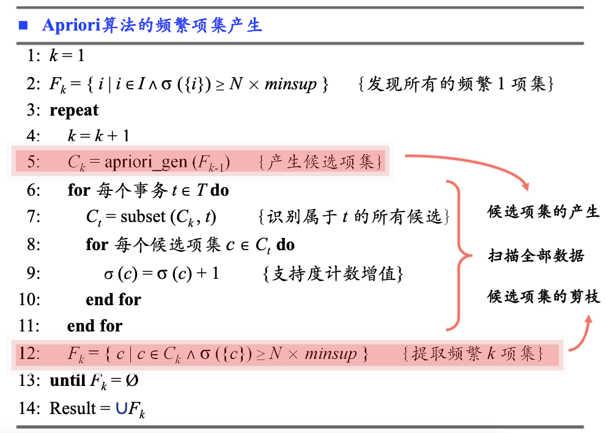
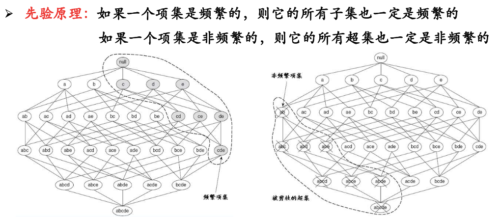
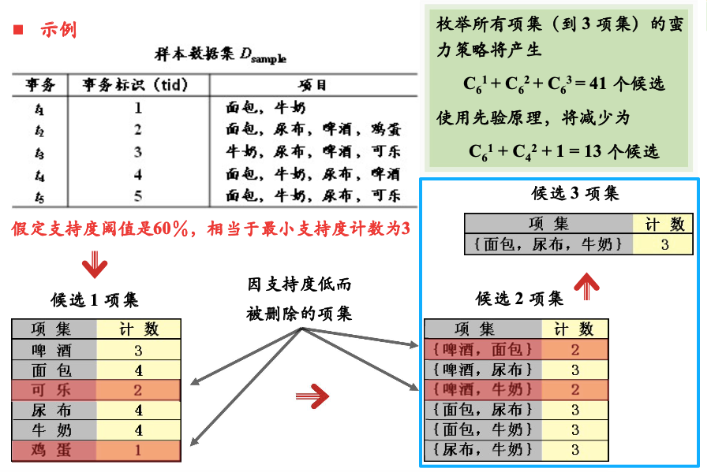
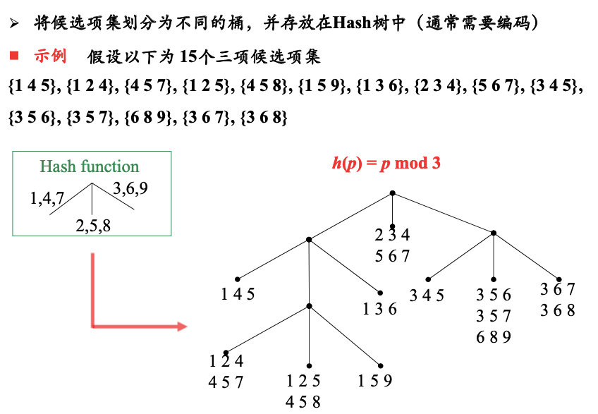
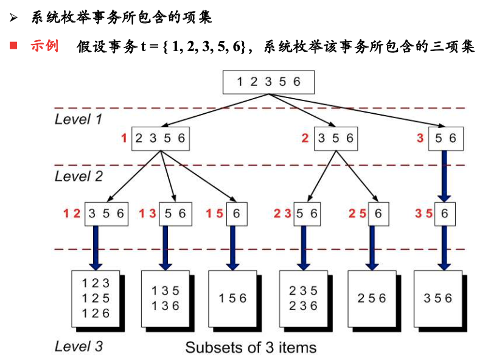
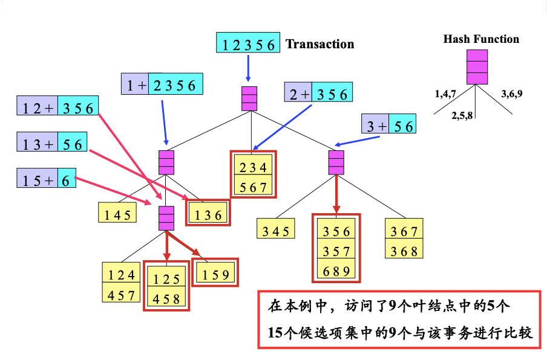
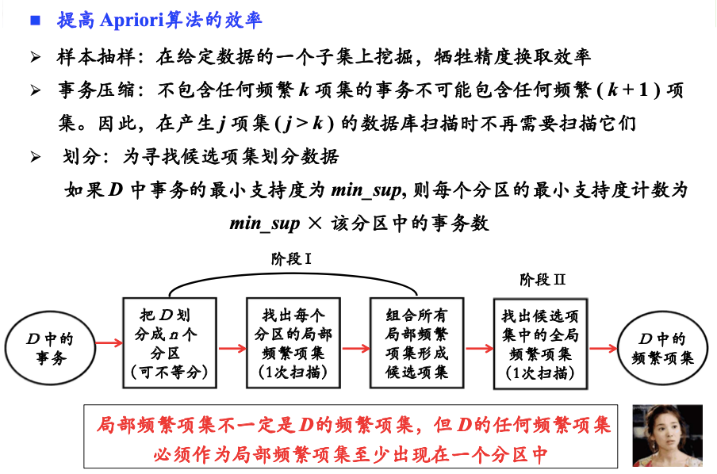

# Apriori算法

# 一、伪代码

> 主要工作分3步：
> 1. 代码第`5`行，**产生候选集**
> 2. 代码`6-11`行，**计算支持度**：扫描全部数据，将候选集与事务进行匹配，
> 3. 代码第`12`行，**候选集剪枝**：将支持度较低的过滤掉

# 二、产生候选集

> 已经有了`1项集`、`2项集`、...、`k-1项集`，如何生成`k项集`？

## 2.1 生成策略

1. 生成所有`k项集`，共$C_d^k$个
2. 使用$F_{k-1}、F_{1}$来生成`k项集`，共$O(|F_{k-1}| * |F_1|)$个
3. 使用$F_{k-1}、F_{k-1}$来生成`k项集`，共$O(|F_{k-1}| * |F_{k-1}|)$个
    - 这种方式数量最少
    - 生成过程中还可以做一些过滤：
        1. 例如A=`{a,c,f}`，B=`{a,d,f}`，可以生成`{a,c,d,f}`
        2. A=`{a,c,f}`，B=`{a,d,e}`，生成`{a,c,d,e,f}`，就可以直接过滤掉
        - 寻找**只有一个差异**的`k-1项集对`

## 2.2 剪枝

> 不用计算支持度值就直接删除某些候选集
> 

> 
先验原理

>
> 
> 例如：项集`{cde}`出现的次数，一定不会超过项集`{de}`出现的次数
> 
> 

从这个具体示例来理解一下：

#### 1) 可直接过滤掉部分`2项集`

例如`{啤酒，面包}=2`、`{啤酒，牛奶}=2`

#### 2) 生成的`3项集`，可进一步检查

例如：
$$
\begin{cases}
    \{啤酒，尿布\} = 3 \\
    \{面包，尿布\} = 3
\end{cases}
\Rightarrow \{啤酒，面包，尿布\}
$$

但是`{啤酒，面包，尿布}`中，`{啤酒，面包}=2`，  
因此这个候选集的支持度不可能超过2，直接过滤掉

## 2.3 去重

最后，每个**候选集**，可以按**项**排序，  
从而对**候选集**进一步去重。  

# 三、计算支持度

## 3.1 暴力匹配

有`N`条事务，`M`个候选集，复杂度$O(MN)$

## 3.2 Hash树方法

#### 1) 候选集 --> Hash树

#### 2) 枚举事务所包含的`k项集`

#### 3) `k项集`去Hash树中匹配

# 四、更多内容

> 最后一种方式，例如最小支持度为`60%`：  
> 将整个数据集划分为5个区，  
> 如果某个项集X在5个区的支持度分别为`[10%, 30%, 20%, 30%, 20%]`
>
> 项集X在整个数据集中的支持度，应该是它们的加权平均：  
> $\alpha_1$ `10%` + $\alpha_2$ `30%` + $\alpha_3$ `20%` + $\alpha_4$ `30%` + $\alpha_5$ `20%`，  
> 不可能超过`60%`  