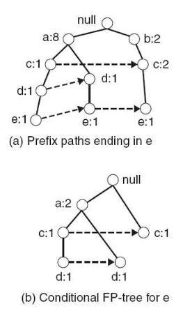
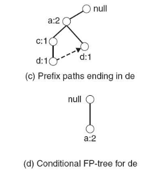
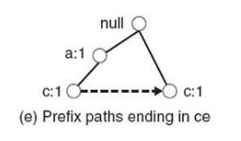
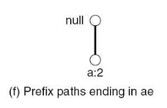

# FP增长算法

> 直接产生频繁项集

## 1. 构造FP-tree

## 2. 挖掘后缀e

#### 1) 构造e的条件FP-tree

> **图a**: 所有包含e的路径  
> **图b**: 在**图a**基础上，构建条件树  
> 得到频繁项集`ae`、`ce`、`de`

#### 2) 构建de的条件FP-tree

> **图c**: **图b**中，所有包含de的路径  
> **图d**: 在**图c**基础上，构建条件树  
> 得到频繁项集`ade`

#### 3) 构建ce的条件FP-tree

> **图e**: **图b**中，所有包含ce的路径  
> 在此基础上，构建的条件树为空

#### 4) 构建ae的条件FP-tree

> **图f**: **图b**中，所有包含ae的路径  
> 在此基础上，构建的条件树为空

## 3. 挖掘后缀d、c、b、a

> 略