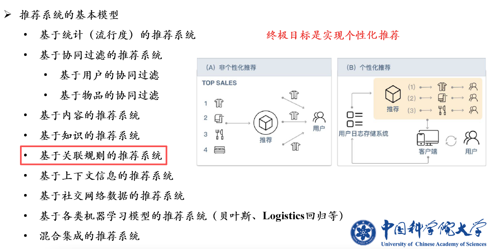

# 关联分析

> 推荐系统是一门庞大的课程，这节课介绍其中一个：**基于关联规则的推荐系统**
> 

> 
推荐系统概览

>
> 
>
> 

1. [基本概念](模式识别与机器学习/关联分析/基本概念.md)
2. [Apriori算法](模式识别与机器学习/关联分析/Apriori算法.md)
3. 发现频繁项集的其他方法
    - 主要介绍了[FP增长算法](模式识别与机器学习/关联分析/FP增长算法.md)
4. [关联规则的扩展](模式识别与机器学习/关联分析/关联规则的扩展.md)
