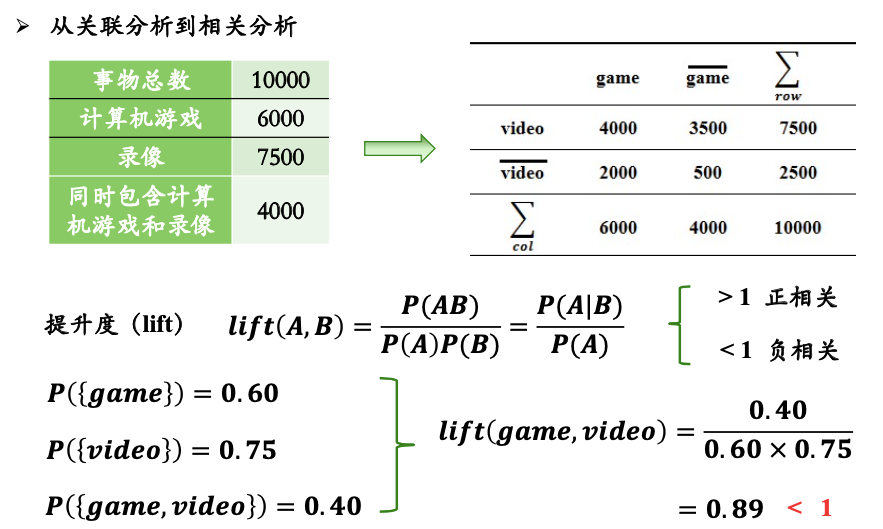
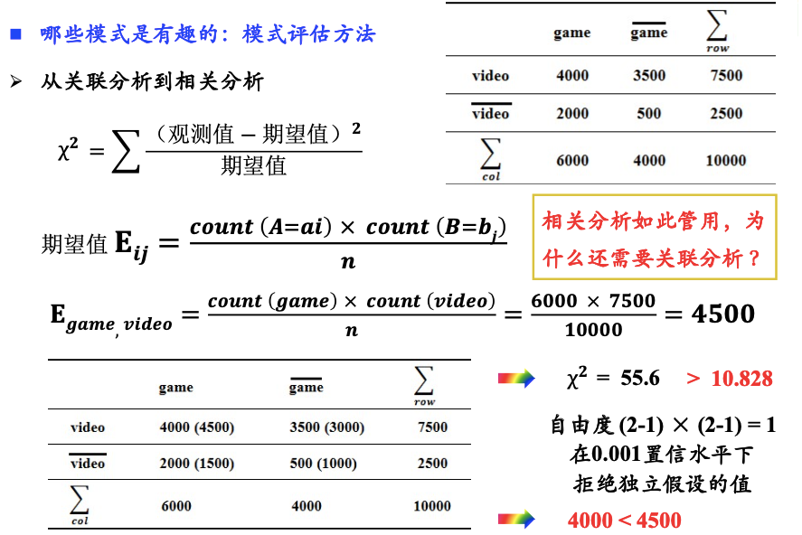
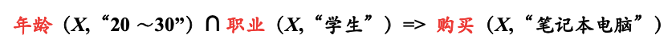

# 关联规则的扩展

# 一、挖掘更多规则

1. 多层次关联规则
2. 多维关联规则
3. 定量关联规则
4. 加权关联规则
5. 频繁子图挖掘
6. 序列模式发现

# 二、 非频繁模式挖掘

> 略

# 三、 `支持度–置信度`框架的问题

> 基于这个框架，找出来的强关联规则，也可能是无趣的甚至是误导的。  
> 又引入了**相关度**的概念。  
> 介绍了两个评价指标

## 3.1 提升度

> 两种极端情况：
> 1. 如果A发生时，B一定不发生。$P(AB)=0  \Rightarrow 提升度 =0 <1$
> 2. 如果A发生时，B一定发生。那么$P(AB)=P(A) \Rightarrow 提升度 = \frac 1 {P(B)} >1$

## 3.2 $\chi^2$

> $\chi^2$值较大，证明它们不独立

## 3.3 为什么仍然使用`支持度–置信度`框架？

**相关度**只能在两个变量之间计算，  
而**关联分析**，可以在多个变量之间计算。  
例如**多维关联规则**的一个例子：

