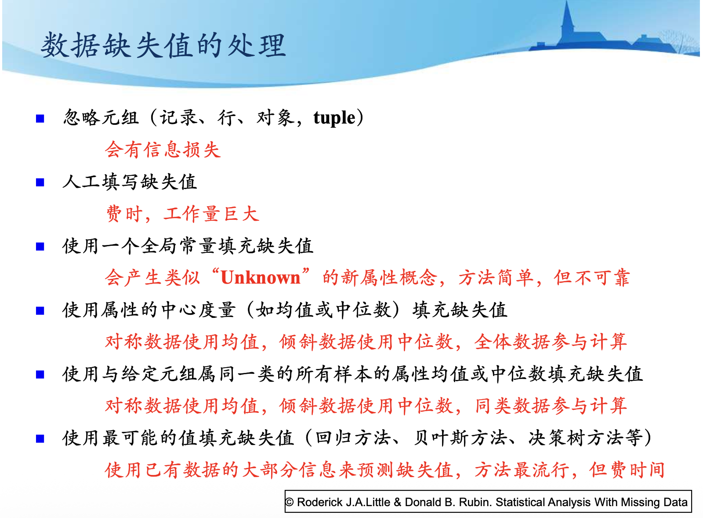

# 数据预处理

1. 一些基本概念：
    1. 数据类型
        - 看论文的时候，要知道`nominal`、`numeric`的含义
    2. 数据的基本统计描述
        - 把握数据全貌
        1. **中心趋势度量**：均值、中位数、众数
        2. **数据散布度量**：盒图、Q-Q图
        3. **图像显示**：直方图、散点图
    3. 数据预处理的基本原因
        - 主要是为了 将输入数据设计成一种能适合所选学习方案的形式

2. 数据缺失值处理

    

    
概览

    

    

3. 数据预处理的方法
    1. [属性选择（Feature Selection）](模式识别与机器学习/数据预处理/属性选择.md)
    2. [属性转换（Feature Extraction）](模式识别与机器学习/数据预处理/属性转换.md)
    3. [数值属性离散化和离散属性数值化](模式识别与机器学习/数据预处理/数值属性离散化和离散属性数值化.md)
    4. 自动数据处理
        - **稳健回归**：重新定义距离公式，实现对离群点的处理

4. [数据建模的困境](模式识别与机器学习/数据预处理/数据建模的困境.md)