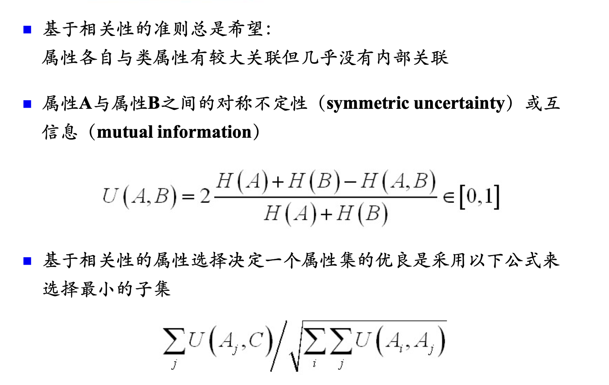

# 属性选择

# 一、添加属性

> 略

# 二、属性子集选择

## 2.1 Embedded（嵌入）

决策树中，每一次分裂，选择某个特征进行分裂。  
构建模型的同时，也选择了相应特征。

## 2.2 Filter（过滤）

#### 1）基于可分性的准则

常见的一种策略：
1. 训练决策树模型，从而得出每个特征的“**重要性**”
2. 使用topk个特征，去训练自己的模型

#### 2）基于相关性的准则

## 2.3 Wrapper（包装）

> 略