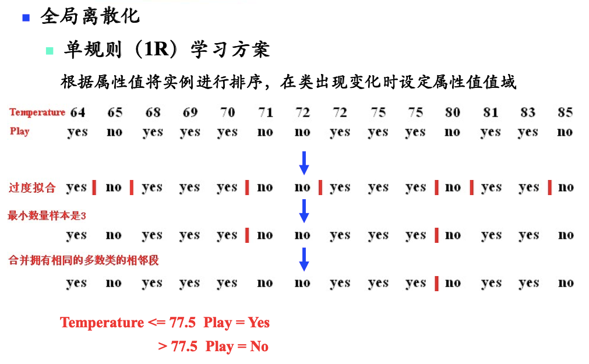
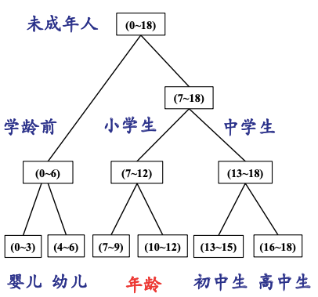

# 数值属性离散化和离散属性数值化

# 一、数据属性离散化

## 1.1 有监督

#### 1) 全局离散化

#### 2) 局部离散化

例如决策树的某个结点，只对结点内的这部分数据，做离散化

#### 3) 熵 + MDL

1. 基于**熵**来选择分裂点
2. 应用MDL原则停止分裂

> 也可以基于**误差**、**相关性**选择分裂点

## 1.2 无监督

#### 1) 等值

- 按照值域划分，例如：
    1. `x<70`，划分为一类
    2. `70<x<80`，划分为一类
    3. `x>80`，划分为一类

#### 2) 等频

排序后，按照样本数量划分

#### 3) 直方图

画出直方图，再去分桶

#### 4) 聚类

只对特征去做聚类，也可以做离散化

#### 5) 概念分层

# 二、离散属性数值化

#### 1) onehot

#### 2) embedding

