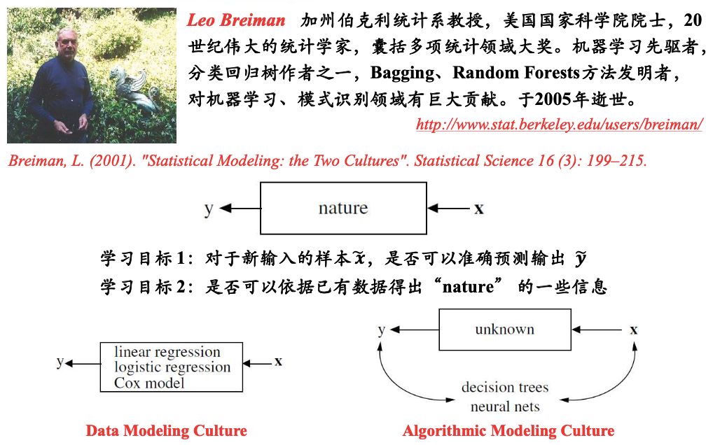
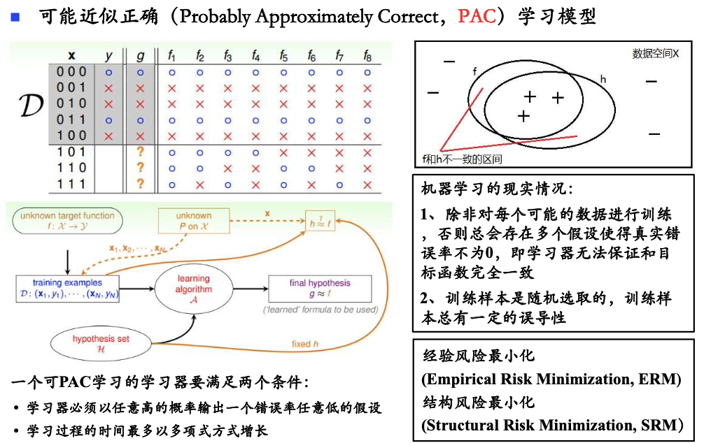

# 数据建模的困境

#### 1) 困境1

1. 两类模型都可以做到**目标1**
2. 线性回归、逻辑回归等，可以做到**目标2**。
    - 训练完后，认为给定的数据集服从特定分布
3. 神经网络，则是个“黑盒子”，很难说清是个什么分布

> 数据建模，有时候难以说清 真实的自然规律

#### 2) 困境2

1. 假设真实模型为$f_1$
2. 由于训练集只有**5/8**的数据，可以训练出8个模型，都完美拟合训练集
3. 如果我们训练的模型为$f_8$，那么在未知数据上，预测就会完全错误

> PAC理论告诉我们，总可以找到一条数据，让模型预测错误…