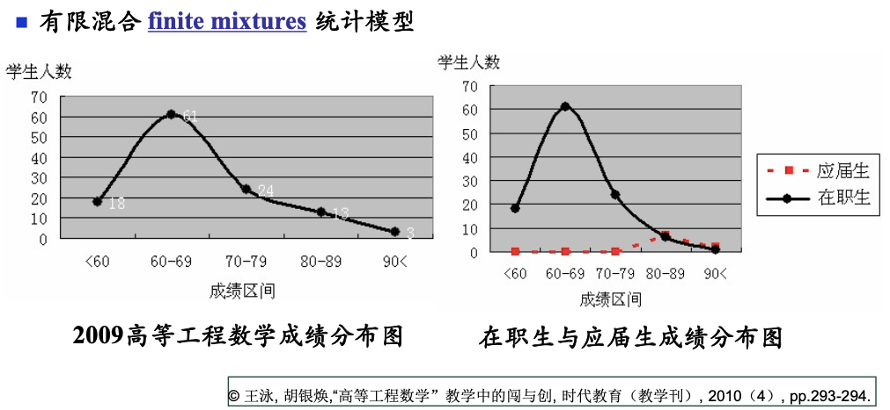
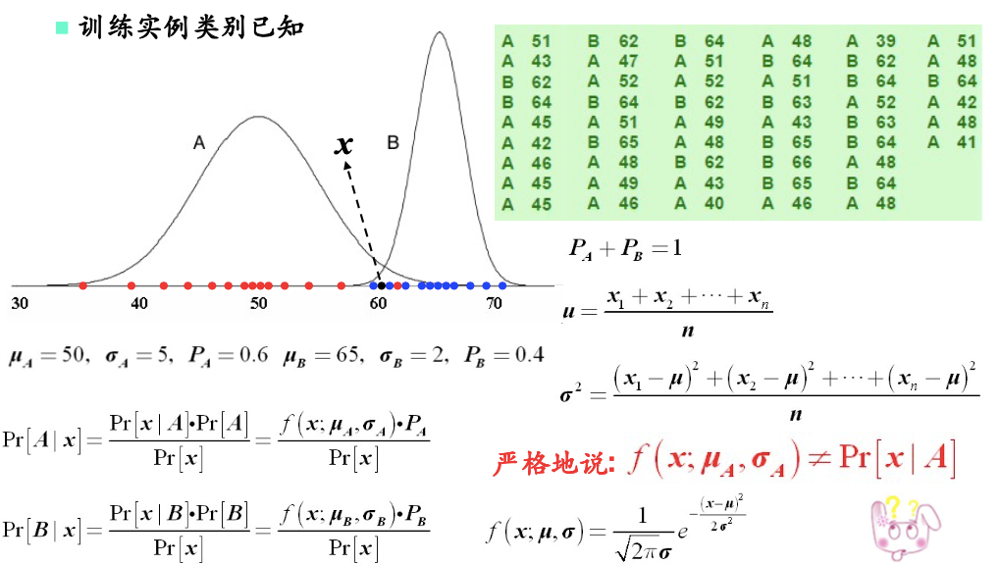
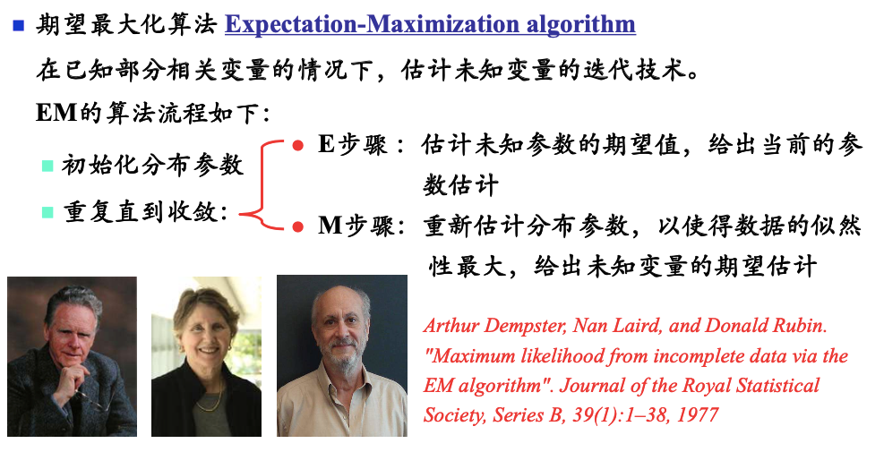
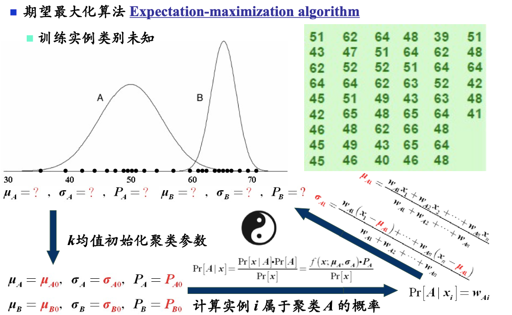

# EM算法在聚类中的应用

> 按照自己的理解来写的，跟老师的介绍有出入～

# 一、有限混合统计模型

1. 左图是老师在2009年教授的一门课程，学生成绩
    - 看起来好像毫无规律
2. 右图，老师将`在职生`、`应届生`的成绩分别画出来
    - 看起来就很合理了，各自符合`高斯分布`

- 所以左图这个分布，实际上是两个`高斯分布`的混合。

# 二、高斯判别模型

> 1. 对于A类数据，我们可以拟合出一个高斯分布
> 2. 对于B类数据，我们也可以拟合出一个高斯分布
> 3. $P_A、P_B$也可以通过**最大似然估计**，估算出来

- 对于一个新样本x，我们就可以分别计算它属于A、B类的概率，从而分类。

# 三、高斯混合模型

> 如果我们没有标签数据，只知道它们是两个高斯分布的混合  
> 此时就无法通过**最大似然估计**，来估算所有参数了  
> 怎么办呢?还有**EM算法**
>
> 

> 
<b>EM算法</b>简介

> 
> 
> 一直没学会EM算法，只能记个大致思想了...
>
> 

1. 随机初始化一组参数$\mu_A、\sigma_A、P_A、\mu_B、\sigma_B、P_B$
    - 类似于**k-means**中，我们先随机选择几个簇类中心
2. 重复这两步直到收敛
    1. ($E$-步骤): 基于目前的参数，计算每个训练样本$x$属于A类、B类的概率，从而划分类别
        - 类似于**k-means**中，计算每个训练样本距离每个簇类中心的距离，找到属于哪个簇
    2. ($M$-步骤): 给每个样本划分类别后，就可以使用**最大似然估计**，更新参数$\mu_A、\sigma_A、P_A、\mu_B、\sigma_B、P_B$
        - 即重新调整每个高斯分布
        - 类似于**k-means**中，将每个样本划分到簇后，重新调整簇类中心

示意图

---

> 综上，这节课并没有介绍**EM算法**的原理  
> 而是介绍了一下**EM算法**在聚类中的一个应用～