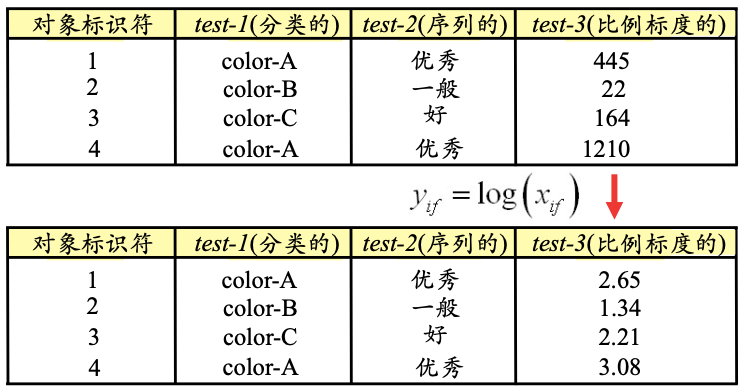
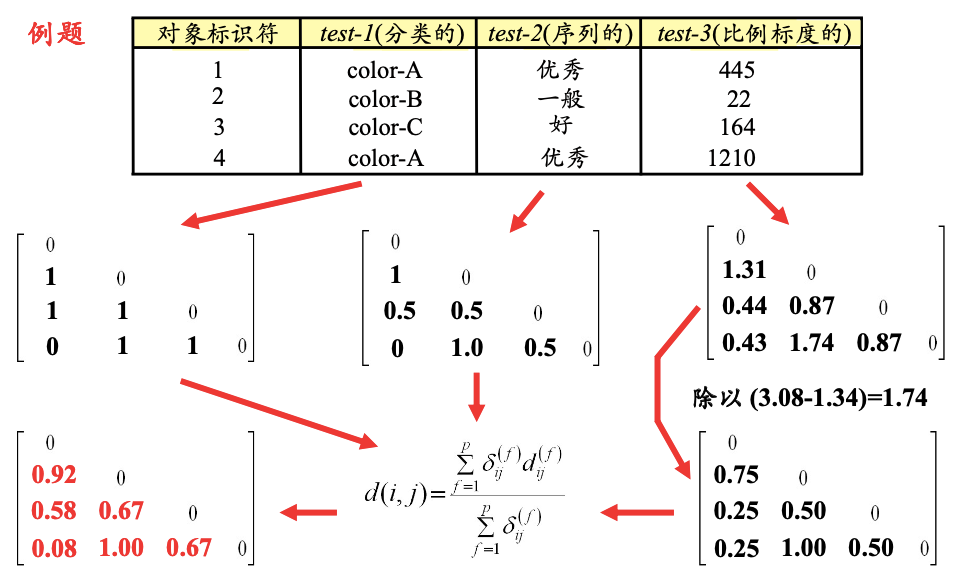

# 数据类型

# 一、两点之间的距离

## 1.1区间标度变量

1. 度量标准化
    - [属性转换（Feature Extraction）](模式识别与机器学习/数据预处理/属性转换.md)中，刚介绍过
2. 相异度矩阵

## 1.2 二元变量

### 1.2.1 计算相异度

> - **a=2**: Jack和Marry都取1的特征，共有2个
> - **b=0**: Jack取1，Marry取0的特征，共有0个
> - **c=1**: Jack取0，Marry取1的特征，共有1个
> - **d=3**: Jack和Marry都取0的特征，共有3个

### 1.2.2 推广至多元变量

#### 1) 简单计算

|id|帽子|上衣|下衣|鞋|
|---|---|---|---|---|
|i|color-A|color-B|color-C|color-B|
|j|color-C|color-B|color-B|color-A|

$$
d(i,j) = \frac {p-m} p = \frac {4-1} 4
$$

1. $p$是全部变量的数目（这些变量的取值都是color）
    - 例如上例中，$p=4$
2. $m$是状态值相同的变量数目
    - 例如上例中，$m=1$

#### 2) 转化为二元变量，再计算

1. 例如上表，可以转化成这样：
    |id|帽子|上衣|下衣|鞋|
    |---|---|---|---|---|
    |i|100|010|001|010|
    |j|001|010|010|100|

2. 然后计算它们之间的相异度：
    |id|test1|test2|test3|test4|test5|test6|test7|test8|test9|test10|test11|test12|
    |---|---|---|---|---|---|---|---|---|---|---|---|---|
    |i|1|0|0|0|1|0|0|0|1|0|1|0|
    |j|0|0|1|0|1|0|0|1|0|1|0|0|

## 1.3 序列变量

- 示例：一般 --> 好 --> 优秀
    |id|test2|
    |---|---|
    |1|优秀|
    |2|一般|
    |3|好|
    |4|优秀|

1. 先做一步转化，用相应的`秩`来代替：
    |id|test2|也可以转化成这样|
    |---|---|--|
    |1|3|5（更突出优秀）|
    |2|1|1|
    |3|2|2|
    |4|3|5|

2. 归一化
    |id|test2|test2_归一化|
    |---|---|--|
    |1|3|1|
    |2|1|0|
    |3|2|0.5|
    |4|3|1|

## 1.4 比例标度变量

> 例如该变量表示 细菌群体的增长  
> 可能第一天数量为22，第3天数量为1210

## 1.5 混合变量

> 每个变量单独计算**相异度**，然后求平均值。

## 1.6 向量

#### 1) 余弦

#### 2) Tanimoto系数

# 二、两个簇之间的距离

