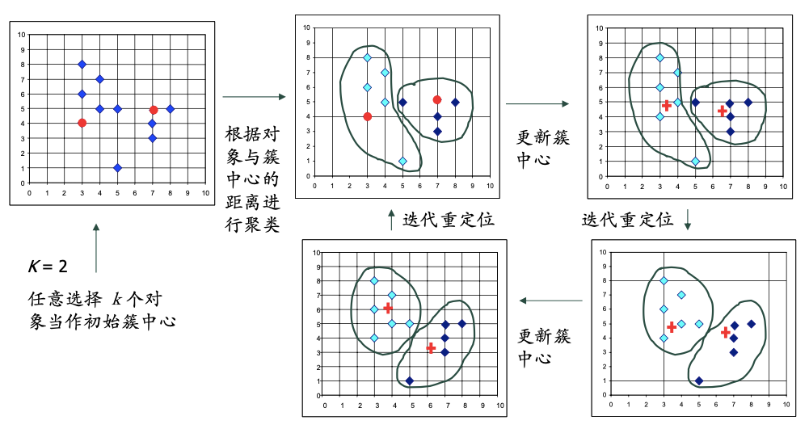
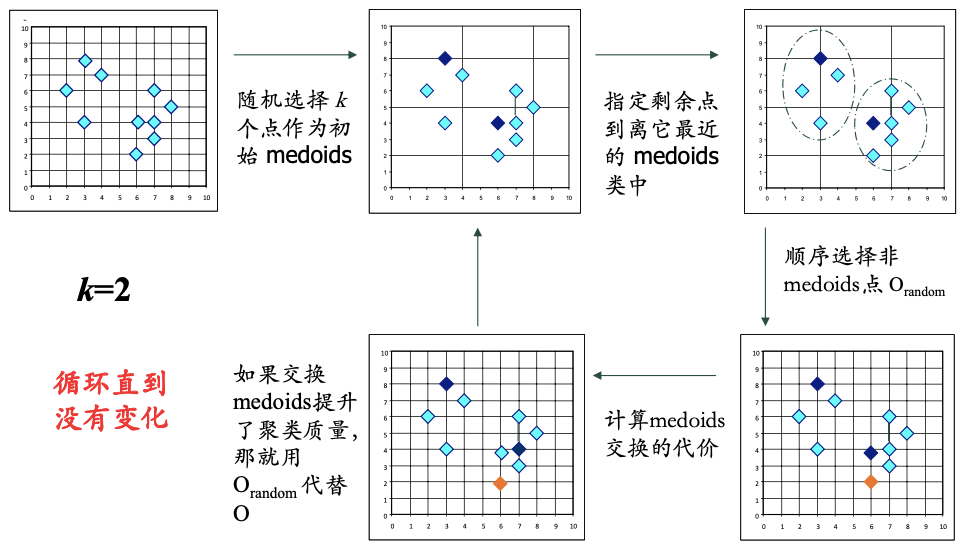
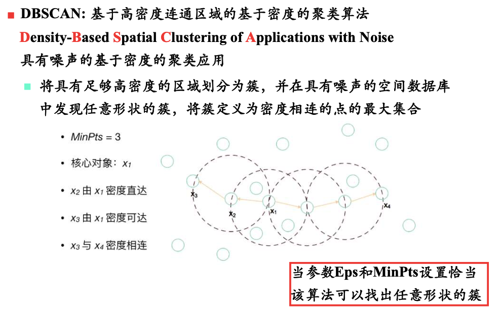
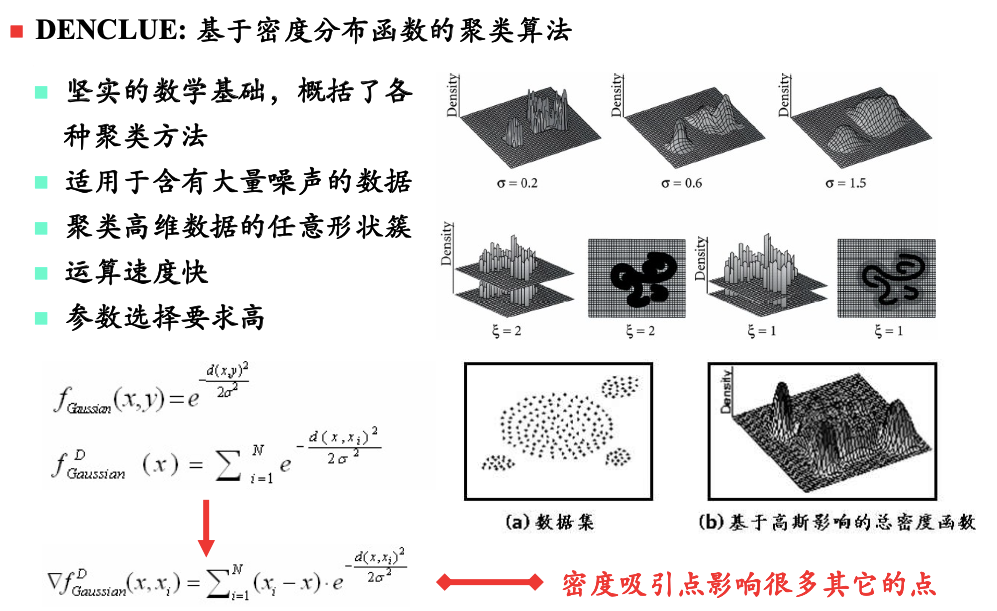
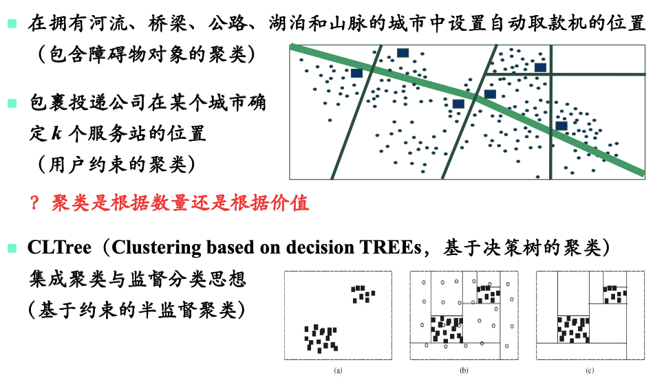

# 聚类方法

# 一、划分方法

## 1.1 k-means

## 1.2 k-medoids

> 算法流程与k-means类似  
> 只是每次选取一个真实样本，作为`簇中心`  
> 对于脏数据和异常数据不敏感，但是复杂度较高$O(k(n-k)^2)$

#### 更多算法

1. Clara 算法
2. Clarans 算法

# 二、层次方法

1. **凝聚层次聚类**：自底而上
    1. 首先将每个对象作为其簇
    2. 然后合并这些原子簇为越来越大的簇
        - 直到所有的对象都在一个簇中，或者某个终止条件满足
2. **分裂层次聚类**：自顶向下
    1. 首先将所有对象置于一个簇中
    2. 然后将它逐渐细分为越来越小的簇
        - 直到每个对象自成一簇，或者达到某个终止条件
3. BIRCH
4. ROCK
5. CHAMELEON

# 三、基于密度的方法

## 3.1 DBSCAN

> 1. 首先以$x_1$为中心，如果距离$x_1$小于某个半径`Eps`的点**足够多**。那么它们聚为一类
>    - **足够多**：点的个数大于一定数量`MinPts`
> 2. 接下来对于簇内的每个点，重复上步操作。

## 3.2 DENCLUE

1. **影响函数**：一个数据点`y`对另外一个数据点`x`的影响程度
    $$
    f_{Gaussian}(x,y) = e^{- \frac {d(x,y)^2} {2 \sigma^2}}
    $$
2. **密度估计函数**：一个数据点`x`的密度，被定义为所有数据点对它的影响之和
    $$
    f_{Gaussian}^D(x) = \sum\limits_{i=1}^N f_{Gaussian}(x,x_i) = \sum\limits_{i=1}^N e^{- \frac {d(x,x_i)^2} {2 \sigma^2}}
    $$
3. **密度吸引点**：$f_{Gaussian}^D(x)$的局部极大值点
4. **噪声阈值**$\xi$：如果某个密度吸引点的密度$f_{Gaussian}^D(x) < \xi$，则认为该点**不显著**，是噪声

- 聚类的过程，就是寻找每个数据点`x`的**显著密度吸引点**
    - 梯度上山法
    - 属于同一个**显著密度吸引点**的数据点，聚为一类

示意图

## 3.3 OPTICS

# 四、基于网格的方法

> 没有直接对数据进行处理，  
> 而是将数据所在的空间，划分成多个网格，然后对网格进行合并

# 五、聚类高维数据

1. **针对数据**：通过**属性选择**或者**属性变换**降维，再聚类
2. **针对数据空间**：子空间聚类

# 六、基于约束的方法

> 根据应用需求或者用户指定的约束(偏好)对对象进行分组

举例

# 七、基于模型的方法

> 假设数据都是根据潜在的混合概率分布生成，  
> 为每个簇假设一个模型，并找出数据与该模型的最佳拟合

1. 概念聚类
2. 神经网络方法（SOM）
3. 统计方法
    1. [EM算法](模式识别与机器学习/无监督学习/EM算法.md)
    2. 贝叶斯聚类算法