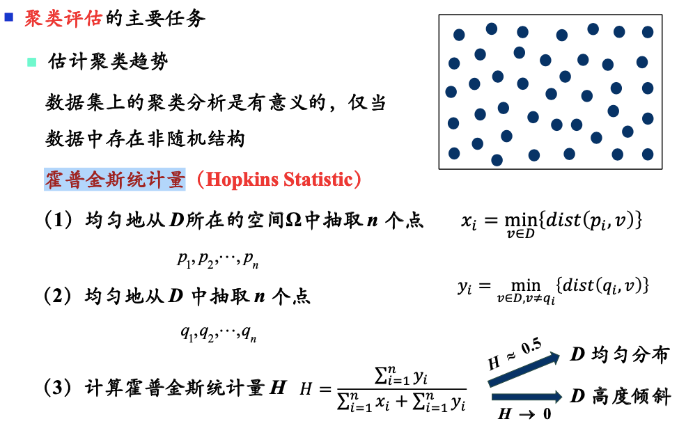
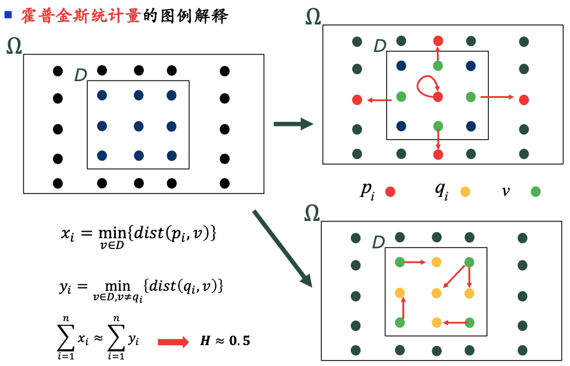
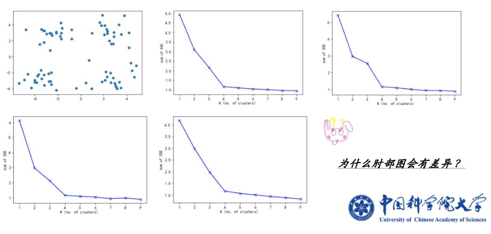
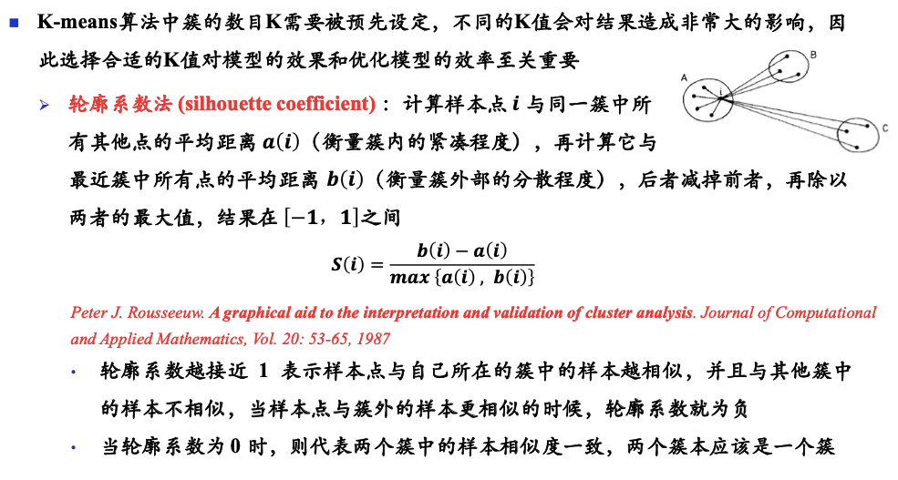
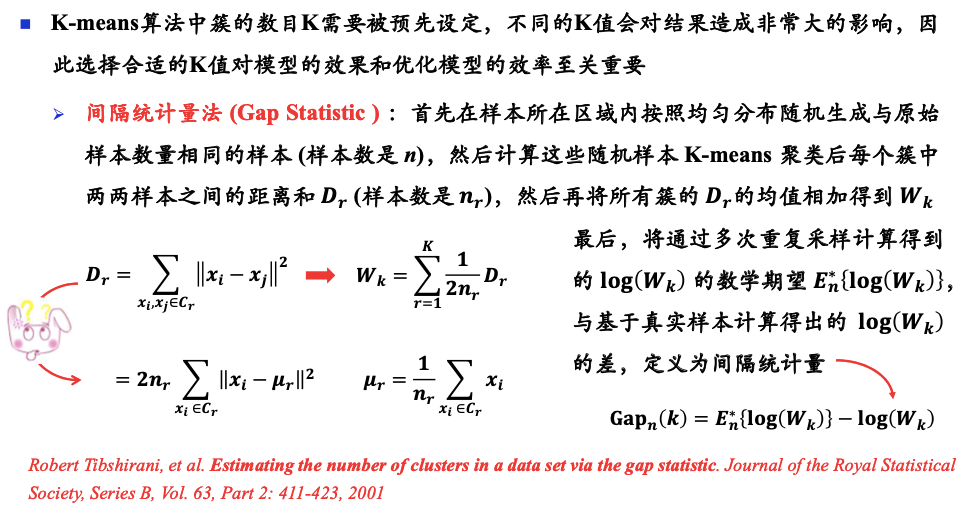
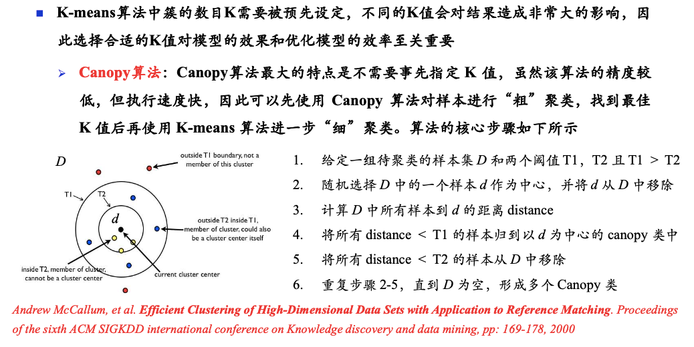

# 聚类模型评估

# 一、霍普金斯统计量

> 估计聚类趋势：给定一个数据集，是否值得做聚类？

图解：<b>均匀分布</b>

图解：<b>高度倾斜</b>

# 二、如何确定簇数$k$

## 2.1 经验方法

对于n个点的数据集，簇数$k$大约为$\sqrt{\frac n 2}$，每个簇大约有$\sqrt{2n}$个点

## 2.2 肘方法

增加簇数$k$，会降低簇内方差，可以通过绘制该图，来寻找合适的k值

## 2.3 轮廓系数法

## 2.4 间隔统计量法

> 假设实际样本对应的最佳簇数为K，  
> 那么此时实际样本的簇内样本相异度应该相对较小,   
> 而随机样本的簇内样本相异度与实际样本的簇内样本相异度的差值此时应该达到最大值  
> 即$Gap_n(k)$最大

## 2.5 Canopy算法

# 三、测定聚类质量

> 聚类方法的有效性也可以根据其发现隐含模式的能力来衡量