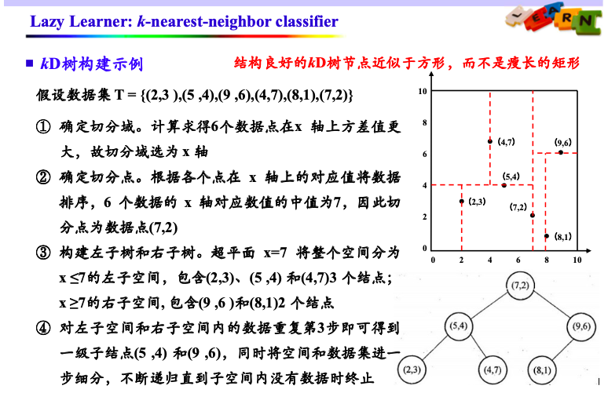
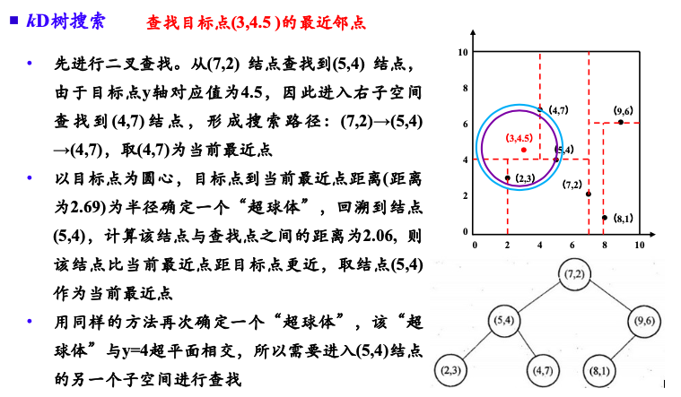
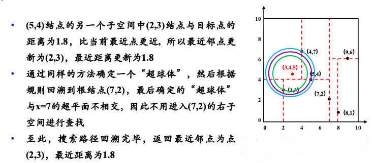

# KNN（k-nearest-neighbor）

# 一、KNN的三要素

## 1.1 计算距离

### 1.1.1 计算距离的几种方式
|||公式|应用|
|---|---|---|---|
|曼哈顿距离|向量的1范数|$\sum\limits_{i=1}^n \left\| x^{(1)}_i - x^{(2)}_i \right\|$|城市距离|
|欧氏距离|向量的2范数|$\left[ \sum\limits_{i=1}^n \left( x^{(1)}_i - x^{(2)}_i \right)^2 \right]^{\frac 1 2}$|两点间距|
|切比雪夫距离|向量的$\infty$范数|$\max\limits_{1 \le i \le n} \left\| x^{(1)}_i - x^{(2)}_i \right\| $|棋盘距离|
|闵可夫斯基距离|向量的p范数|$\left[ \sum\limits_{i=1}^n \left( x^{(1)}_i - x^{(2)}_i \right)^p \right]^{\frac 1 p}$||

### 1.1.2 可能存在的问题

- 量纲问题（同一组数据，选择的量纲不同，计算结果不同）
    - 例如这组数据：
        |身高(cm)|体重(kg)|
        |---|---|
        |170|50|
        |190|50|
        |170|70|
    - 也可以这样表示：
        |身高(m)|体重(kg)|
        |---|---|
        |1.7|50|
        |1.9|50|
        |1.7|70|

- 解决办法
    1. 归一化
        - 将数据缩放到一个固定范围
        - 常见方式（最小最大归一化）：$X_{norm} = \frac {X-X_{min}} {X_{max}-X_{min}}$
    2. 标准化
        - 将数据缩放成均值为0，方差为1的分布
        - 常见方式（Z-Score标准化）：$X_{std} = \frac {X - \mu} \sigma$

## 1.2 k值选择
通常由交叉验证选择最优值

## 1.3 预测
1. 分类：多数表决
2. 回归：平均值

# 二、KD树（k-Dimension）
KNN算法，需要计算输入数据与每一个训练数据的距离。  
当数据集规模较大时，计算非常耗时。  
为提高搜索效率，提出了KD树

## 2.1 构建

## 2.2 搜索

