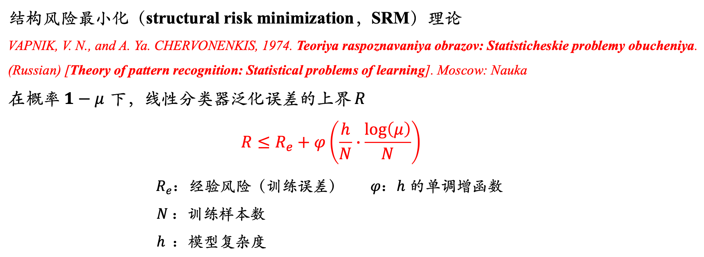
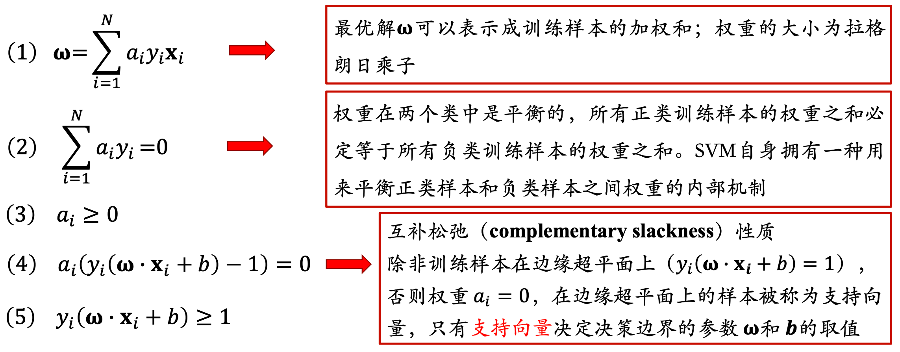
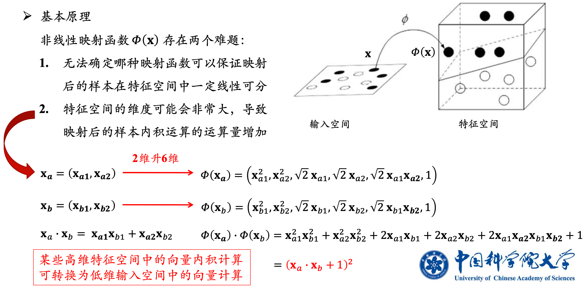

# SVM

# pre、为什么要寻找`最大间隔`？

- 对于线性分类器：
    1. 依据**SRM原理**，随着模型能力增加，泛化误差的上界也随之提高。
        

        
<b>SRM原理</b>

        
        

        

    2. 具有较大间隔的决策边界比那些具有较小间隔的决策边界具有更好的泛化误差。

- 因此需要设计具有`最大间隔`的线性分类器

# 一、目标函数

> 先讨论最简单的情况：数据集`线性可分`

## 1.1 几何间隔

回忆一下二维空间中，点到直线的距离，  
点$(x^{(i)}, y^{(i)})$到某个超平面$w^T x + b$的距离，可以表示为:
$$
\begin{aligned}
    \gamma &= \frac {y^{(i)}(w^T x^{(i)} + b)} {||w||}  \\
    &= \frac {\hat{\gamma}} {||w||}
\end{aligned}
$$

> $\gamma$ 称为`几何间隔`  
> $\hat{\gamma}$ 称为`函数间隔`

## 1.2 最大间隔

**SVM**中，不仅想要正确划分，还想要`几何间隔`最大  
**用数学公式表示出来就是**:  

$$
\begin{aligned}
    & \max\limits_{\gamma,w,b} \quad \quad \gamma & (1)\\
    s.t. \quad & \frac {y^{(i)}(w^Tx^{(i)}+b)} {||w||} \geq \gamma,\quad i=1,...,m & (2)\\
\end{aligned}
$$

也可以用`函数间隔`来表示：
$$
\begin{aligned}
    & \max\limits_{\hat{\gamma},w,b} \quad \quad \frac {\hat{\gamma}} {||w||} & (1')\\
    s.t. \quad & y^{(i)}(w^Tx^{(i)}+b) \geq \hat{\gamma},\quad i=1,...,m & (2')\\
\end{aligned}
$$

而这里$\hat{\gamma}$的取值，对不等式没有任何影响。

详细解释

$$
\begin{aligned}
    & \max\limits_{\hat{\gamma}=1,w,b} \quad \quad \frac 1 {||w||} & (3)\\
    s.t. \quad & y^{(i)}(w^Tx^{(i)}+b) \geq 1,\quad i=1,...,m & (4)\\
\end{aligned}\\
\\
\begin{aligned}\\
    & \max\limits_{\hat{\gamma}=2,w',b'} \quad \quad \frac 2 {||w'||} & (3')\\
    s.t. \quad & y^{(i)}(w'^Tx^{(i)}+b') \geq 2,\quad i=1,...,m & (4')\\
\end{aligned}
$$
> (3)(4)式，是在参数空间$(w,b)$中寻找最优解  
> (3')(4')式，是在参数空间$(w',b')$，也即$(2w,2b)$中寻找最优解  
> 两者是完全等价的
>    - 例如在参数空间$(w,b)$对应的最优解为$(w^*,b^*)$
>    - 在参数空间$(w',b')$中的最优解就是$(2w^*,2b^*)$

因此，**不妨令$\hat{\gamma}=1$，** 将问题表述为:  
$$
\begin{aligned}
    & \max\limits_{w,b} \quad \quad \frac 1 {||w||} & (1'')\\
    s.t. \quad & y^{(i)}(w^Tx^{(i)}+b) \ge 1,\quad i=1,...,m & (2'')
\end{aligned}
$$

**最终形式**:  
更进一步，求解 $\max\limits_{w,b} \frac 1 {||w||}$ 与 求解 $\min\limits_{w,b} \frac 1 2 ||w||^2$是等价的  
所以也可以这样表述:  
$$
\begin{aligned}
    & \min\limits_{w,b} \quad \quad \frac 1 2 {||w||^2} & (1)\\
    s.t. \quad & y^{(i)}(w^Tx^{(i)}+b) \ge 1,\quad i=1,...,m & (2)
\end{aligned}
$$

# 二、对偶优化问题

## 2.1 拉格朗日函数

首先引入拉格朗日函数：
$$
\begin{aligned}
    & L(w,b,\alpha) = \frac 1 2 {||w||^2} + \sum\limits_{i=1}^m \alpha_i  (1 - y^{(i)}(w^Tx^{(i)}+b)) & (5) \\
    s.t. \quad & \alpha_i \ge 0
\end{aligned}
$$

原始的`最小化问题`，可以转化为**相应拉格朗日函数**的`极小极大问题`：
$$
\begin{aligned}
    & \min\limits_{w,b} 原始问题 = \min\limits_{w,b} \max\limits_{\alpha} L(w,b,\alpha) \\
    s.t. \quad & \alpha_i \ge 0
\end{aligned}
$$

## 2.2 对偶问题

该`极小极大问题`的对偶问题，为`极大极小问题`：
$$
\begin{aligned}
    & \max\limits_{\alpha} \min\limits_{w,b} L(w,b,\alpha) \\
    s.t. \quad & \alpha_i \ge 0
\end{aligned}
$$

> **SVM**中，求解原始问题，可以转化为求解对偶问题。  

## 2.3 对偶问题的求解

1. 先求解 $\min\limits_{w,b} L(w,b,\alpha)$
    $$
    \begin{aligned}
        \frac{\partial}{\partial w} L(w,b,\alpha)=w-\sum^m_{i=1}\alpha_i y^{(i)}x^{(i)} =0 \\
        \Rightarrow \quad w=\sum^m_{i=1}\alpha_i y^{(i)}x^{(i)} \quad & (6) \\
        \frac{\partial}{\partial b} L(w,b,\alpha)=\sum^m_{i=1}\alpha_i y^{(i)}=0 \quad & (7)
    \end{aligned}
    $$
    > 将(6)、(7)式代入(5)，简化一下，可以得到:  
    $$
    \begin{aligned}
    G(\alpha) = \min\limits_{w,b} L(w,b,\alpha) &= \sum^m_{i=1}\alpha_i-\frac 1 2 \sum^m_{i,j=1} y^{(i)}y^{(j)}\alpha_i\alpha_j(x^{(i)})^Tx^{(j)} \\
    &= \sum^m_{i=1}\alpha_i-\frac12\sum^m_{i,j=1}y^{(i)}y^{(j)}\alpha_i\alpha_j \langle x^{(i)} \cdot x^{(j)} \rangle & (8)
    \end{aligned}
    $$

2. 再求解 $\max\limits_\alpha G(\alpha)$
    $$
    \begin{aligned}
        & \max\limits_\alpha G(\alpha) =\sum^m_{i=1}\alpha_i-\frac 1 2 \sum^m_{i,j=1}y^{(i)}y^{(j)}\alpha_i\alpha_j \langle x^{(i)} \cdot x^{(j)} \rangle & (8) \\
        s.t. \quad & \alpha_i \geq 0 & 引入拉格朗日函数时的约束 \\
        & \sum^m_{i=1} \alpha_iy^{(i)}=0 \quad & 上面的(7)式
    \end{aligned}
    $$
    > 如何求解$\alpha$？后面单独来介绍 ---`SMO`

## 2.4 小结

经过上面的过程，我们将**原始优化问题**：
$$
\begin{aligned}
    & \min\limits_{w,b} \quad \quad \frac 1 2 {||w||^2} & (1)\\
    s.t. \quad & y^{(i)}(w^Tx^{(i)}+b) \ge 1,\quad i=1,...,m & (2)
\end{aligned}
$$
转化为了**对偶优化问题**：
$$
\begin{aligned}
    & \max\limits_\alpha G(\alpha) =\sum^m_{i=1}\alpha_i-\frac 1 2 \sum^m_{i,j=1}y^{(i)}y^{(j)}\alpha_i\alpha_j \langle x^{(i)} \cdot x^{(j)} \rangle & (8) \\
    s.t. \quad & \alpha_i \geq 0 & \\
    & \sum^m_{i=1} \alpha_iy^{(i)}=0 \quad & (7)
\end{aligned}
$$

# 三、分离超平面

> 假设我们已经解决**对偶优化问题**，得到$\alpha^*$  
> 如何求出$w^*,b^*$？

**定理**：$w^*,b^*$是`原始问题(1)`的最优解，$\alpha^*$是`对偶问题(8)`的最优解 $\Leftrightarrow$ $w^*, b^*, \alpha^*$满足`KKT条件`

SVM问题的<b>KKT条件</b>

所以可以这样来求解：
1. 利用KKT条件中的`(1)式`：
    $$
    w^\ast = \sum\limits^m_{i=1} \alpha_i^\ast y^{(i)}x^{(i)}
    $$ 
2. $(\alpha_1^\ast,\alpha_2^\ast,\cdots,\alpha_n^\ast,)$中一定存在下标j，使得$\alpha_j^\ast>0$。可以这样求解$b^\ast$:  
    $$
    b^\ast = y^{(j)} - \sum\limits^m_{i=1} \alpha_i^\ast y^{(i)} \langle x^{(i)} \cdot x^{(j)} \rangle
    $$
    > 详细证明过程见李航老师的《统计学习方法》

分离超平面$w^{\ast T} x + b^\ast = 0$也可以用类似的形式表示出来:  
$$
\left[ \sum\limits^m_{i=1} \alpha_i^\ast y^{(i)}x^{(i)} \right] x + b^\ast = 0 \\
\Rightarrow \sum\limits^m_{i=1} \alpha_i^\ast y^{(i)} \langle x^{(i)} \cdot x \rangle + b^\ast = 0
$$

# 四、线性不可分

> 前面3节，我们讨论了最简单的情况：数据集`线性可分`  
> 如果数据集`线性不可分`呢？

对于每一个样本点，我们添加了一个参数$\xi_i$，将原始问题改写为:

$$
\begin{aligned}
    & \min\limits_{w,b,\xi} \quad \frac 1 2 \parallel w\parallel ^2+C\sum^m_{}\xi_i \\
    s.t. \quad & y^{(i)}(w^Tx^{(i)}+b) \geq1-\xi_i,i=1,...,m\\
    & \xi_i \geq 0 ,i=1,...,m
\end{aligned}
$$

这样就允许数据集里面有**函数间隔**小于1的情况了，一个样本的**函数间隔**可以为 $1 - \xi_i$ (其中 $\xi_i \geq  0$)  
- $C$ 是一个参数，用于控制相对权重，具体的控制需要在两个目标之间进行权衡  
    1. 一个是使得 $\parallel w\parallel ^2$ 取最小值  
    2. 另一个是想让$\xi_i$尽可能小，确保绝大部分的样本都有至少为 1 的函数边界

同样推导一下对应的**对偶优化问题**，可以得到:

$$
\begin{aligned}
    & \max\limits_\alpha \quad G(\alpha) =\sum^m_{i=1}\alpha_i-\frac12\sum^m_{i,j=1}y^{(i)}y^{(j)}\alpha_i\alpha_j \langle  x^{(i)} \cdot x^{(j)} \rangle \\
    s.t. \quad & 0\leq \alpha_i \leq C, \quad i=1,...,m \\
    & \sum^m_{i=1}\alpha_iy^{(i)}=0  \\
\end{aligned}
$$

对比**第二节**`线性可分`的情况，相当于添加了一组约束条件:  
$$ \alpha_i \leq C,\quad i=1,...,m $$

# 五、核函数

## 5.1 基本原理

结合一个具体例子来理解：

> 如果我们把之前公式中的 $\langle x^{(i)} \cdot x^{(j)} \rangle$，  
> 都替换成 $K(x^{(i)}, x^{(j)}) = (x^{(i)} \cdot x^{(j)} + 1)^2$。
>
> 那么相当于将 $\langle x^{(i)} \cdot x^{(j)} \rangle$ 替换成 $\langle \phi(x^{(i)}) \cdot \phi(x^{(j)}) \rangle$，  
> 也就是将`二维特征`，先映射到`六维特征`，  
> 再去对数据集进行划分。

## 5.2 常用核函数

# 六、SMO（sequential minimal optimization）

## 6.1 坐标上升法
要解决下面这样的无约束优化问题：

$$
\max_\alpha G(\alpha_1,\alpha_2,...,\alpha_m)
$$

我们采用下面的算法:

$$
\begin{aligned}
    &重复直到收敛：\{  \\
    &\qquad For \quad i=1,...,m, \{ \\
    &\qquad \qquad \alpha_i:= \arg \max_{\hat \alpha_i}G(\alpha_1,...,\alpha_{i-1},\hat\alpha_i,\alpha_{i+1},...,\alpha_m) \\
    &\qquad \} \\
    &\}
\end{aligned}
$$

> 坐标上升法的思想比较简单:  
> 如上式中所示，算法最内层的循环中，每次只调整一个(或者一批)参数 $\alpha_i$  
> 先假设除了某个特定的 $\alpha_i$ 之外的参数为常数，通过优化$G$来调整参数 $\alpha_i$

## 6.2 SMO

> 在上面的版本中，最内层循环，选择参数的顺序是按照参数的排列次序:  
> 依次更新$\alpha_1, \alpha_2, \cdots, \alpha_m$

更进一步，我们可以采用`启发式算法`：  
预测哪个参数可以使 $G(\alpha)$ 增加最多，来作为下一个需要更新的参数。

#### SMO算法，基本思想如下:  

重复直到收敛 {

1.  选择出某一对的 {$\alpha_i$、$\alpha_j$}
    - 可以使 $G(\alpha)$ 增加最多的一对参数
    1. **外循环**：寻找第一个乘子$\alpha_i$
    2. **内循环**：基于$\alpha_i$，再去寻找$\alpha_j$
2.  保持其他的 $\alpha_k$ 值固定($k\neq i,j$)，通过优化$G(\alpha)$，来调整 $\alpha_i$ 、 $\alpha_j$
    - 通过**解析法**直接求解

}