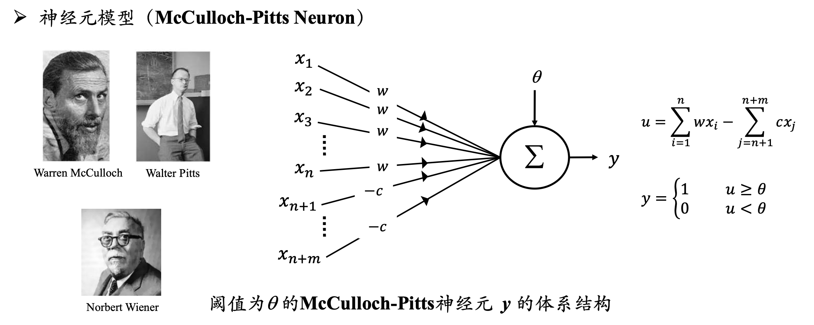
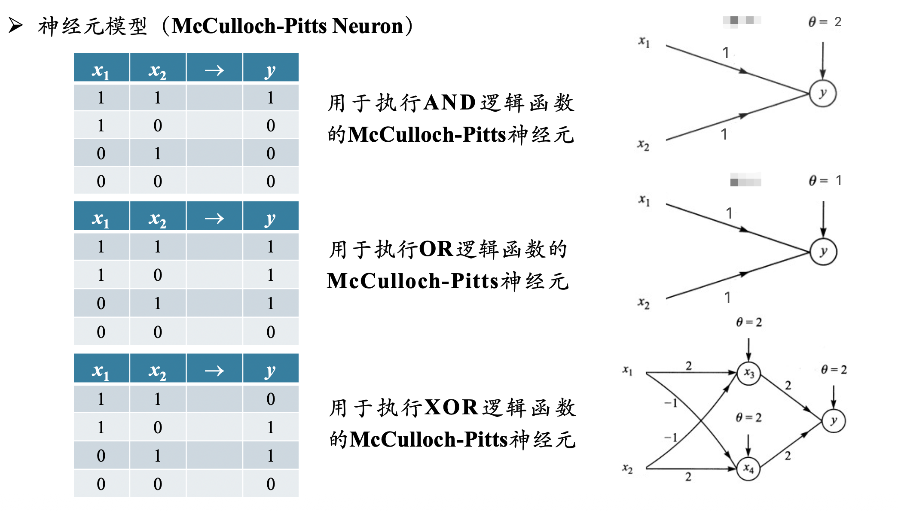
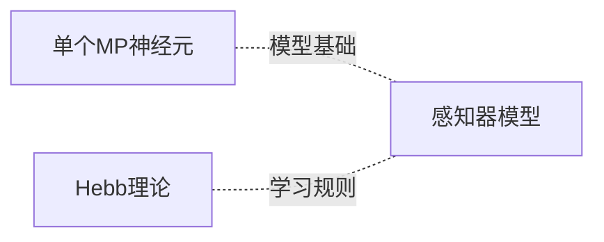
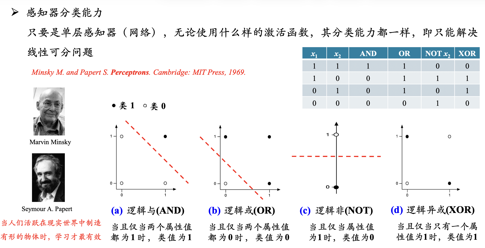
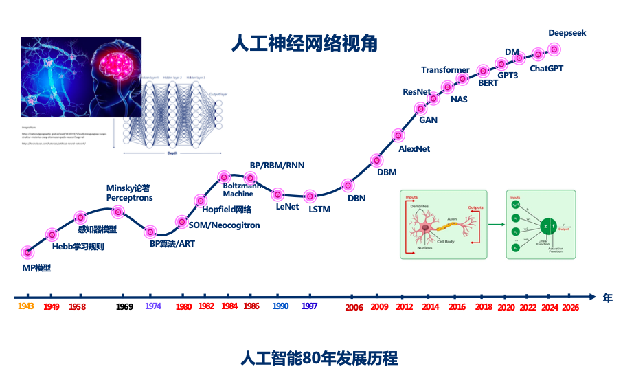
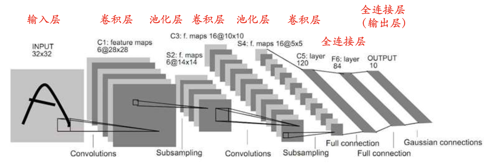

# 神经网络

---

# pre、人工智能三大流派

1. 符号主义
    - 研究抽象思维，注重数学可解释性。又称为逻辑主义、计算机学派
2. 联结主义
    - 研究形象思维，注重仿人脑模型。又称为仿生学派、生理学派
    - 例如我们这节课要学习的神经网络
3. 行为主义
    - 研究感知思维，注重应用和仿真。又称为进化主义、控制论学派
    - 例如强化学习

> **！最重要的收获**  
> 有些知识点在多门课程中都会讲到，可以听听每位老师的讲解
> 1. 有的老师计算机专业出身，有的老师控制论专业出身。每位老师都有自己独到的见解
> 2. 有些知识点，听一遍不懂，多听几遍就懂了。

---
# 一、1940s - 1960s

## 1.1 MP模型

### 1.1.1 MP神经元

### 1.1.2 多个神经元组合

将多个**MP神经元**连接成一个网络，就可以计算任何逻辑函数

例如 <b>AND</b>、<b>OR</b>、 <b>XOR</b> 

## 1.2 Hebb理论

#### 如果两个神经元同步激发，则它们结合的权重增加；如果单独激发，则权重减少

用公式表示如下：
$$
w_{ij} (t+1) = w_{ij} (t) + \eta x_i x_j \qquad (1)
$$

- $\eta$为学习率
- $x_i、x_j$ 分别为节点i、j的输出

## 1.3 感知器模型（Perceptron）

感知器的训练法则：
$$
W(n+1) = W(n) + \eta [d(n)- y(n)] X(n) \qquad (2)
$$

> 对比(1)式：
> - X(n) 是模型输入
> - d(n) 是模型输出
> - W(n) 是它们之间的连接权重

- 用现在的观点来理解，感知机是**误分类驱动**的：
    1. 对于分类正确的样本，损失函数为0
    2. 对于误分类的样本，计算损失函数，然后更新权重

#### 更多知识

1. 感知器收敛定理
    - 线性可分问题，并使用了充分小的学习步长，感知器就一定能够在有限步内收敛到问题的一个解
2. 感知器delta法则
    - 不是线性可分的，那么基于梯度下降的delta法则会收敛到目标概念的最佳近似

## 1.4 第一次寒冬

- 单层感知器的缺陷：

    

    
无法解决<b>异或</b>问题

    

    

> 学习到这里，回顾一下[人工智能原理](人工智能原理/)第一节课
> 

> 
人工智能的发展历程

> 
> 
> 
> 
 
> 
> 两位老师用不同的方式介绍了**神经网络的发展历程**

#### 更多知识

1. 感知器模型是线性分类模型，通过引入`核技巧`，也可以对非线性数据进行分类
    - 线性回归、逻辑回归、SVM等，也可以。
2. 一项Science研究发现，人类大脑中的单个神经元就能解决异或问题
    - https://www.science.org/doi/10.1126/science.aax6239

---

# 二、1970s - 1980s

- 寒冬中的探索与突破
    1. 1974年，Werbos首次提出**BP算法**
    2. 1986年，**BP算法**被Rumelhart等人重新发明和普及
        - 终于可以训练`多层网络`了！结束了第一次AI寒冬
    3. 1989年，**万能逼近定理**：具有一个隐藏层的前馈神经网络可以逼近任意连续函数
        - **BP算法**告诉我们可以训练`多层网络`了，但是为什么要训练呢？
        - **万能逼近定理**告诉我们，神经网络可以逼近任意连续函数
    3. 1989年，Yann LeCun提出了LeNet，识别手写数字
        - 第一个成功的卷积神经网络应用，是深度学习在工业应用的先驱

## 2.1 BP算法

接下来老师重点介绍了**BP算法**。

> 公式复杂，理解不了没关系。以后再听听别的老师讲解...  
> 听多了就懂了

## 2.2 小插曲

#### 交叉熵损失函数可以避免因为$\sigma'$饱和而带来的学习率下降的情况，$\sigma$是sigmoid型的激活函数

> 个人觉得在输出层是可以的  
> 在前面的隐藏层，就不行了

## 2.3 LeNet

# 三、1990s - 2010s

## 3.1 第二次寒冬

BP算法复兴神经网络之后，研究界一度非常乐观。  
然而，到了1990年代，这种乐观情绪逐渐消退。  
大概有这些原因：

1. **理论**
    - 无法训练深层网络：层度加深时，梯度消失、梯度爆炸会导致网络无法学习
2. **算力**
3. **数据**
4. 强大的竞争对手 ---[SVM](模式识别与机器学习/监督学习/SVM.md)

## 3.2 第二次突破

1. **理论** 2006年，Hinton提出**深度信念网络**，证明了深度网络可以有效训练
2. **算力** 2009年，Andrew Ng提出在GPU上去做深度学习
3. **理论** 2011年，Bengio提出**ReLU**，有效解决梯度消失问题
4. **数据** 大数据时代的来临。代表性工作：李飞飞老师主导的**IMAGENET**

- 标志性事件：
    - 2012年，Hinton和他的两位学生，提出了**AlexNet**
    - 在ImageNet2012图像识别挑战赛(`ILSVRC 2012`)中，绝对优势胜出
