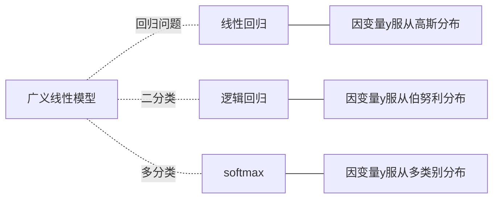
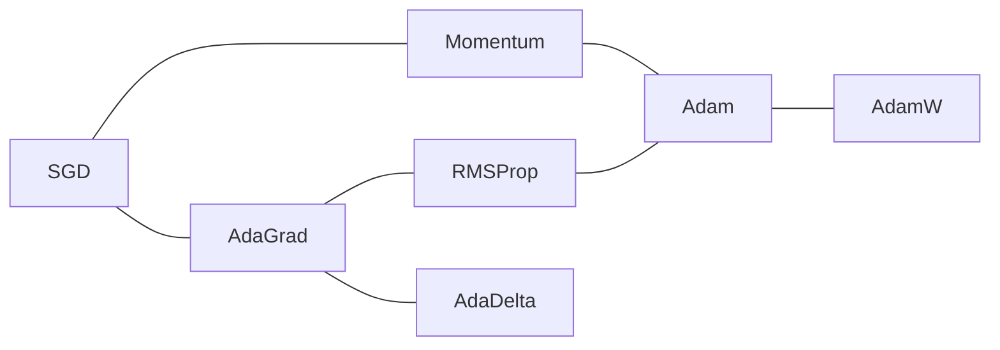

# 线性回归和逻辑回归

> 这节不详细整理笔记了，随便写写

## 一、线性模型

- 都可以用概率论的知识来推导
    1. 假设因变量y服从某个分布，写出似然函数
    2. 最大似然估计，得到优化目标

## 二、优化算法

1. **线性回归**可以用解析法，直接求最小值。
    - 回想一下二次函数 $y=ax^2+b$ 求最小值
    - 但是计算量很大
2. **逻辑回归**就没法直接求了。

于是老师介绍了**梯度下降算法**，以及它的一些变体。

