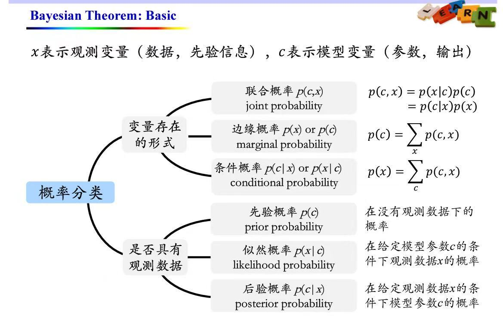

# 贝叶斯学习算法

# 一、基本概念

## 1.1 先验概率、后验概率

## 1.2 贝叶斯定理

$$
\begin{aligned}
P(C|X) &= \frac {P(X|C) \cdot P(C)} {P(X)} &= \frac {P(X|C) \cdot P(C)} {\sum\limits_C P(X|C) \cdot P(C)}  \\
即：\quad 后验概率 &= \frac {似然概率 \cdot 先验概率} {P(X)} &= \frac {似然概率 \cdot 先验概率} {\sum\limits_C 似然概率 \cdot 先验概率}
\end{aligned}
$$

# 二、朴素贝叶斯方法

- 用于分类，属于**生成式模型**

## 2.1 分类模型

1. 训练
    - 拿到训练数据，我们就可以统计出所有的**先验概率**、**似然概率**
2. 预测
    - 来了新数据，就可以计算出**后验概率**
    - 选取**后验概率**最大的作为预测结果

## 2.2 tricks

1. **朴素贝叶斯方法**需要满足较强的条件独立性假设，如何解决？
    - 特征工程：例如，把相关性很高的一些特征 综合成 一个
    - 贝叶斯网络
2. 训练数据中可能从来没出现过某类数据，**先验概率**或者**似然概率**的统计结果为0，怎么办？
    - 拉普拉斯平滑

# 三、贝叶斯决策

- 用于模型评估

1. 最小错误率
    - 希望错误率的`平均值`最小
2. 最小风险
    - 给每一类错误分配不同的权重，希望错误率的`加权平均值`最小
    - 处理样本不均衡问题，例如病例、信贷等

# 四、参数估计

- 看到过一篇很好的文章：https://zhuanlan.zhihu.com/p/72370235

## 4.1 最大似然估计（MLE）

- 认为每个参数是一个具体的数值，求解这个公式：
    $$
    \begin{aligned}
    \hat{\theta} &= \argmax_\theta \ p(D|\theta) \\
    &= \argmax_\theta \ \ln p(D|\theta)
    \end{aligned}
    $$

## 4.2 最大后验估计（MAP）

- 认为每个参数都服从某个分布（上帝之手）。我们需要找到最可能的$\theta$：
    $$
    \begin{aligned}
    \hat{\theta} &= \argmax_\theta \ p(\theta|D) \\
    &= \argmax_\theta \ \frac {p(\theta) p(D|\theta)} {p(D)} \\
    &= \argmax_\theta \ \frac {p(\theta) p(D|\theta)} {与\theta无关的常数} \\
    &= \argmax_\theta \ p(\theta) p(D|\theta) \\
    &= \argmax_\theta \ \underbrace{\ln p(\theta)}_{先验概率} + \underbrace{\ln p(D|\theta)}_{MLE} & (1)
    \end{aligned}
    $$

#### MLE & MAP

- 很神奇的事： **MAP** 相当于 **MLE+正则**
    1. 如果认为每个参数都服从拉普拉斯分布，上面(1)式中的 $\ln p(\theta)$，相当于**l1正则**
    2. 如果认为每个参数都服从高斯分布$N(0, \sigma^2)$，上面(1)式中的 $\ln p(\theta)$，相当于**l2正则**

## 4.3 贝叶斯参数估计

- 训练时，不直接找出具体$\theta$。 而是计算$\theta$的**后验分布**：
    $$
    p(\theta|D) = \frac {p(D|\theta) \cdot p(\theta)} {p(D)}
    $$
- 预测时，让每个$\theta$都去预测。再将它们的结果**加权平均**

## 4.4 EM算法

> 后面介绍**聚类**的课程中，介绍了[EM算法](模式识别与机器学习/无监督学习/EM算法.md)的一个具体应用