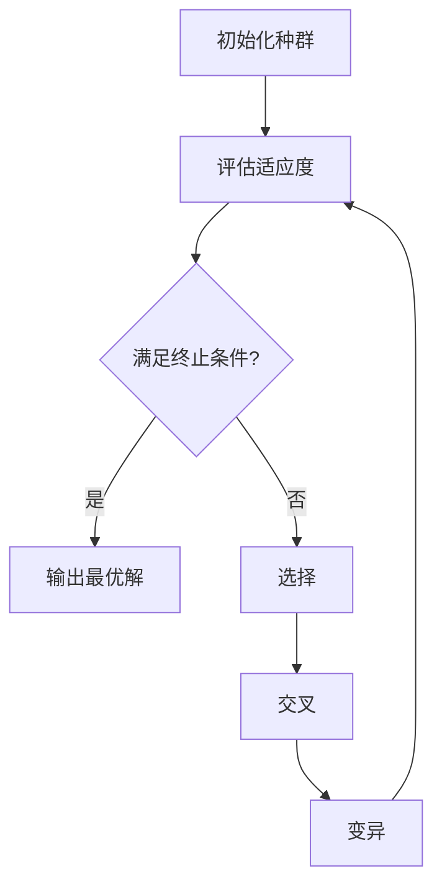

# 遗传算法（Genetic Algorithms）

遗传算法是一种受**生物进化论**启发而提出的全局优化搜索算法

# 一、完整流程

# 二、详细说明
用一个示例来说明整体流程：寻找$f(x)=x^2$在`[0,31]`上的最大值（x为整数）

## 2.1 准备工作
- 给问题的潜在解，即`[0,31]`中的每一位整数，设计一套**编码方案**
    - 我们用5位二进制来表示x，例如`0`=`00000`，`31`=`11111`

## 2.2 基本流程
1. 初始化种群
    - 随机生成初始种群`[01101, 11000, 01000, 10011]`
2. 评估适应度
    - 这里适应度函数可以直接用f(x)。例如个体`01101`的适应度为f(13)=169
3. 选择（适者生存）
    - 根据个体的适应度，以一定的概率选择出一些优秀的个体作为父代，用于繁殖下一代
    - 例如**赌轮选择法**
4. 交叉
    - 模拟基因重组，以一定的概率（一般为`0.4~0.99`）交换它们的部分染色体
    - `01101`与`11000`的后半段发生交换，例如最后两位数字做交换，得到`01100`与`11001`
5. 变异
    - 以很小的概率（一般为`0.0001~0.1`），随机改变子代个体中某个基因的值
    - `01100`的第3位发生变异，变为`01000`

## 2.3 终止条件

1. 达到了最大迭代代数
2. 个体的适应度已经满足要求，或连续多代不再显著提高
3. 种群多样性降低到一定程度