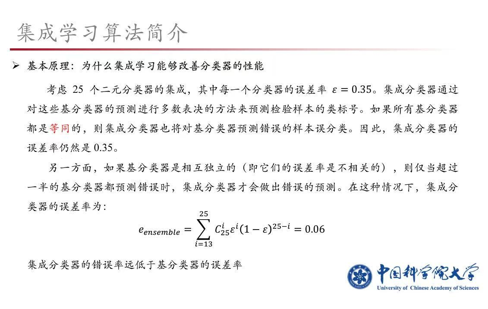
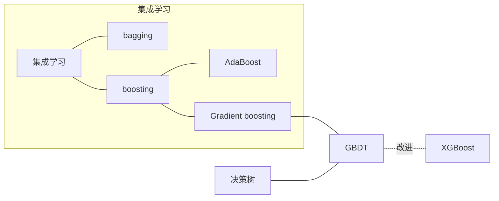
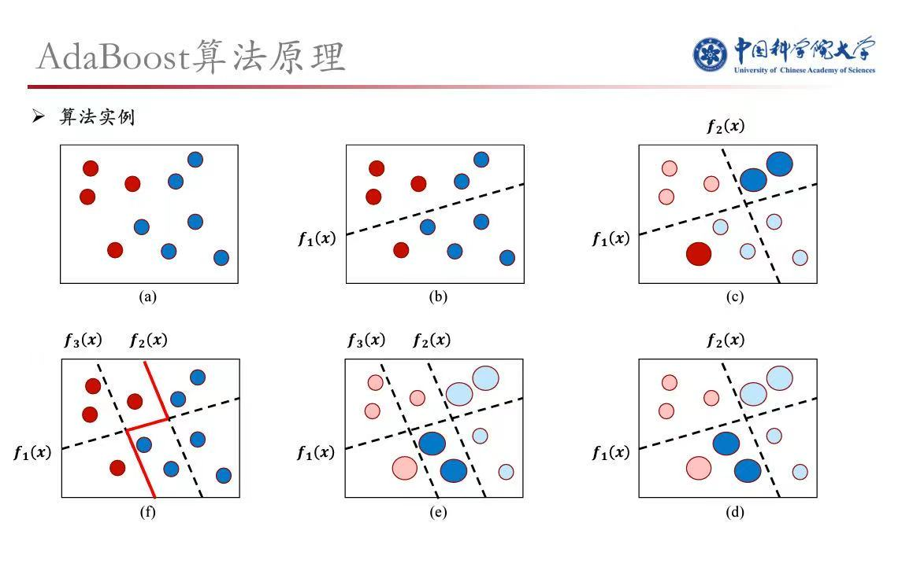

# 集成学习

还有些其他名称：多分类器融合、组合学习、ensemble...

# 一、基本原理

- 将一系列弱分类器集成在一起，提升为强分类器。
    - 实例展示：25个准确率为65%的分类器集成在一起，准确率提升到94%

    

    
详细解释

    

    

# 二、典型的集成学习算法

# 三、AdaBoost

## 3.1 简要流程

- for m in range(M):
    1. 使用数据集，训练一个弱学习模型$G_m$
    2. 根据$G_m$的分类误差率$e_m$，计算该模型的权重$\alpha_m$
    3. 根据$\alpha_m$，调整每个样本的权重，生成新的数据集
        - 被分错的样本，提高权重
        - 分类正确的样本，降低权重
- 最终的预测结果为: f(x) = $\sum\limits_{m=1}^M \alpha_m G_m(x)$

## 3.2 最终效果

最后学习出来的，是图中红色的分类线：

---

> #### 后面的部分可以略过
> 老师课上没讲，我自由发挥的

---

# 四、GBDT

通过梯度来定位模型的不足

## 4.1 简要流程

1. 只有一个根结点时，计算根结点的预测值$\hat{y} = \argmin\limits_{\hat{y}} \sum\limits_{i=1}^N L(y_i, \hat{y})$
    - 初始时，所有的样本都预测为$\hat{y}$
    - 然后取 $f_0(x) = \hat{y}$
2. for m = 1 to M:
    1. 对每个样本，预测值为$f_{m-1}(x_i)$，计算损失函数$L(y_i, f_{m-1}(x_i))$。
    2. 计算每个样本相应的梯度：
        $$
        \frac {\partial L(y_i, f_{m-1}(x_i))} {\partial f_{m-1}(x_i)}
        $$
    3. 使用所有的`负梯度`，作为新的数据集。拟合一个回归树$T_m$。
        - 这里使用的`CART决策树`
    4. 更新$f_m(x) = f_{m-1}(x) + \eta T_m(x)$
        - $\eta$为学习率
3. 最后的预测结果为: $f_M(x) = f_0(x) + \sum\limits_{m=1}^M \eta T_m(x)$

## 4.2 梯度下降的角度来思考

1. 首先我们有一个初始预测值$f_0(x)$
2. 第一棵$T_1(x)$的目标是拟合`负梯度`，于是我们的预测值更新为$f_0(x) + \eta T_1(x)$
3. 第二棵$T_2(x)$的目标是拟合`新的负梯度`，于是我们的预测值更新为$f_0(x) + \eta T_1(x) + \eta T_2(x)$
4. ...
5. 一步步迭代下去，逐渐接近真实值

> 所以GBDT的计算过程，与梯度下降是不是很像？  
> 参数$\eta$，也显得很自然了吧。

# 五、XGBoost

## 5.1 简要流程

1. 只有一个根结点时，计算根结点的预测值$\hat{y} = \argmin\limits_{\hat{y}} \sum\limits_{i=1}^N L(y_i, \hat{y})$
    - 初始时，所有的样本都预测为$\hat{y}$
    - 然后取 $f_0(x) = \hat{y}$
2. for m = 1 to M:
    1. 对每个样本，预测值为$f_{m-1}(x_i)$，计算损失函数$L(y_i, f_{m-1}(x_i))$。
    2. 计算每个样本相应的一阶、二阶梯度：
        $$
        \frac {\partial L} {\partial f_{m-1}}、\frac {\partial^2 L} {\partial f_{m-1}^2}
        $$
    3. （利用一阶、二阶梯度信息）拟合一个回归树$T_m$，使得损失函数$L(y_i, f_{m-1}(x_i))$下降最大
        - 这里的分裂规则，是直接`基于损失函数`的
        - 终于回答了[决策树](模式识别与机器学习/监督学习/决策树.md)这章，最后留下的坑...
    4. 更新$f_m(x) = f_{m-1}(x) + \eta T_m(x)$
3. 最后的预测结果为: $f_M(x) = f_0(x) + \sum\limits_{m=1}^M \eta T_m(x)$

## 5.2 梯度下降的角度来思考

1. 首先我们有一个初始预测值$f_0(x)$
2. 第一棵$T_1(x)$的目标是`损失函数下降最大`，于是我们的预测值更新为$f_0(x) + \eta T_1(x)$
    - 并且这里使用了一阶、二阶梯度信息，下降方向更准确
3. 第二棵$T_2(x)$的目标是`新的损失函数下降最大`，于是我们的预测值更新为$f_0(x) + \eta T_1(x) + \eta T_2(x)$
4. ...
5. 一步步迭代下去，逐渐接近真实值

> 所以XGBoost的计算过程，与梯度下降是不是也很像？  
> 并且利用了二阶梯度，下降方向更准确