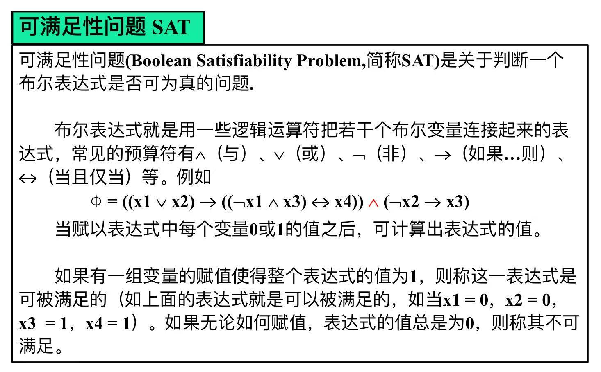
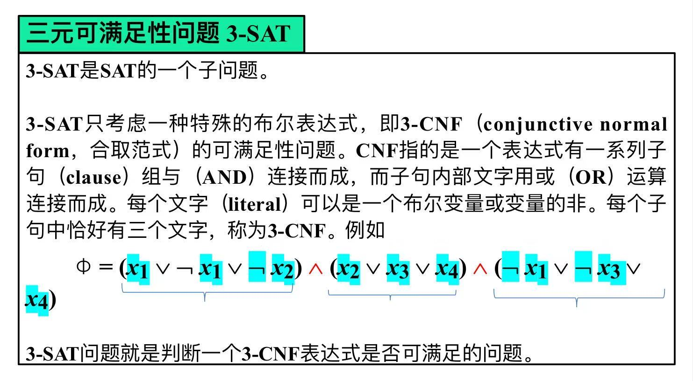
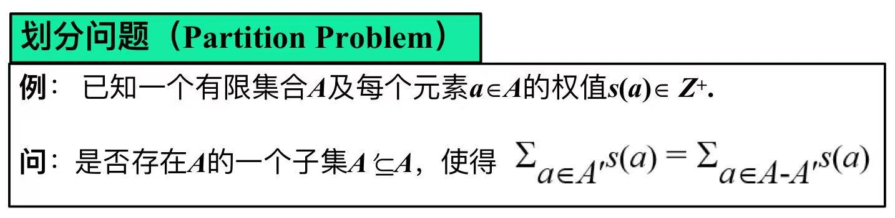
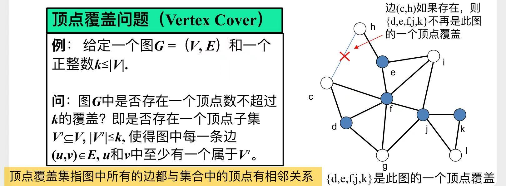
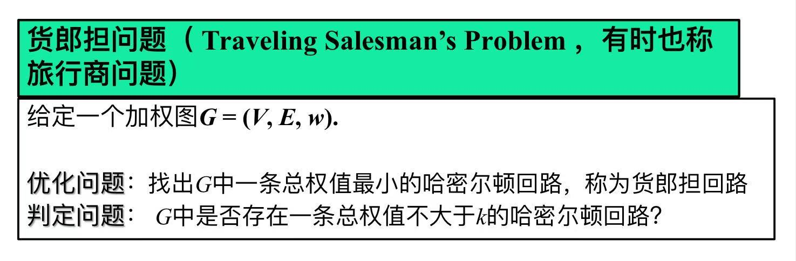
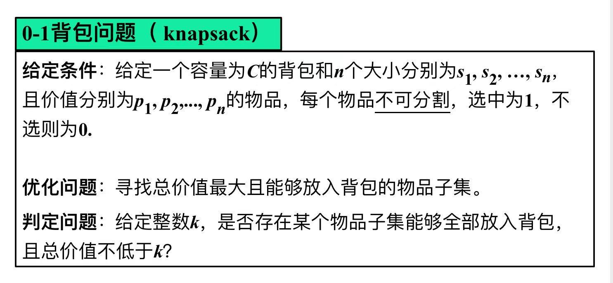

# NP-完全语言类、NP-完全问题

# 一、NP-完全语言（NPC语言）

也就是`NPC问题`，是**NP类**中最难的那些问题。

判断方法：
$$
\begin{cases}
    L \in NP  & (1)\\
    NP中的任何一个语言L'，都可以多项式规约到L & (2)
\end{cases}
\Rightarrow
语言L，是NPC语言
$$

从问题$\pi$的角度来表述：
$$
\begin{cases}
    \pi 是一个NP类问题 & (1)\\
    任何一个NP类问题，都可以多项式规约到\pi & (2)
\end{cases}
\Rightarrow
问题\pi，是NPC问题
$$

#### 通常可以这样来判断：
$$
\begin{cases}
    \pi 是一个NP类问题 & (1)\\
    已知的一个NPC问题，可以多项式规约到\pi & (2)
\end{cases}
\Rightarrow
问题\pi，是NPC问题
$$

> 1. 已知的一个NPC问题
>     - $\Rightarrow$ 任何一个NP类问题，都可以多项式规约到该问题
> 2. 该问题，可以多项式规约到$\pi$
>     - $\Rightarrow$ 任何一个NP类问题，都可以规约到$\pi$

#### NP-难问题

如果只满足条件(2)，则问题$\pi$称为`NP-难问题`

# 二、NP-完全语言类

`NPC语言`的集合，或者说`NPC问题`的集合

## 2.1 定理

任何一个`NPC语言`有多项式判定算法 $\Leftrightarrow$ P=NP

> 翻译过来：  
> 只要有一个`NPC问题`可以在多项式时间内解决，所有的`NPC问题`都可以解决了

## 2.2 推论

一个`NPC语言`没有多项式判定算法 $\Leftrightarrow P \cap NPC = \varnothing$

# 三、若干著名NPC问题

1. 可满足性问题

2. 三元可满足性问题

3. 划分问题

4. 顶点覆盖问题

5. Hamilton回路问题

6. 货郎担问题（旅行商问题）

7. 0-1背包问题

---

# 四、多项式规约的几个示例

> 前面介绍了一堆复杂概念，  
> 看完这几个具体示例，才大致明白了**多项式规约**到底在干啥，  
> 也算是对**NPC问题**有个初步认识吧。

1. 三元可满足性问题 $\le_p$ Clilque问题
    - Clilque问题：图G中是否存在 由k个顶点组成的团
2. Clilque问题 $\le_p$ 顶点覆盖问题
3. 顶点覆盖问题 $\le_p$ Hamilton回路问题
4. Hamilton回路问题 $\le_p$ 货郎担问题