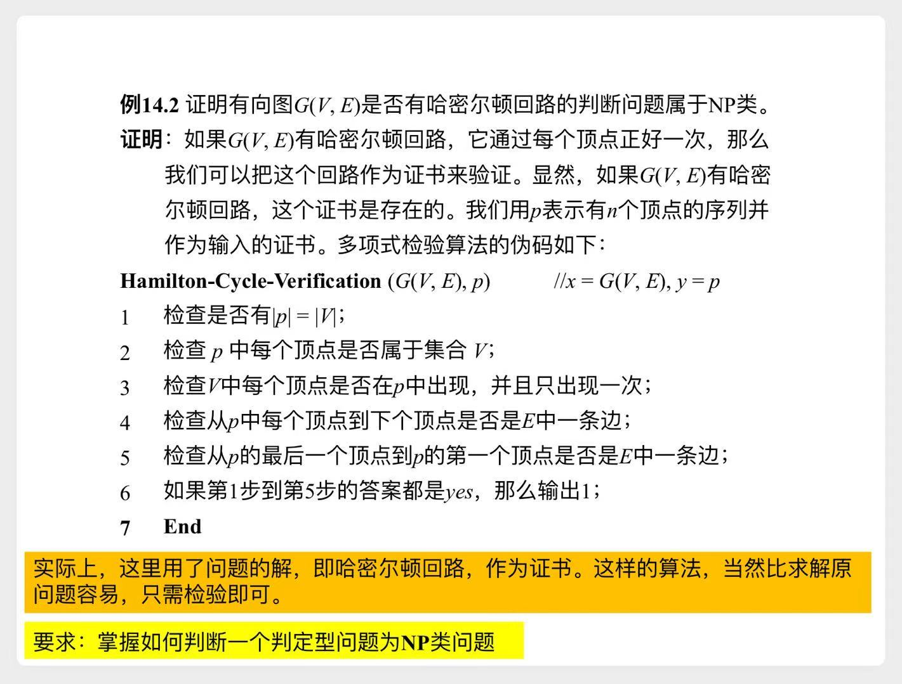
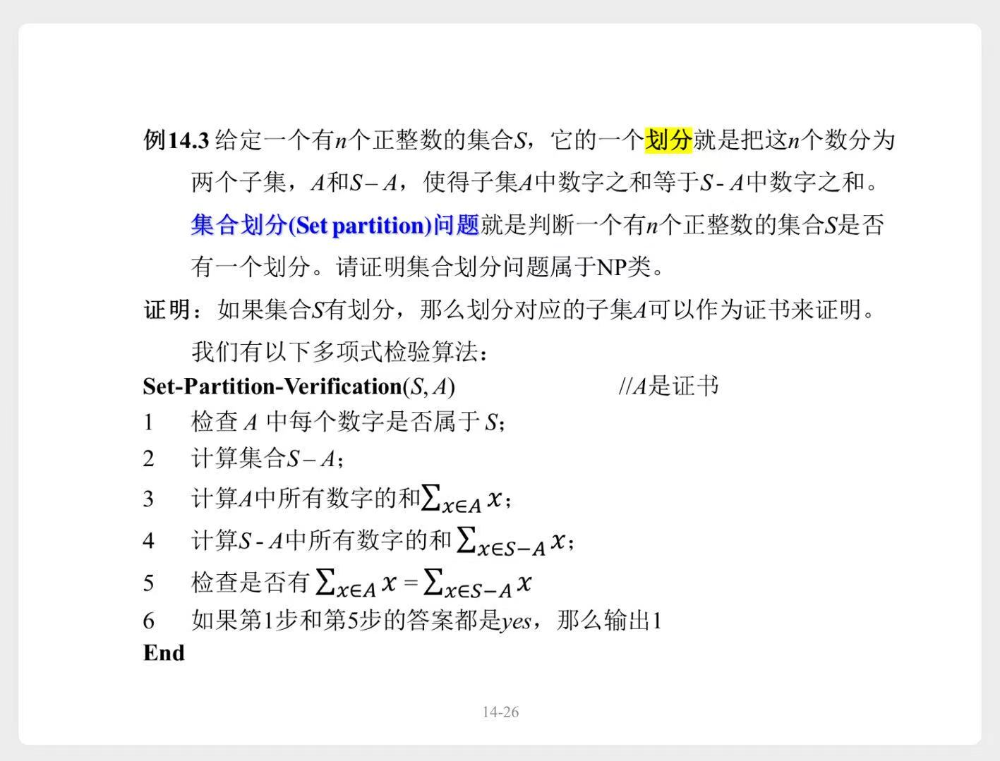

# P语言类、NP语言类

再回顾一下这张表格

|概念|示例|
|---|---|
|字符集$\sum$|{0, 1}|
|全语言$\sum^*$|`空串λ` `0`, `1` `00`, `01`, `10`, `11` `000`, ...|
|语言$L$|$\sum^*$的某个**子集**|
|判定型问题$\pi$|**哈密尔顿回路问题**：判断一个图中是否有**哈密尔顿回路**|
|{0, 1}组成的字符串`x`|一个具体的图，具体实例：`01000110`|
|$\pi(x) = 1$|给定的图x中，存在**哈密尔顿回路**|
|$\pi(x) = 0$|给定的图x中，不存在**哈密尔顿回路** 或者 给定的x，不是图。只是个杂乱字符串|
|判定型问题$\pi$对应的语言$L(\pi)$  (也就是问题$\pi$的所有答案)|所有$\pi(x) = 1$的字符串，构成的集合 {`01000110`, `01110101`, ... }|

> 判定型问题$\pi$，可以对应一个语言$L(\pi)$。  
> 所以对问题的分类，就是对语言的分类。

# 一、P语言类（P类）

- 所有可以被`确定性图灵机`在多项式时间内`判定`的语言，构成的集合。
    - 也就是说，所有`P类问题`的集合

#### 定理

语言L可以被`确定性图灵机`在多项式时间内`接收`  
$\Rightarrow$ 语言L可以被`确定性图灵机`在多项式时间内`判定`

> 可以被`确定性图灵机`在多项式时间内`接收`，  
> 也就是可以被`某个可执行的算法`在多项式时间内`接收`

# 二、NP语言类（NP类）

- 所有可以被`非确定性图灵机`在多项式时间内`接收`的语言，构成的集合。
    - 也就是说，所有`NP类问题`的集合

> 这里的`非确定性图灵机`，不是一个可以直接编程执行的算法  
> 而是一个完美的“思想实验”工具

## 2.1 多项式检验算法

> 概念没太看懂，太绕了...  
> 翻译成人话就是：
>
> 对于一个问题$\pi$，如果你告诉我一个正确答案，我能在多项式时间内，验证它是对的。
>    - 例如**哈密尔顿回路问题**：判断一个图中是否有**哈密尔顿回路**
>    - 如果告诉我一个答案，有这么一条回路。
>    - 那么我能够快速验证这条路确实是对的。

一个语言，可以被`非确定性图灵机`在多项式时间内`接收`  
$\Leftrightarrow$ 一个语言，可以被`确定性图灵机`在多项式时间内`检验`

## 2.2 如何判断？

有了**多项式检验算法**，  
我们就可以来判断一个问题是否属于NP类：

**给定一个问题和正确答案，能够在多项式时间内，输出`yes`** $\Rightarrow$ 该问题属于`NP类`

示例1

示例2

