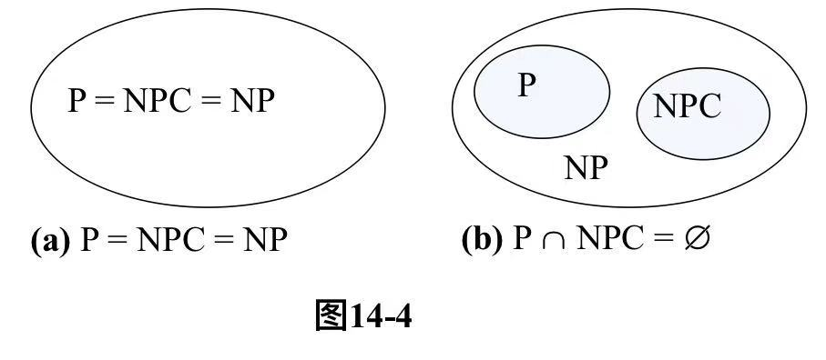
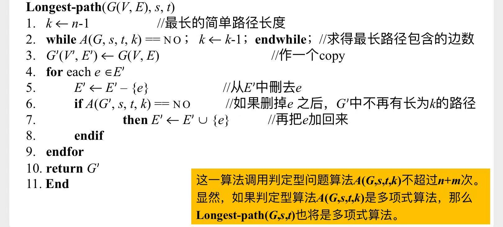
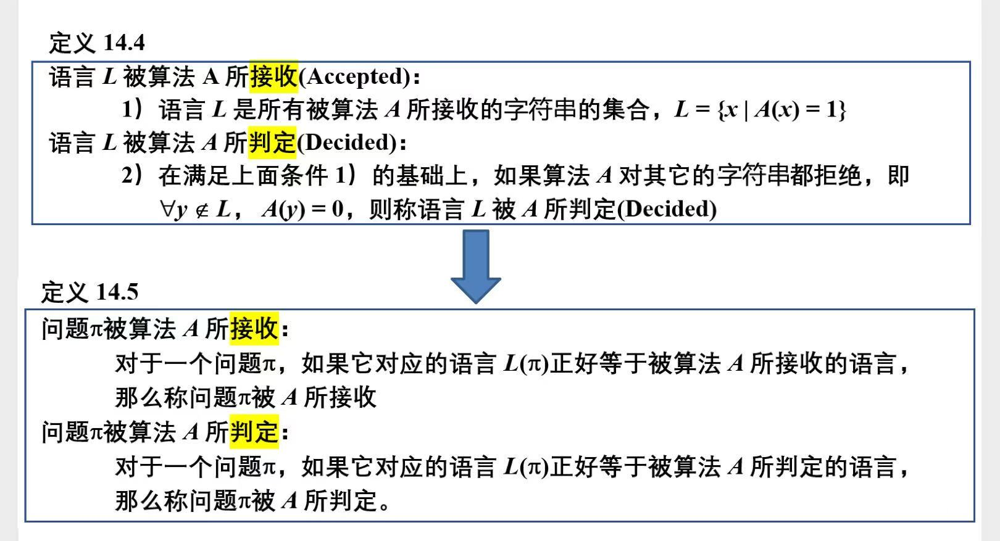
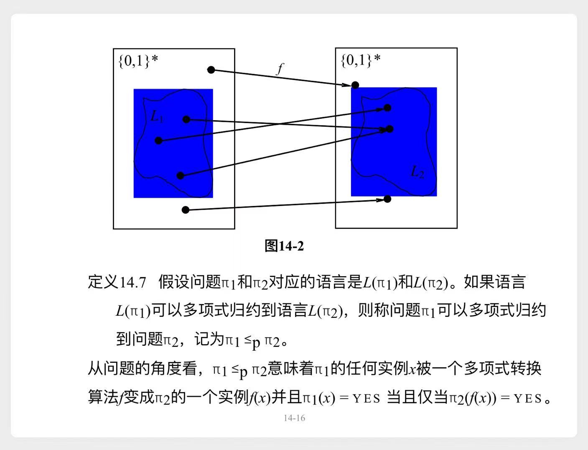

# 预备知识

# 一、 P类问题、NP类问题、NPC类问题

1. P类问题
    - 可以被`确定性图灵机`在多项式时间内解决的问题
    > 例如**排序算法**，我们可以在$O(n^2)、O(n \lg n)$内解决
2. NP类问题
    - 可以被`非确定性图灵机`在多项式时间内解决的问题
    - $\Leftrightarrow$ 可以被`确定性图灵机`在多项式时间内`检验`的问题
    > 翻译过来就是：直接求解，很难。但是如果你告诉我一个正确答案，我能快速验证它是对的。
    >    - 例如**哈密尔顿回路问题**：判断一个图中是否有**哈密尔顿回路**
    >    - 给定一个图，直接判断，很难
    >    - 但是如果告诉我一个答案，有这么一条回路。那么我能够快速验证这条路确实是对的。
3. NPC类问题
    - NP类问题中，最难的一类

三者之间的关系

> 大部分人相信**图b**，但有待证明

---

# 二、图灵机、符号集

> 略

# 三、判定型问题 & 优化型问题

- 为了求解一个**优化型问题**，往往可以这样：
    1. 构造一个对应的**判定型问题**，  
    2. 通过多次求解**判定型问题**，来得出答案。

示例

- **优化型问题**：给定一个图，寻找从s到t的`最长简单路径`
- 对应的**判定型问题**：从s到t，是否存在至少k条边的`简单路径`？

> 可以通过多次使用`A(G,s,t,k)`求解**判定型问题**，来得到最优解。

#### 结论

如果**判定型问题**有多项式算法（可在多项式时间内解决），那么对应的**优化型问题**也有多项式算法。  
所以后续讨论中，只研究**判定型问题**。

# 四、问题 --> 语言

## 4.1 基础概念

|概念|示例|
|---|---|
|字符集$\sum$|{0, 1}|
|全语言$\sum^*$|`空串λ` `0`, `1` `00`, `01`, `10`, `11` `000`, ...|
|语言$L$|$\sum^*$的某个**子集**|
|判定型问题$\pi$|**哈密尔顿回路问题**：判断一个图中是否有**哈密尔顿回路**|
|{0, 1}组成的字符串`x`|一个具体的图，具体的实例。例如：`01000110`|
|$\pi(x) = 1$|给定的图x中，存在**哈密尔顿回路**|
|$\pi(x) = 0$|给定的图x中，不存在**哈密尔顿回路** 或者 给定的x，不是图。只是个杂乱字符串|
|判定型问题$\pi$对应的语言$L(\pi)$  (也就是问题$\pi$的所有答案)|所有$\pi(x) = 1$的字符串，构成的集合 {`01000110`, `01110101`, ... }|

## 4.2 判定算法

有了前面这些概念，求解一个判定型问题$\pi$，就可以这样表述：  
识别任意字符串`x`是否属于$L(\pi)$

- 于是又引出了一个概念，**判定算法A**
    - 输入任意字符串`x`，**算法A**来判断`x`是否属于$L(\pi)$：
$$
\begin{cases}
    A(x) = 1, & x \in L(\pi) \\
    A(x) = 0, & x \notin L(\pi) \\
    A(x) = 不回答, & 不能判定 \\
\end{cases}
$$

## 4.3 接收、判定

$A(x)$描述了任意字符串`x`与**算法A**之间的关系。  
那么语言$L$、或者判定型问题$\pi$，与**算法A**之间的关系也可以表示出来：

# 五、多项式关联

- 两个计算模型之间的关系
    - 例如`图灵机`就是一个计算模型

> 这页PPT，剩下的内容看不懂...

# 六、多项式规约

- 两个语言$L_1、L_2$之间的关系
    - 两个问题$\pi_1、\pi_2$对应的语言为$L(\pi_1)、L(\pi_2)$
    - 也可以描述 两个问题之间的关系

示意图

> 问题$\pi_1$可以**多项式规约**到问题$\pi_2$  
> 翻译成人话就是：
>
> 问题$\pi_1$中的每一个实例$x_1$  
> 都可以在多项式时间内  
> 转化为问题$\pi_2$中的一个实例$x_2$  
> 并且有：$x_1有解 \Leftrightarrow x_2有解$

# 定理

$$
\begin{cases}
    L_1 可以多项式规约到 L_2 \\
    L_2 可被多项式算法A_2判定
\end{cases}
\Rightarrow
存在多项式算法A_1，使得L_1被A_1判定
$$

从另外一个角度来理解：
$$
\begin{cases}
    \pi_1可以多项式规约到\pi_2 \\
    \pi_2 可在多项式时间内解决
\end{cases}
\Rightarrow
\pi_1 可在多项式时间内解决
$$

> 也就是说，如果$\pi_1可以多项式规约到\pi_2$，  
> 只要能解决$\pi_2$，就可以解决$\pi_1$了。

#### 推论

$$
\pi_1可以多项式规约到\pi_2
\Rightarrow
\pi_2比\pi_1更难
$$