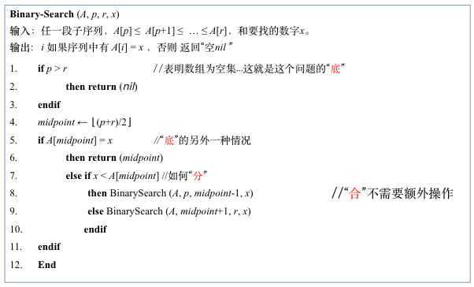
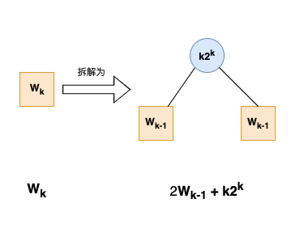
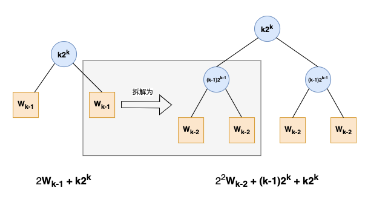

# 原理介绍

# 一、 分治法原理

#### 分治法，需要想清楚三件事:
1. **底**: 对足够小的输入规模，如何直接解出。
2. **分**: 如何将输入规模为 n 的问题分解为规模小一些的子问题。
    - 子问题在形式上与原问题完全相同，只是规模小一些。
3. **合**: 如何通过各个子问题的解获得原问题的解。

#### 只看这段文字，很难完全理解。接下来以`二分查找`为例，具体说明
- 伪代码

    

    > 假设我们要在数组`{2,3,5,7,9}`中查找数字`3`  
        > 1. 找到A[midpoint]=5 > `3`，于是去更小的数组`{2,3}`中去查找 --> **分**
        > 2. 找到A[midpoint]=2 < `3`，于是去更小的数组`{3}`中去查找 --> **分**
        > 3. 找到A[midpoint]=3 = `3`，于是返回结果 --> **底**

**二分查找**的过程中，**合**不需要额外操作，理解起来不是很直观。  
不要急，后面还会有一个具体的例子，立马上强度！！

# 二、 递推关系求解

上强度之前，再介绍一个理论知识：如何求解分治法的复杂度  
这部分主要是一些数学推导

- 分治法的复杂度，往往需要求解以下的递推关系
    - T(1) = c
    - T(n) = a T(n/b) + f(n)
        > 各参数含义: 将规模为n的问题，拆分为a个规模为n/b的问题。分解和合并的复杂度为f(n)

## 2.1 替换法
- 先猜想一个复杂度，然后用数学归纳法证明
- **示例**: 给出以下递推关系，求 $T(n)$
    $$
    \begin{cases}
    T(n) = \Theta(1), & 1 \le n \le 4 \\
    T(n) = 2T(\lfloor \frac n 2 \rfloor) + n, & n > 4
    \end{cases}
    $$

    > 我们猜想 $T(n) = \Theta(n \lg n)$，然后用数学归纳法证明

    - 先证 $T(n) = O(n \lg n)$
        
        

        
详细证明过程

        - 只需证明 $n \ge 4时，T(n) \le c n \lg n$ 即可
        1. $n=4$ 时，$T(n)=\Theta (1)$，故存在c，使得 $T(n) \le c \le c n \lg n$。不妨设c>1
            - 假设存在$c_0 \le 1$使得上式成立，那么随便取一个比$c_0$大的常数，肯定也成立。
        2. 假设 $n \in [4, k-1]$ 时，$T(n) \le c n \lg n$成立
            - 接下来证 $n=k(k \ge 5)$ 时，$T(n) \le c n \lg n$仍然成立
            1. 由于 $\lfloor \frac n 2 \rfloor = \lfloor \frac k 2 \rfloor \le k-1$ ，根据我们的假设，就有：
            $$
            \begin{aligned}
            T(\lfloor \frac n 2 \rfloor) & \le c \lfloor \frac n 2 \rfloor \lg \lfloor \frac n 2 \rfloor \\
            & \le c \frac n 2 \lg \frac n 2 \\
            & = c \frac n 2 (\lg n - 1)
            \end{aligned}
            $$
            2. 将上面的不等式，代入递推公式：
            $$
            \begin{aligned}
            T(n) & = 2T(\lfloor \frac n 2 \rfloor) + n \\
            & \le 2 c \frac n 2 (\lg n - 1) + n \\
            & = c n (\lg n - 1) + n \\
            & = c n \lg n - c n + n \\
            & \le c n \lg n \qquad 这里是由于c>1
            \end{aligned}
            $$
        - 于是 $T(n) = O(n \lg n)$ 成立
        
        

    - 再证 $T(n) = \Omega (n \lg n)$

        

        
详细证明过程

        - 这次我们证明 $T(n) \ge d (n \lg n + n)$，d为常数

        1. $n \in [1,4]$ 时，一定存在常数d，使得$T(n) \ge d (n \lg n + n)$。不妨设 $0<d< \frac 1 4$
            - 假设存在$d_0 \ge \frac 1 4$使得上式成立，那么随便取一个比$d_0$小的常数，肯定也成立。
        2. 假设 $n \in [4, k-1]$ 时，$T(n)  \ge d (n \lg n + n)$ 成立
            - 接下来证 $n=k(k \ge 5)$ 时，$T(n)  \ge d (n \lg n + n)$仍然成立
            1. 先推导一个结论，当n>4时，有：
            $$
            \lfloor \frac {n} {2} \rfloor > \frac {n} {2} - 1 = \frac {2n-4} 4 = \frac {n + (n-4)} 4 > \frac n 4 \quad (1)
            $$
            2. 由于 $\lfloor \frac n 2 \rfloor = \lfloor \frac k 2 \rfloor \le k-1$ ，根据我们的假设，就有：
            $$
            \begin{aligned}
            T(\lfloor \frac n 2 \rfloor) & \ge d \left[ \lfloor \frac n 2 \rfloor \lg \lfloor \frac n 2 \rfloor + \lfloor \frac n 2 \rfloor \right] \\
            & \ge d \left[ (\frac n 2 -1) \lg \lfloor \frac n 2 \rfloor + (\frac n 2 -1) \right] \\
            & \ge d \left[ (\frac n 2 -1) \lg \frac n 4 + (\frac n 2 -1)  \right] & 根据上面(1)式 \\
            & = d (\frac n 2 -1) (\lg n - 2) + d (\frac n 2 -1) \\
            & = d \frac n 2 \lg n - d \frac n 2 2 - d \lg n + 2d + d \frac n 2 - d \\
            & = d \frac n 2 \lg n - d \lg n - \frac n 2 d + d \\
            & > d \frac n 2 \lg n - d \lg n - \frac n 2 d & 省去末尾的d\\
            & > d \frac n 2 \lg n - d n - \frac n 2 d & \lg n < n \\
            & = d \frac n 2 \lg n - \frac {3n} 2 d \\
            \end{aligned}
            $$
            3. 将上面的不等式，代入递推公式：
            $$
            \begin{aligned}
            T(n) & = 2T(\lfloor \frac n 2 \rfloor) + n \\
            & > 2 \left( d \frac n 2 \lg n - \frac {3n} 2 d \right) + n \\
            & = d n \lg n - 3nd + n \\
            & > d n \lg n - 3 n \frac 1 4 + n &  d < \frac 1 4 \\
            & = d n \lg n + \frac 1 4 n \\
            & > d n \lg n + d n & d < \frac 1 4 \\
            & = d (n \lg n + n)
            \end{aligned}
            $$

        - 于是 $T(n) = \Omega (n \lg n + n)$ 成立
        - 于是 $T(n) = \Omega (n \lg n)$ 成立

        

## 2.2 序列求和法

- **示例**: 给出以下递推关系，求 $T(n)$
    $$
    \begin{cases}
    T(1) = O(1) \\
    T(n) = 2T(\frac n 2) + n \lg n
    \end{cases}
    $$

    

    
求解过程

    
    1. 取 $n=2^k$，得到 $T(2^k) = 2T(2^{k-1}) + k 2^k$。
    2. 记$W_k=T(2^k)$，$W_1=T(2)=2T(1)=2O(1)$
    $$
    \begin{aligned}
    W_k &= 2W_{k-1} + k2^k \\
    &= 2[2W_{k-2} + (k-1)2^{k-1}] + k2^k \\
    &= 2^2W_{k-2} + (k-1)2^k + k2^k \\
    &= 2^2[2W_{k-3} + (k-2)2^{k-2}]  + (k-1)2^k + k2^k \\
    &= 2^3W_{k-3} + (k-2)2^k + (k-1)2^k + k2^k \\
    &= ... \\
    &= 2^{k-1}W_1 + 2 \cdot 2^k + 3 \cdot 2^k + ... + (k-1) 2^k + k 2^k \\
    &= 2^{k-1}W_1 + [2+3+...+(k-1)+k]2^k \\
    &= 2^{k-1}O(1) + (\frac {k(k+1)} 2 - 1)2^k & 从1加到k，直接套公式，最后再减1\\
    &= \Theta (k^2 2^k) \\
    &= \Theta (n \lg^2 n) & n=2^k，k=\lg n \\
    \end{aligned}
    $$

    

    

    
图解

    1. $W_k = 2W_{k-1} + k2^k$

        

        > $k2^k$ 为 将原问题 $W_k$ 分解和合并的复杂度，即f(n)  
        > $W_k$为原问题的复杂度，$W_{k-1}$为拆分后两个子问题的复杂度

    2. $2W_{k-1} + k2^k = 2^2W_{k-2} + (k-1)2^k + k2^k$
        
        

    3. 一直递归下去，最终得到：
        $$ W_k = 2^{k-1}W_1 + 2 \cdot 2^k + 3 \cdot 2^k + ... + (k-1) 2^k + k 2^k $$

    

## 2.3 主方法

> 上面两种方法有些复杂，幸运的是，很多时候我们不需要完整去推导  
> 人们在使用**序列求和法**时，已经总结出了一些规律，直接应用就可以了  

设递推关系为：$T(n) = a T(n/b) + f(n)，a \ge 1，b > 1$
- 先解出 $k = \log_b a$，然后基于规则来判断：
    1. **规则1**

        $$ 存在 \varepsilon > 0，使得 f(n) 比 n^{k-\varepsilon}低阶 \Longrightarrow T(n)=\Theta(n^k) $$

        

        
示例

        $$
        T(n) = 9T(n/3) + n \lg n \\
        \begin{cases}
        k = \log_b a = \log_3 9 = 2 \\
        f(n) = n \lg n 比 n^{k-\varepsilon} = n^{2-0.2} 低阶
        \end{cases}
        \Longrightarrow T(n)=\Theta(n^2)
        $$

        

    2. **规则2**

        $$ f(n) 与 n^{k} 同阶 \Longrightarrow T(n)=\Theta(n^k \lg n) $$

        

        
示例

        $$
        T(n) = 2T(n/2) + n \\
        \begin{cases}
        k = \log_b a = \log_2 2 = 1 \\
        f(n) = n 与 n^k = n 同阶
        \end{cases}
        \Longrightarrow T(n)=\Theta(n \lg n)
        $$

        

    3. **规则3**
        
        $$
        \begin{cases}
        存在 \varepsilon > 0，使得 f(n) 比 n^{k+\varepsilon}高阶 \\
        存在 0<c<1，使得 af(n/b) \le cf(n)
        \end{cases}
        \Longrightarrow T(n)=\Theta(f(n))
        $$

        

        
示例

        $$
        T(n) = 3T(n/2) + n^2 \lg n \\
        \begin{cases}
        k = \log_b a = \log_2 3 \approx 1.58 \\
        f(n) = n^2 \lg n 比 n^{k+\varepsilon} = n^{1.58+0.2} 高阶 \\
        存在 c=3/4，使得 af(n/b) \le cf(n)
        \end{cases}
        \Longrightarrow T(n) = \Theta(f(n)) = \Theta(n^2 \lg n)
        $$

        

## 2.4 主方法的简单总结

- 三条规则，其实就是比较 $n^k$ 与 $f(n)$ 哪个更高阶，占据主要部分。
> `!!但是`，我们不能直接去比较 $n^k$ 与 $f(n)$  
> 例如**规则1**，不能直接看到 $f(n)$ 比 $n^{k}$ 低阶，就直接应用。一定要确认 $f(n)$ 比 $n^{k-\varepsilon}$ 更低阶  
> 例如**规则3**，不能直接看到 $f(n)$ 比 $n^{k}$ 高阶，就直接应用。一定要确认 $f(n)$ 比 $n^{k+\varepsilon}$ 更高阶

#### 最后用一个例题来说明这一点

回顾一下**2.2 序列求和法**中，我们的示例:
$$ T(n) = 2T(\frac n 2) + n \lg n $$

如果我们只是简单去比较 $n^k$ 与 $f(n)$，流程会是这样：
$$
\begin{cases}
k = \log_b a = \log_2 2 = 1 \\
f(n) = n \lg n 比 n^k = n 高阶 \\
存在 1 - \log_n 2 \le c < 1，使得 af(n/b) \le cf(n)
\end{cases}
\Longrightarrow T(n) = \Theta(f(n)) = \Theta(n \lg n)
$$

再对比一下前面我们辛辛苦苦推导出的结论:
$$ T(n) = \Theta (n \lg^2 n) $$

- 问题出在哪里呢？
    - 就是因为直接看到 $f(n)$ 比 $n^{k}$ 高阶，于是去套用**规则3**
    - 切记一定要确认 $f(n)$ 比 $n^{k+\varepsilon}$ 更高阶
    - 那么我们来试试，能不能找到 $\varepsilon$，使得$f(n)$ 比 $n^{k+\varepsilon}$ 高阶
        > $$ f(n) = n \lg n，n^{k+\varepsilon} = n^{1+\varepsilon} $$
        > $$ \lg n 比 n^\varepsilon 低阶 \Longrightarrow n \lg n 比 n^{1+\varepsilon} 低阶 \Longrightarrow f(n) 一定比 n^{k+\varepsilon} 低阶 $$
        > $$ 也就是说，找不到这样的\varepsilon $$
**所以不能直接套用规则3！！**