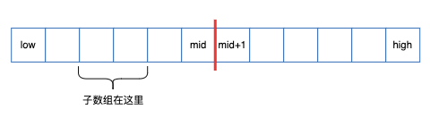
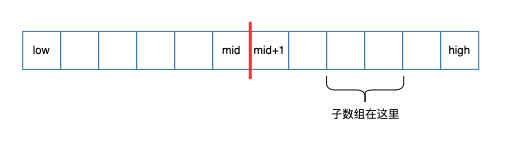
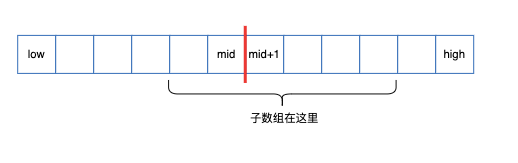

# 最大子数组问题

1. 先引入这个问题: [买卖股票的最佳时机](https://leetcode.cn/problems/best-time-to-buy-and-sell-stock/)
2. 将问题转化为: [最大子数组和](https://leetcode.cn/problems/maximum-subarray/description/)

> 吐槽一下~  
> [买卖股票的最佳时机](https://leetcode.cn/problems/best-time-to-buy-and-sell-stock/)有简单解法，没必要转化  
> 感觉不如忽略第一道题，直接开始介绍[最大子数组和](https://leetcode.cn/problems/maximum-subarray/description/)

# 一、图解
最终答案，可能有三种情况:

1. 子数组位于A[low, mid]中

2. 子数组位于A[mid+1, high]中

3. 子数组跨越中点mid

# 二、伪代码

> **底**：当我们拆分到数组中只有一个元素，直接返回结果即可
>
> **分**：
>   1. 代码第4行，我们去寻找左侧的最大子数组
>   2. 代码第5行，我们去寻找右侧的最大子数组
>
> **合**：
>   1. 代码6、7行，找到跨越中点的最大子数组
>   2. 代码8、9、10行，比较这三个子数组，返回最终结果

# 三、算法复杂度
1. **分**：对于一个规模为n的数组，我们每次拆分为两个规模为n/2的数组
    - a=2, b=2
2. **合**：主要工作量在代码6、7行，需要遍历求解
    - f(n) = n

于是得到递推关系：
$$ T(n) = 2T(n/2) + \Theta(n) $$
再由**主方法**`规则2`：
$$ T(n) = \Theta(n \lg n) $$

# 四、补充材料

> 还有复杂度O(n)的解法，可以看看[leetcode: 最大子数组和](https://leetcode.cn/problems/maximum-subarray/description/)里的题解