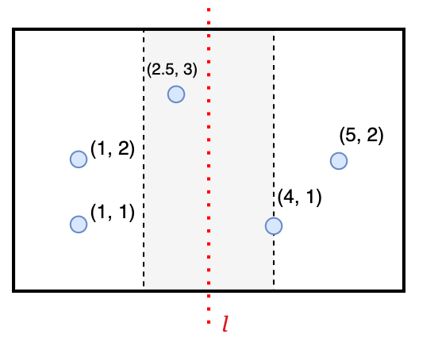

# 最近点对问题

**问题描述**：给定平面上的n个点，我们要找出距离最近的两个点。

# 一、暴力求解
- 计算所有点对之间的距离，需计算 $\frac {n(n-1)} 2$次，复杂度为 $O(n^2)$

# 二、分治法
## 2.1 底&分&合
以这个示例来说明：

> **分**：将图分为左右两部分，分别求解左、右图中的最近点对  
> **底**：当$n \le 3$时，暴力求解：左图最近距离为1，右图最近距离为 $\sqrt 2$  
> **合**：
>   1. 接下来只需考虑一个点在左，另外一个点在右的情况。
>   2. 前面已经知道左图最近距离为1，因此整个图的最近距离一定$\le 1$。
>   3. 令$\delta=1$，接下来只需要在带状区域$[l-\delta, l+\delta]$中，去计算最近距离$\delta_0$。  
>   4. 最后取$min\{ \delta, \delta_0 \}$即可

## 2.2 带状区域的更多优化

1. 每个点只需要往上查找，就可以了
2. 最多只需要往上查找7个点

- 这样的话，这部分的时间复杂度就可以降为 $O(n)$

# 三、复杂度
与[最大子数组问题](计算机算法设计与分析/分治法/算法实例/最大子数组问题.md)类似，递推关系关系为:
$$ T(n) = 2T(n/2) + O(n) $$
于是时间复杂度：
$$ T(n) = O(n \lg n) $$