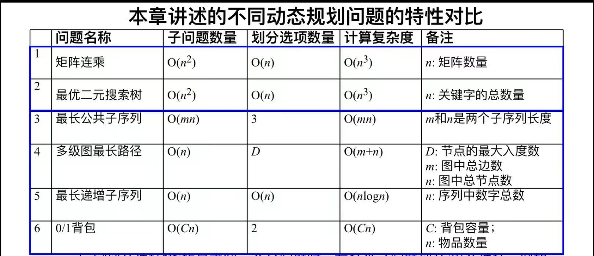
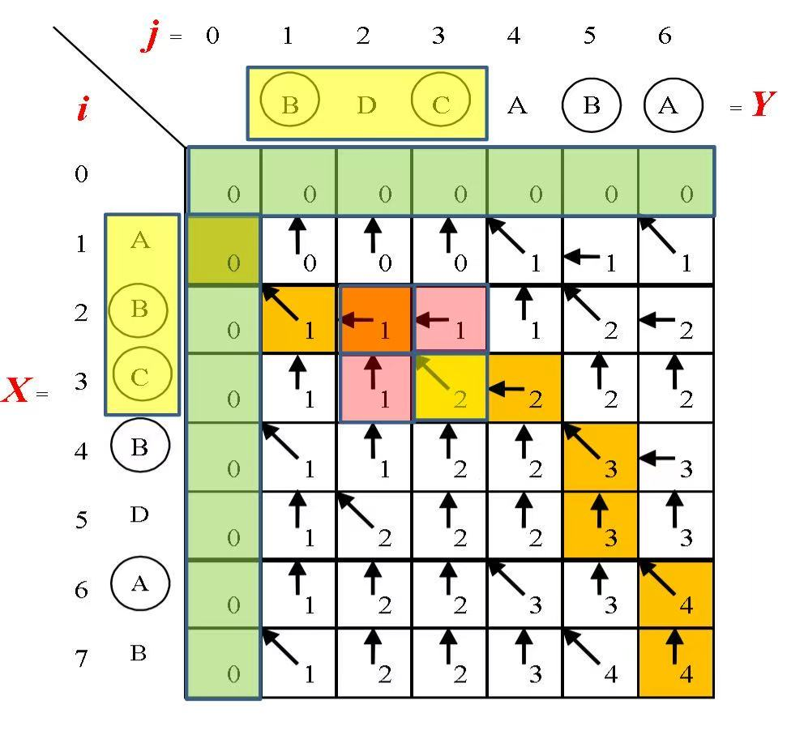

# 动态规划总结

## 一、动态规划 VS 分治法

- **分治法**：将原问题划分互不相交的子问题。
- **动态规划**：子问题可能重叠。动态求解过程中，每个子问题只解一遍存入表中，供后续使用。

## 二、动态规划 VS 带备忘录的递归

介绍[矩阵连乘](计算机算法设计与分析/动态规划/矩阵连乘.md)问题时，分别介绍了这两种方法。

- **动态规划**：`自底而上`。先求解所有的子问题，并存表。然后一步步往上。
- **带备忘录的递归**：`自顶而下`。递归过程中，每次求解出新的子问题，就将其存表，作为**备忘录**，供后续使用。

- 因此它们的复杂度几乎相同，都可以这样来分析：
    1. 原问题共包含多少个子问题？
        - 每个子问题，我们需要求解一次
    2. 每次求解一个问题时，需要划分为多少个子问题？

## 三、复杂度分析

1. **矩阵连乘**
    - 子问题数量：$O(n^2)$。任选两个数$1 \le i \le j \le n，OPT(i,j)$都是一个子问题。共有$C_n^2 = O(n^2)$个
    - 划分数量：$O(n)$。求解$OPT(i,j)$时，需要遍历i到j的每个切分点
2. **最优二叉搜索树**
    - 同上
3. **最长公共子序列**
    - 子问题数量：$O(mn)$。回想一下，求解过程中，需要填满$m*n$的那张表格
    - 划分数量：3。查看3个箭头方向

        

        
为了方便，把表格贴在这里

        

        

4. **多级图**
    - 这个问题比较特殊，不适合用这个方法来分析。
    - 需要看看代码，理解遍历过程。发现所有的点需要遍历一次，所有的边需要遍历一次。
    - 于是时间复杂度为$O(m+n)$
5. **最长递增子序列**
    - 子问题数量：$O(n)$。需要依次求解$L(1)、L(2)、...、L(n-1)$
    - 划分数量：$O(n)$。每次求解$L(i)$时，需要遍历1到i的每个切分点。
    - 这样分析的话，复杂度还是$O(n^2)$。老师稍微提了一下改进方案：
        - 划分数量虽然是$O(n)$，但是我们可以预先对$L(i)$排序
        - 这样每次可以使用二分查找，来寻找切分点。复杂度降为$O(\lg n)$
6. **0/1背包问题**
    - 子问题数量：$O(Cn)$。求解过程中，需要填满$C*n$的那张表格
    - 划分数量：2。
