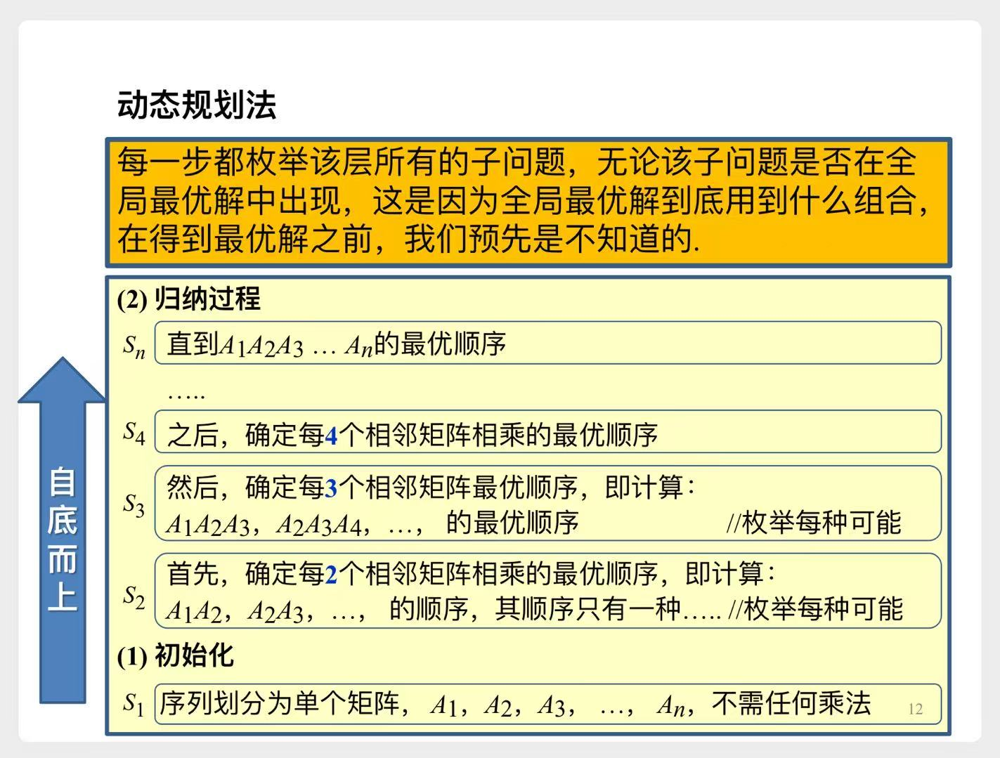
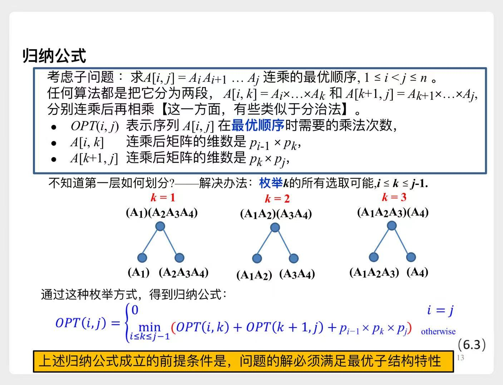
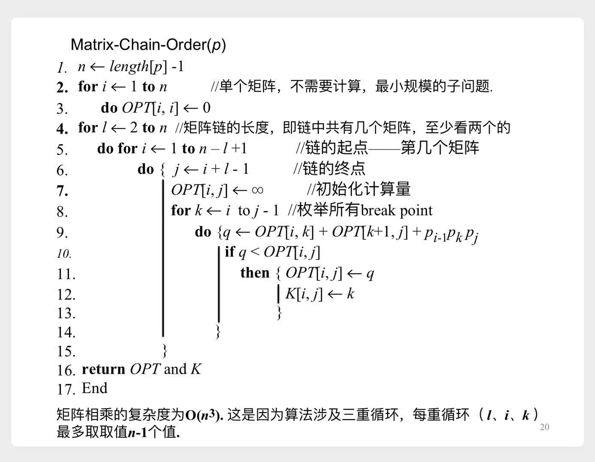
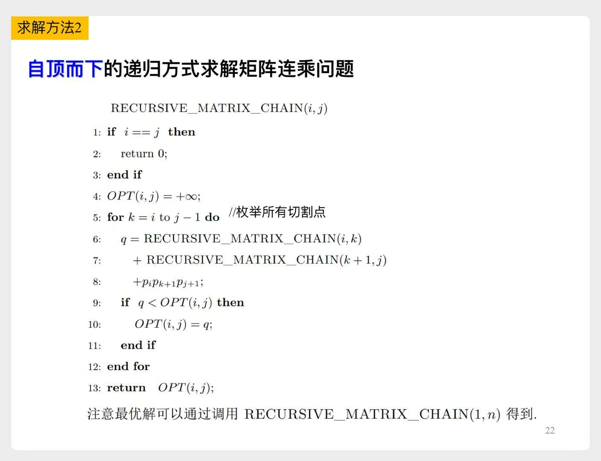
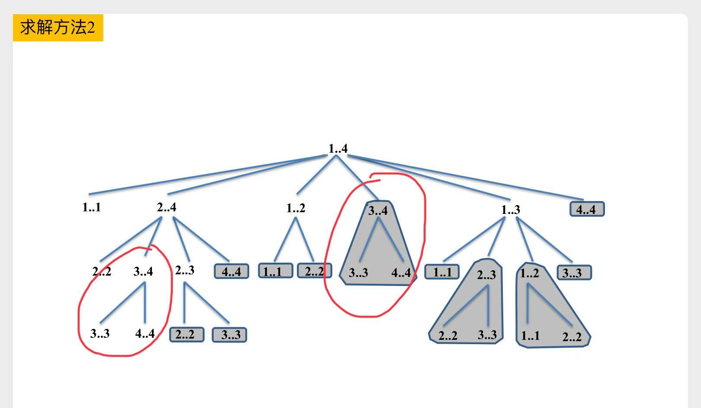
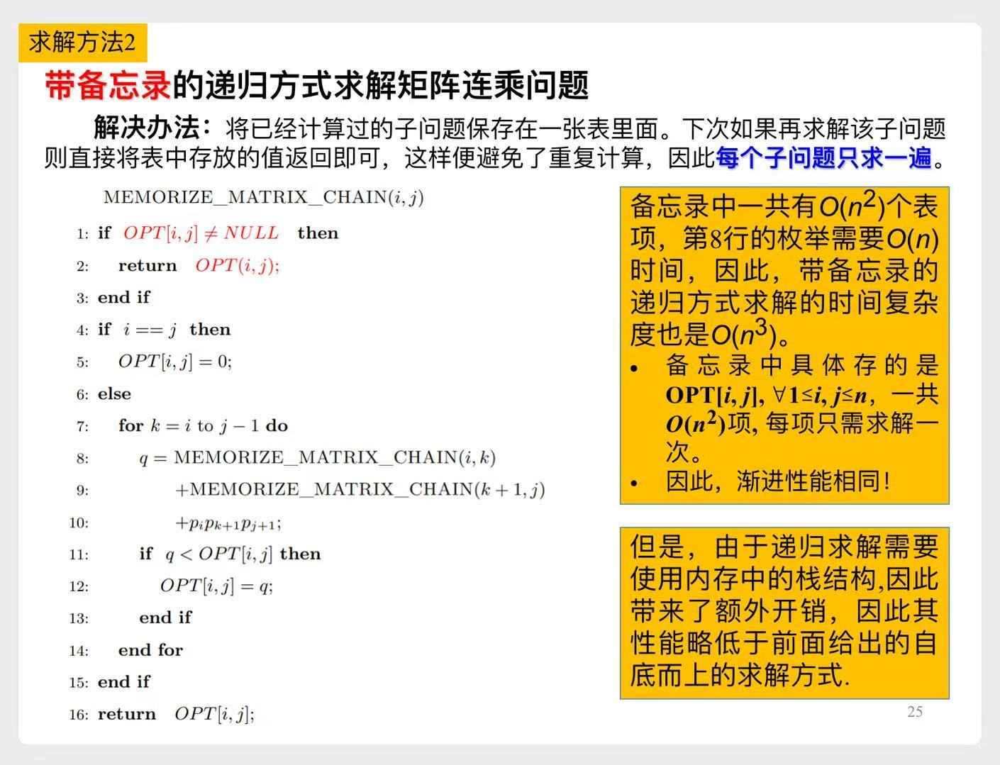

# 矩阵连乘

# 一、问题描述

我们要将多个矩阵A、B、C、D连乘起来，它们的维度如下：
|A|B|C|D|
|---|---|---|---|
|25x2|2x40|40x15|15x30|

- 可以有多种计算顺序
    1. (((AB)C)D)
    2. (A(B(CD)))
    3. ((AB)(CD))
    4. ...
- 哪种顺序乘法次数最少？
    - ~~可以暴力求解，但是那样复杂度为指数级别~~

# 二、动态规划法

## 2.1 示意图

> 例如step3，需要求解 $A_1A_2A_3$ 的最优顺序
> - 需要遍历 $(A_1A_2)A_3$、$A_1(A_2A_3)$ 两种计算顺序
> - 而 $(A_1A_2)$、$(A_2A_3)$ 我们在step2已经计算好了，可直接利用，降低时间复杂度

> 再例如step4，需要求解 $A_1A_2A_3A_4$ 的最优顺序
> - 需要遍历 $(A_1A_2A_3)A_4$、$(A_1A_2)(A_3A_4)$、$A_1(A_2A_3A_4)$ 三种计算顺序
> - $(A_1A_2A_3)$、$(A_2A_3A_4)$ 我们在step3已经计算好了
> - $(A_1A_2)$、$(A_3A_4)$ 我们在step2已经计算好了

## 2.2 输入输出

- 输入：n个矩阵连乘，我们输入n+1个数值即可
    - 例如这个示例，我们输入为`[25, 2, 40, 15, 30]`
        |A|B|C|D|
        |---|---|---|---|
        |25x2|2x40|40x15|15x30|
- 输出：找到最优计算顺序时，所需的乘法次数

## 2.3 归纳公式

## 2.4 伪代码

## 2.5 示例

> 张老师用一个具体示例，详细展示了计算流程。~~这里略~~

# 三、递归法

## 3.1 伪代码

上面的**2.3**节，我们总结出了**归纳公式**。能不能直接用递归法求解呢？  
当然可以，伪代码如下：

## 3.2 复杂度分析

> 1. 计算 $A_1(A_2A_3A_4)$ 时，我们需要递归地去计算 $(A_3A_4)$
> 2. 计算 $(A_1A_2)(A_3A_4)$时，我们也需要递归地去计算 $(A_3A_4)$
> - 每个子问题，我们都需要重复去计算
>
>   

>   
示意图

>
>   
>
>   

我们用数学归纳法来证明一下 $T(n) \ge 2^{n-1}$
1. n=1时，$T(1) \ge 1 = 2^{1-1}$ 成立
2. 假设 $k \in [1, n-1]$ 时，不等式成立，那么
$$
\begin{aligned}
T(n) & \ge \underbrace{1}_{伪代码第9行} + \sum\limits_{k=1}^{n-1} [T(k) + T(n-k) + \underbrace{1}_{伪代码第8行}] \\
&= n +  \sum\limits_{k=1}^{n-1} [T(k) + T(n-k)] \\
&= n +  2 \sum\limits_{k=1}^{n-1} T(k) \\
& \ge n + 2 \sum\limits_{k=1}^{n-1} 2^{k-1} \\
&= n + 2 (2^{n-1} - 1) & 等比数列求和 \\
&= n + 2^{n} - 2 \\
& \ge 2^{n-1}
\end{aligned}
$$

# 四、带`备忘录`的递归

递归的复杂度为指数级，主要是因为**子问题**的重复计算。  
解决办法就是添加`备忘录`。
> 第一次遇到一个问题时，我们去递归计算，并将计算结果存储起来  
> 之后再遇到这个问题时，直接查表就可以了  
> 每个**子问题**只求一遍，这样就可以达到**动态规划**的性能了

