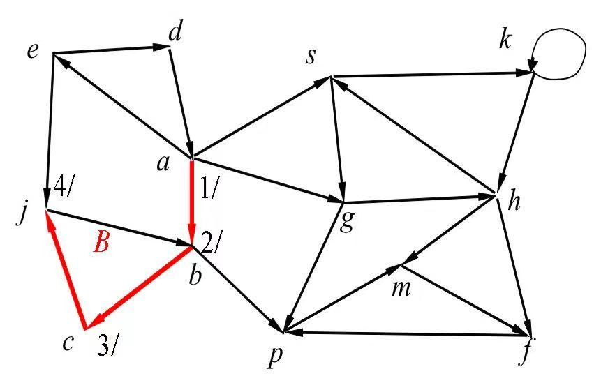
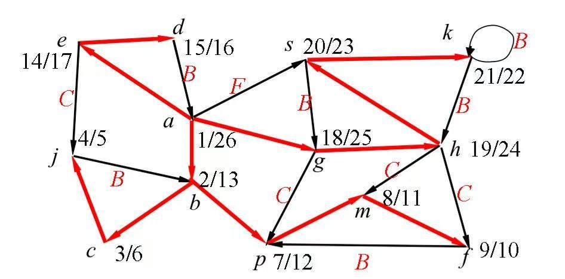
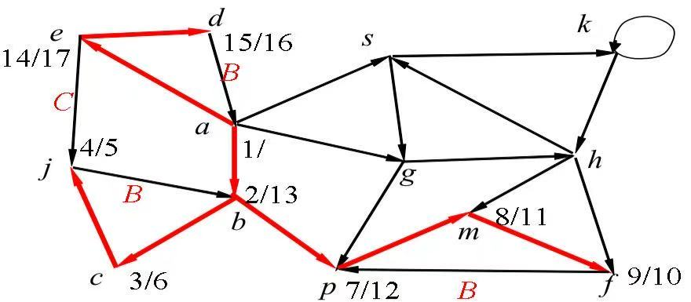
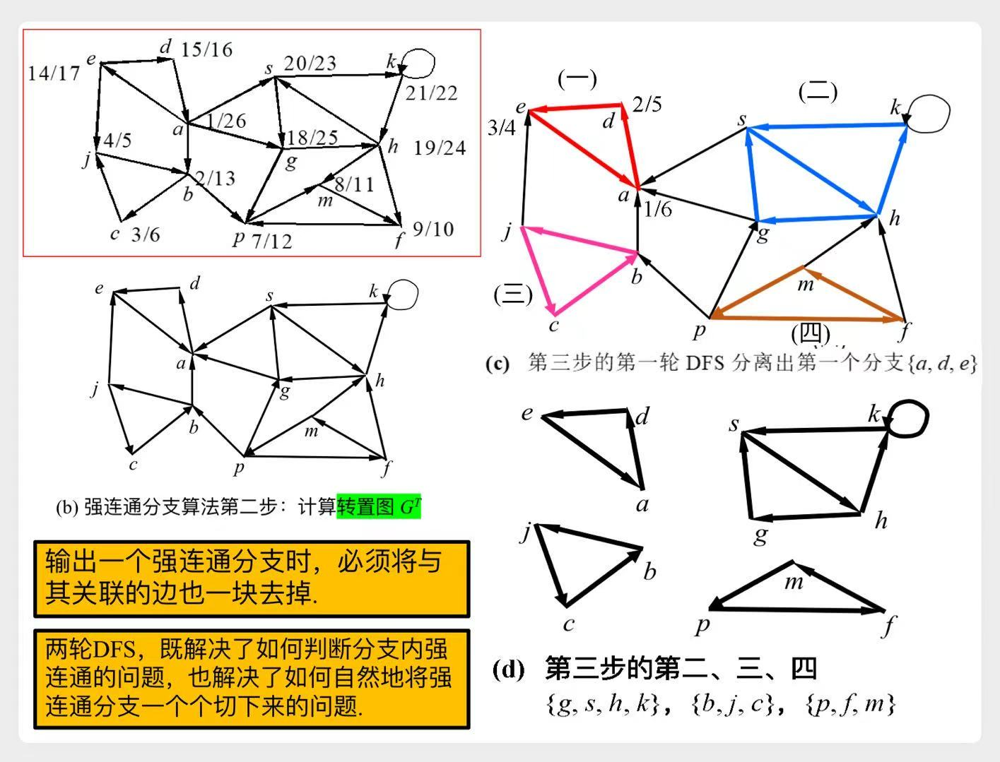
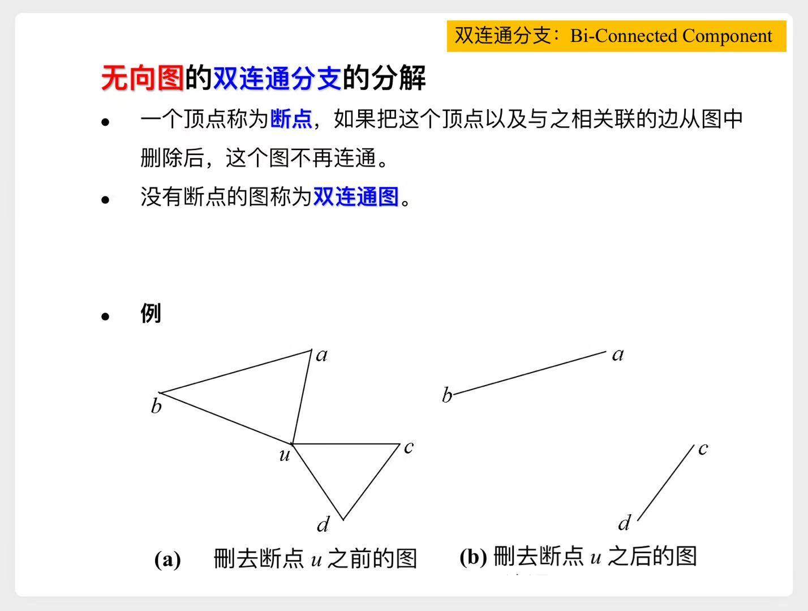
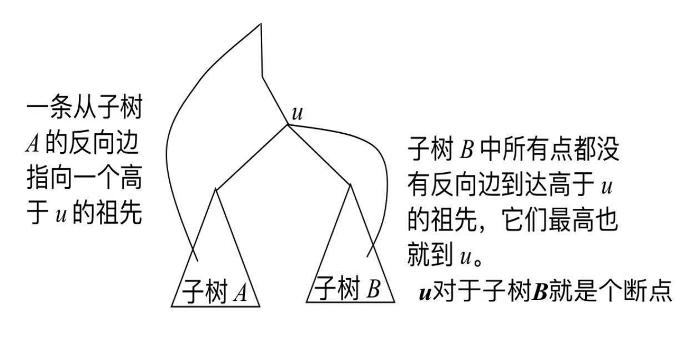

# DFS

# 一、算法流程

对应着`树的DFS`，更好理解一些。~~这里略~~

#### 1) 区间套定理

$$
[d(v), f(v)] \subset [d(u), f(u)] \Longleftrightarrow u是v的祖先
$$

#### 2) 白路径定理

$$
u是v的祖先 \Longleftrightarrow 在d(u)时刻，图中存在一条从u到v的白路径
$$

# 二、图中的几种边

||有向图|无向图|
|---|---|---|
|反向边|✅|✅|
|前向边|✅|已标记为反向边了|
|交叉边|✅|只有单向边才可能被标记为交叉边|

1. 反向边

> 从`j`访问`b`时，发现`b`是祖先  
> 此时`b`一定为**灰色**

2. 前向边

> 从`a`访问`s`时，`s`已经作为后代被访问过  
> 此时`s`已被访问过，为**黑色**。且$d(a)<d(s)$

3. 交叉边

> 从`e`访问`j`时，`j`在其他分支被访问过  
> 此时`j`已被访问过，为**黑色**。且$d(e)>d(j)$

# 三、拓扑排序

> 要求是一个`有向无环图`

## 3.1 基本思想

对整个图做DFS，然后按照完成时间$f(u)$倒排

## 3.2 证明

只须证明：如果图中有一条边 $u \to v$，一定有 $f(u) > f(v)$

以该图为例，我们来考虑`计算机原理`与`逻辑设计`之间的排序：

1. $d(u) < d(v)$
    - 先发现`计算机原理`，此时存在一条从`计算机原理`到`逻辑设计`的白路径
    - $\Rightarrow u是v的祖先$
    - $\Rightarrow [d(v), f(v)] \subset [d(u), f(u)] \Rightarrow f(u) > f(v)$
2. $d(u) > d(v)$
    - 先发现`逻辑设计`
    - 在`有向无环图`中，$有一条边 u \to v \Rightarrow 不存在v到u的路径$
    - 一定是访问完$v$所在的分支，才有可能去发现$u$
    - $f(u) > f(v)$

# 四、有向图的`强连通分支`分解

## 4.1 强连通图、弱连通图

示意图

## 4.2 算法流程

1. 在原图$G$上`DFS`，并标出每个顶点的$d(u)、f(u)$
2. 计算转置图$G^T$
    1. 选择$f(u)$最大的顶点，做一轮`DFS`，所有能访问到的顶点构成一个**强连通分支**
    2. 删除这些顶点，及所有与这些顶点相关联的边，重复上一步
    3. 直至所有顶点都输出

示意图

## 4.3 强连通分支图

示意图

## 4.4 强连通分支算法的证明

### 4.4.1 引理

如果在`强连通分支图`中，$有一条边 u \to v$，  
例如 $u = \{a,d,e\}, v=\{b,j,c\}$  
那么在分支$u、v$的所有顶点中，`DFS`搜索最后完成的点，一定在分支$u$

1. 先发现的顶点$x$在分支$u$
    - 在$d(x)$时刻，$x$有白路径到达任何顶点，于是最后访问$x$
2. 先发现的顶点$x$在分支$v$
    - 由于不存在$v到u的路径$，一定是搜索完分支$v$，再去搜索$u$

### 4.4.2 证明

由上面的**引理**，可以得出这样的结论：

- 如果`DFS`最后访问的顶点$x$，位于强连通分支$u$，那么分支$u$一定满足：
    1. 在原图$G$中，只有出去的边，没有进来的边
    2. 在转置图$G^T$中，只有进来的边，没有出去的边

---

于是我们的4.2节的算法流程，在转置图$G^T$中的循环操作就可以理解了：

- 选择$f(u)$最大的顶点，做一轮`DFS`
- 所有能访问到的顶点一定构成一个**强连通分支**

# 五、无向图的`双连通分支`分解

## 5.1 断点

> DFS树的叶子结点，不可能是断点。  
> DFS树的根结点，易发现：儿子结点数 $\ge 2 \Leftrightarrow$ 是断点。  
> DFS树的内结点，复杂一些：
>
> 

> 
示意图

>
> 
>
> 

## 5.2 算法流程

1. `DFS`，并标出每个顶点的$d(u)$
    - 另外引入变量$back(u)$: **u的所有反向边+u所有后代的反向边** 所能达到的最高祖先高度
    - `DFS`过程中，也可以标出$back(u)$
2. `DFS`树中，如果$u$是$v$的父结点，我们有：
    - $back(v) \ge d(u) \Rightarrow u$是断点
    - 即可剥离出某个分支
