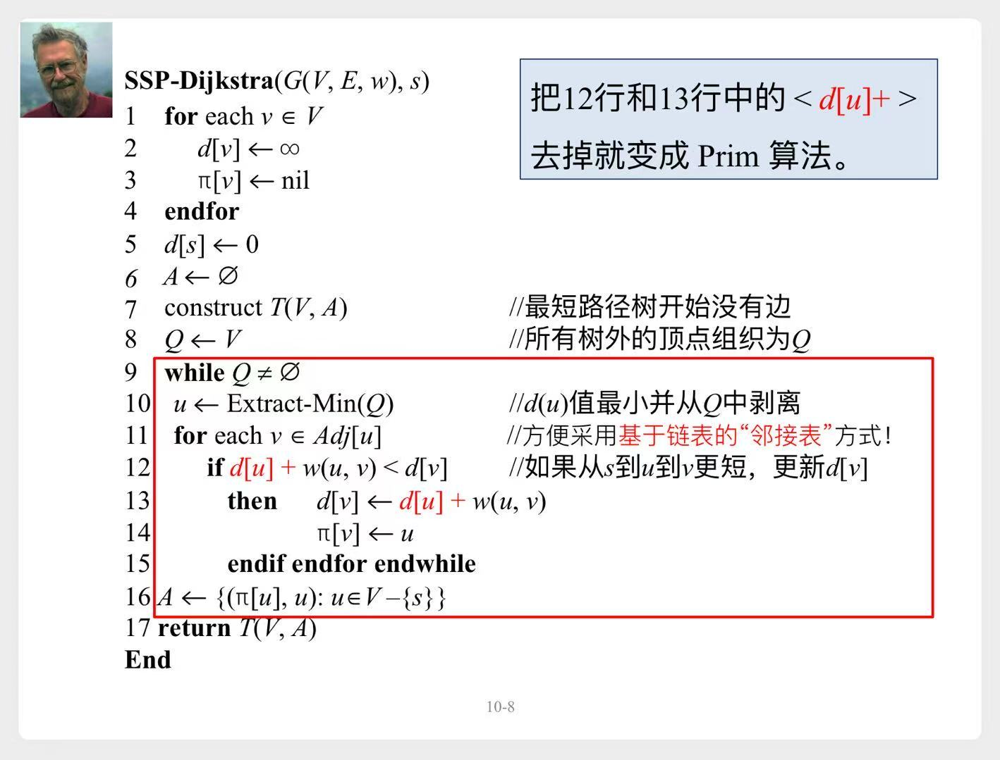
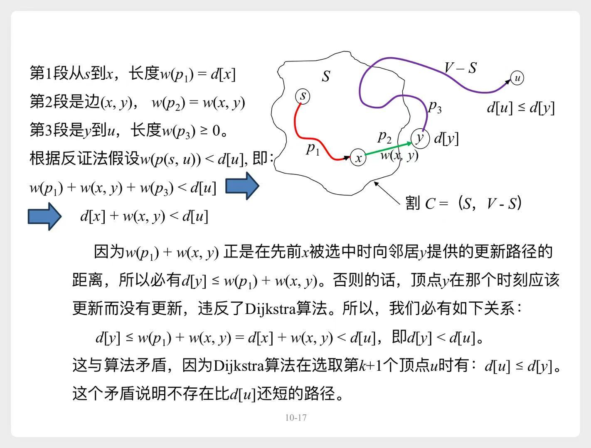
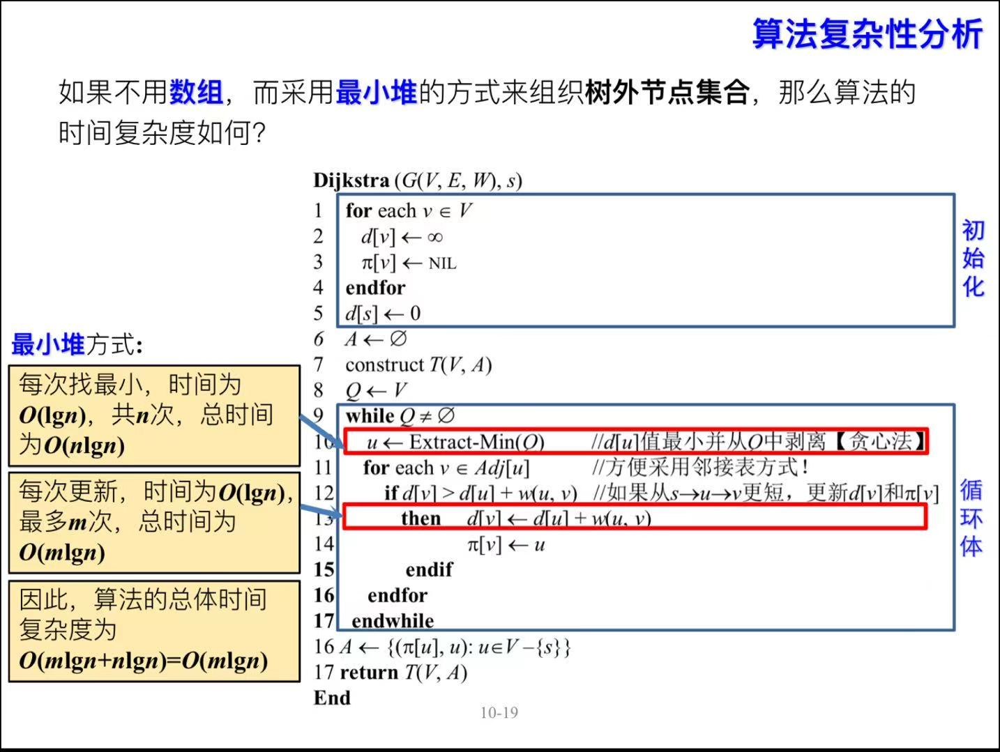
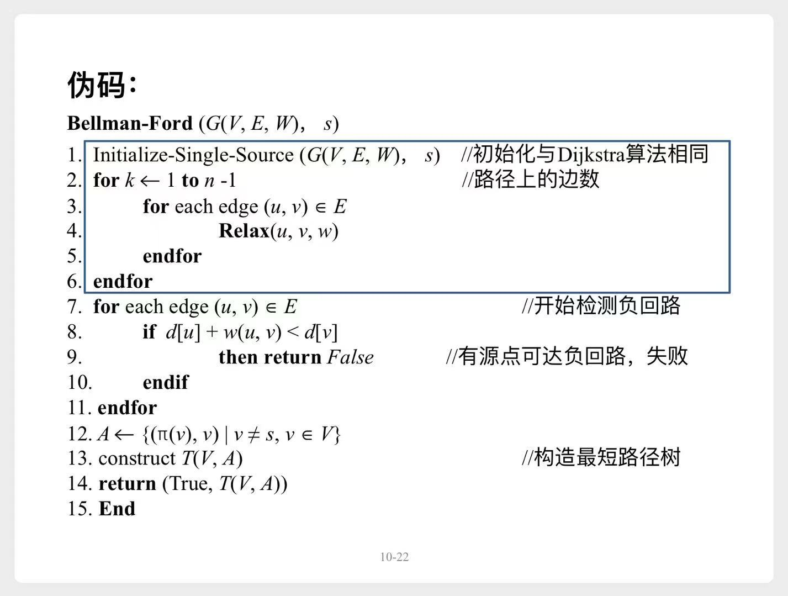
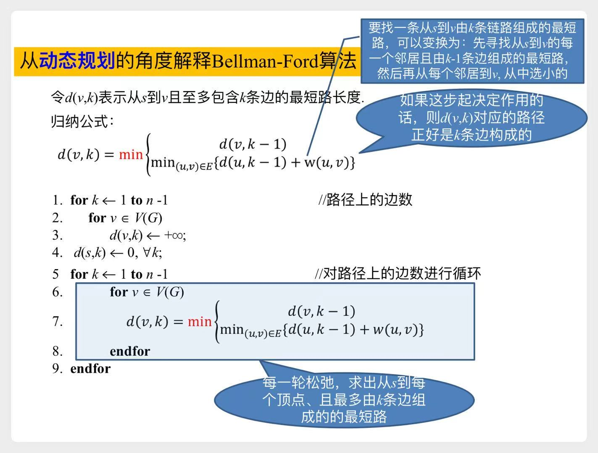
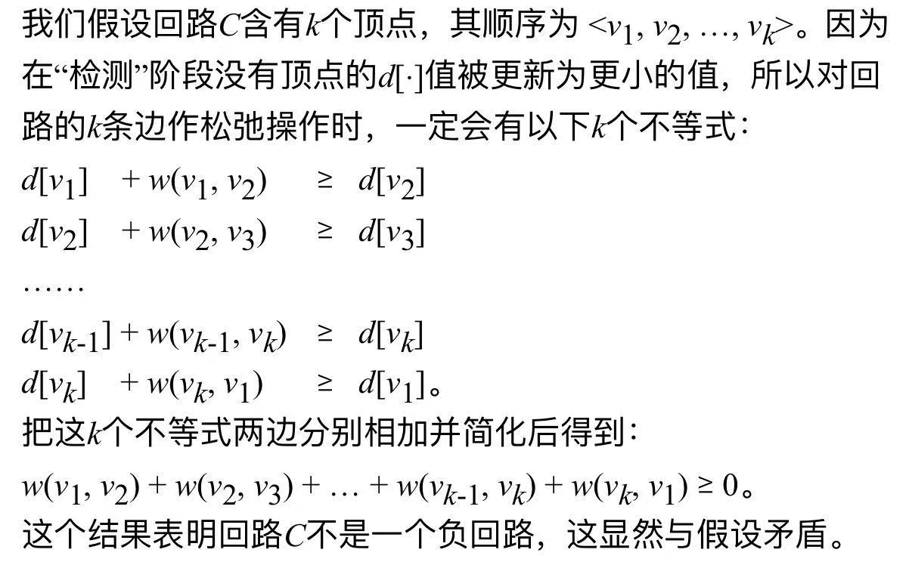

# 单源最短路径

# 一、Dijkstra算法

> 权重为非负实数

## 1.1 伪代码

||Prim|Dijkstra|
|---|---|---|
|$d[u]$的含义|**一跳距离** 树$A$到顶点$u$的最短距离|**累计距离** 源点$s$到顶点$u$的最短距离|

## 1.2 正确性证明

> 从源点$s$到顶点$u$的最短距离，记为$\delta(s,u)$  
> 我们用归纳法证明，每次顶点$u$被选中而连到树$T$上时，$d[u]=\delta(s,u)$

1. **归纳基础**：源点$s$被选中，此时$d[s]=\delta(s,s)=0$，成立
2. **归纳步骤**：
    - 假设已选取了k个顶点，且对这k个任意顶点，均有$d[v]=\delta(s,v)$
    - 此时新选一个顶点$u$，只需证明更新后的$d[u]=\delta(s,u)$

        

        
<b>反证法</b>

        假设$d[u] > \delta(s,u)$，即图中有一条更短路径$p(s,u)$，使得$w(p(s,u)) < d[u]$  
        $\Rightarrow$ 推出矛盾，所以假设不成立

        

        

## 1.3 复杂度

> 与**Prim算法**完全一致
> 

> 
以<b>最小堆</b>为例，详细说明

>
> 
>
> 

# 二、Bellman-Ford算法

> 允许有负权重，但不能有`负回路`

## 2.1 伪代码

> 上面的伪代码很简洁，重要是理解`2-6`行，到底在做啥？  
> 从**动态规划**的角度来分析一下

## 2.2 动态规划的角度

> 我们引入一个新概念 $d(v,k)$ 来代替之前的 $d[v]$

## 2.3 正确性证明

#### 1) 不含`负回路`时，算法能正确返回结果

**定理**：不含`负回路`时，经过n-1轮松弛遍历后，对每个顶点，我们都有$d[v]=\delta(s,v)$

1. 首先证明：如果$s$到$v$的最短路径有k条边，那么第k轮松弛遍历后，就有$d[v]=\delta(s,v)$
    1. **归纳基础**：k=0，即$s$到$v$的最短路径有0条边，成立。
    2. **归纳步骤**：
        - 假设`k-1`轮松弛遍历后，任意有k-1条边的最短路径都已确定。
        - 那么第`k`轮松弛遍历后，任意有k条边的最短路径也会被确定。
            > 假设 $s \to v_1 \to ... \to v_{k-1} \to v_k$ 是一条含有k条边的最短路径。  
            > 第`k-1`轮遍历后，我们已经确定$d[v_{k-1}]$，  
            > 所以第`k`轮，遍历这条边$(v_{k-1}, v_k)$时，我们会更新$d[v_{k}] = d[v_{k-1}] + w(v_{k-1}, v_k)$
2. 如果第k轮时，已经找到了$d[v]=\delta(s,v)$
    - 显然之后第`k+1、k+2、... n-1`轮，$d[v]$就不会变化了

#### 2) 含`负回路`时，算法能正确检测

**反证法**：假设第`n`轮的松弛遍历，所有的$d[v]$均未更新，但却存在一个`负回路`  
$\Rightarrow$ 推出矛盾，所以假设不成立

> 也就是说：如果第`n`轮的松弛遍历，所有的$d[v]$均未更新，那就没有`负回路`

<b>详细证明</b>

`n-1`轮遍历后，所有的$d[v]$均被更新过，不再是 $+\infty$。  
于是可以这样来证明：

