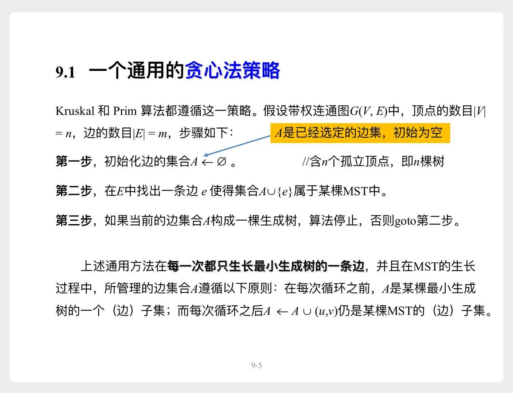
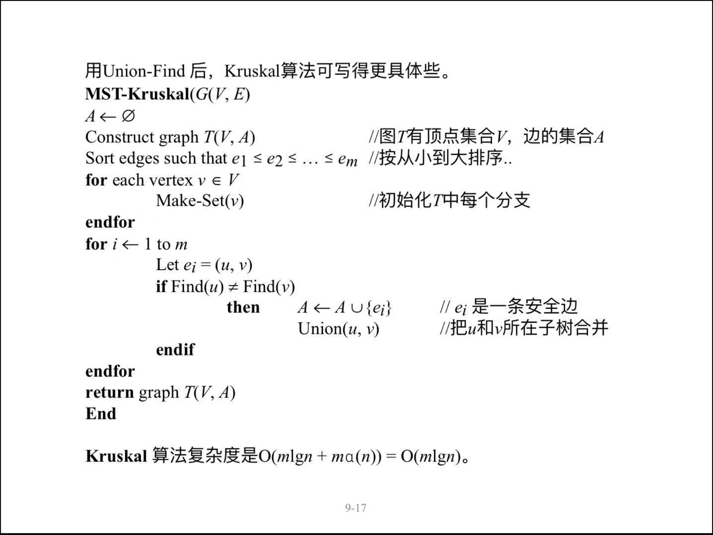
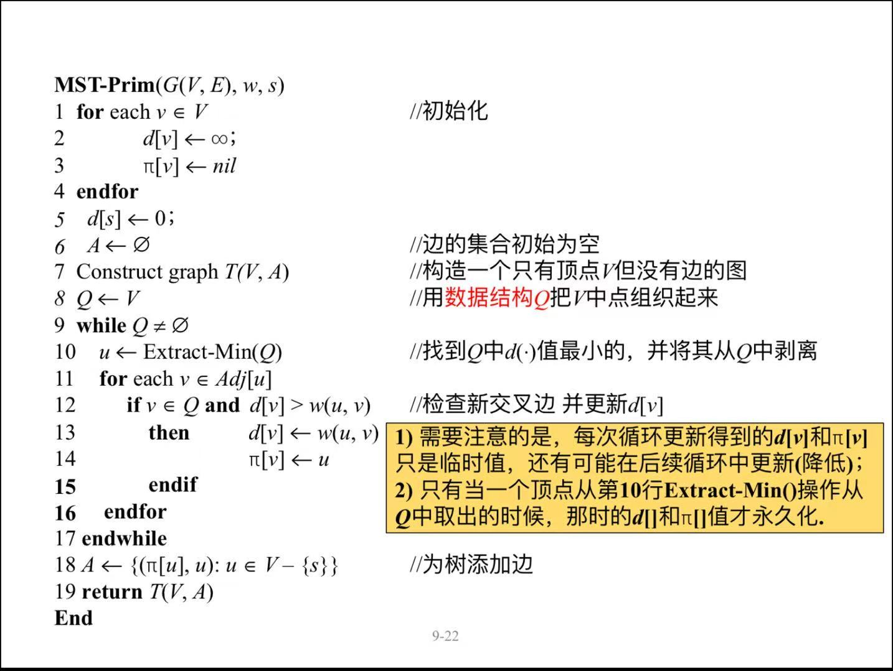

# 最小生成树

# 一、预备知识

## 1.1 贪心法策略

> 最重要的是第2步，如何寻找这样的边？  
> 这样的边也称之为**安全边**，问题就表述为：**如何寻找安全边**？  
> 先来介绍几个概念

## 1.2 基本概念

> **割**: 蓝色的虚线，将图中的顶点分成两个子集  
> **交叉边**: 红色的边，与**割**相交的那些边  
> **最小交叉边**: 权值最小的**交叉边**，例如上图中的$(b,g)$

## 1.3 安全边

> 有了这几个概念，**寻找安全边**的方法就容易表述了

### 1.3.1 定理

1. 一个带权连通图$G(V,E,w)$
2. 这样一个边的集合$A: A \subseteq E$，且包含在某棵MST中
3. 图$G$的任意一个与$A$不相交的割
    - 它的最小交叉边都是一条**安全边**。

> 证明略

### 1.3.2 两种寻找方案

#### 1) Kruskal

连接两个不同分支的所有边中，权重最小的一个

#### 2) Prim

连接`A`与`A之外结点`的所有边中，权重最小的一个

# 二、Kruskal算法

## 2.1 伪代码

## 2.2 复杂度

1. 对m条边进行排序，复杂度$O(m \lg m) = O(m \lg n^2) = O(m \lg n)$
2. `并查集`需要对m条边操作，复杂度可以认为是$O(m)$

- 整体复杂度$O(m \lg n)$

# 三、Prim算法

## 3.1 伪代码

## 3.2 复杂度

|d(u)的存储方式|数组|堆|斐波那契堆|
|---|---|---|---|
|复杂度|$O(n^2)$|$O(m \lg n)$|$O(n \lg n + m)$|